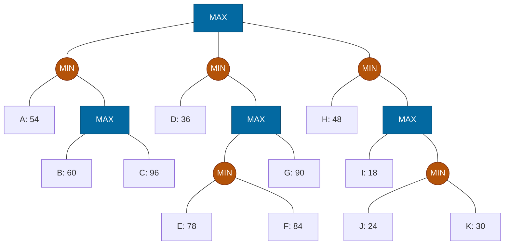

## The Question

Squares = MAX, circles = MIN. Leaves A–K. Tie-breaker: deepest, then leftmost.

| # | Question | Official answer |
|---|----------|-----------------|
| 3.1 | Valid strategies (A: D,E,F,G · B: H,I,J,K · C: D,E,F · D: H,I) | **C and D** |
| 3.2 | Best strategy leaves | `A,C` |
| 3.3 | Alpha-Beta inspected | `A,B,D,H` |
| 3.4 | SSS* solved | `A,B,D,H` |

## The Topic in 60 Seconds

- **Strategy for MAX:** no MAX node's set-leaves may split across two of its children; MIN's alternatives stay whole.
- **Best strategy** maximizes $\min(\text{leaves})$ = root minimax value.
- **α-β:** cutoff when $\alpha \ge \beta$.
- **SSS\*:** solves leaves line-by-line; unneeded leaves never expand.

> Deep-dive: [Game Strategies](/concepts/week-07-game-search/03-game-strategies), [Alpha-Beta Pruning](/concepts/week-07-game-search/02-alpha-beta-pruning), [SSS*](/concepts/week-03-heuristic-search/03-sss-star).

## Step 0 — Back up

- $SQ_1 = \max(60, 96) = 96$; $N_1 = \min(54, 96) = 54$
- $EF = \min(78, 84) = 78$; $SQ_2 = \max(78, 90) = 90$; $N_2 = \min(36, 90) = 36$
- $JK = \min(24, 30) = 24$; $SQ_3 = \max(18, 24) = 24$; $N_3 = \min(48, 24) = 24$
- $\text{Root} = \max(54, 36, 24) = \mathbf{54}$ via $N_1$

## 3.1 — Valid strategies → **C (D,E,F) and D (H,I)**

| Option | Check | Verdict |
|--------|-------|---------|
| A: D,E,F,G | $SQ_2$: E,F via $EF$ **and** G direct — **split!** | Invalid |
| B: H,I,J,K | $SQ_3$: I **and** J,K — **split!** | Invalid |
| **C: D,E,F** | Root→$N_2$ ✓; $N_2$ keeps D and $SQ_2$; $SQ_2$ → $EF$ only; $EF$ keeps E,F ✓ | **Valid** |
| **D: H,I** | Root→$N_3$ ✓; $SQ_3$ → I only ✓ | **Valid** |

## 3.2 — Best strategy → `A,C`

Root → $N_1$ (54). $N_1$ keeps A and $SQ_1$. $SQ_1$ (MAX) picks **C** (96 beats 60). Leaves **A, C**, guarantee $\min(54, 96) = 54$ = game value ✓

## 3.3 — Alpha-Beta inspects → `A,B,D,H`

| Node | Window | Happening |
|------|--------|-----------|
| $N_1$ (MIN) | $(-\infty, \infty)$ | A = 54 → $\beta = 54$ |
| $SQ_1$ (MAX) | $(-\infty, 54)$ | B = 60 ≥ 54 → **β-cutoff** — C pruned! |
| Root | $\alpha = 54$ | |
| $N_2$ (MIN) | $(54, \infty)$ | D = 36 ≤ 54 → **α-cutoff** — $SQ_2$ (E,F,G) pruned |
| $N_3$ (MIN) | $(54, \infty)$ | H = 48 ≤ 54 → **α-cutoff** — $SQ_3$ (I,J,K) pruned |

Inspected: **A, B, D, H** ✓ — 4 leaves out of 11.

## 3.4 — SSS* solves → `A,B,D,H`

1. **A solved** (54) → $N_1 \le 54$.
2. $SQ_1$ live bound 54: solve **B** (60 ≥ 54) → $SQ_1$ proven → **C never expanded**.
3. $N_1$ = 54. **D solved** (36) → $N_2 = 36$ ($SQ_2$ untouched). **H solved** (48) → $N_3 = 48$.
4. Root = 54. Solved: **A, B, D, H** ✓

<Callout type="tip" title="The pattern">
A low first leaf under a MIN node (A=54, D=36, H=48) is a scissors: it cuts every sibling subtree via α-cutoff, and SSS* does the same with bounds. Both algorithms end with the identical 4-leaf set here.
</Callout>

## Tricks & Tips

<Accordion title="Speed routines">
1. Back up all MAX squares first (SQ level), then MIN circles, then root.
2. Strategy check: any MAX node with set-leaves under two children → invalid, done.
3. Best strategy: walk the max down $N_1 \to SQ_1 \to C$; verify min(54, 96) = 54.
4. α-β: write the window at each node; 54 at $N_1$ does all the work.
</Accordion>

**Answers:** 3.1 **C, D** · 3.2 `A,C` · 3.3 `A,B,D,H` · 3.4 `A,B,D,H`
