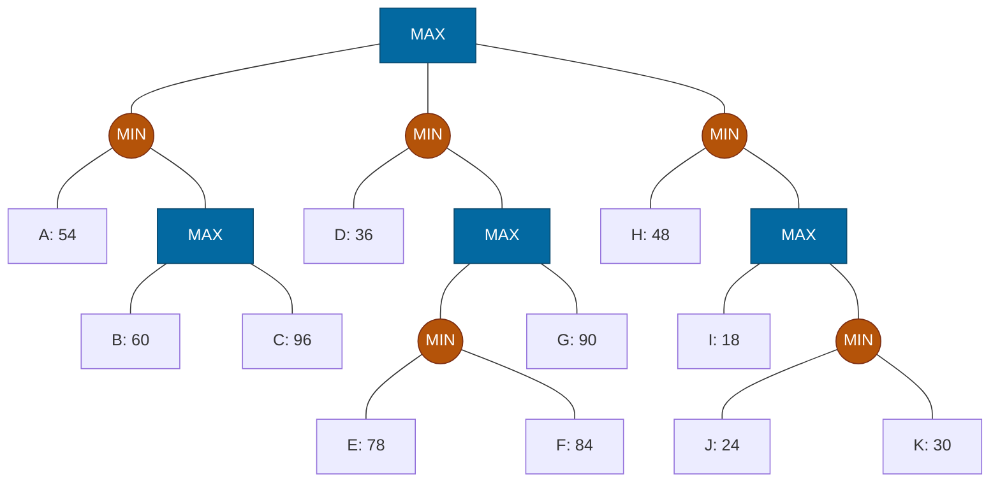

## The Question

Squares = MAX, circles = MIN. Leaves A–K. Tie-breaker: deepest, then leftmost.

| # | Question | Official answer |
|---|----------|-----------------|
| 3.1 | Valid strategies (A: D,E,F,G · B: H,I,J,K · C: D,E,F · D: H,I) | **C and D** |
| 3.2 | Best strategy leaves | `A,C` |
| 3.3 | Alpha-Beta inspected | `A,B,D,H` |
| 3.4 | SSS* solved | `A,B,D,H` |

## The Topic in 60 Seconds

- **Strategy for MAX:** no MAX node's set-leaves may split across two of its children; MIN's alternatives stay whole.
- **Best strategy** maximizes $\min(\text{leaves})$ = root minimax value.
- **α-β:** cutoff when $\alpha \ge \beta$.
- **SSS\*:** solves leaves line-by-line; unneeded leaves never expand.

> Deep-dive: [Game Strategies](/concepts/week-07-game-search/03-game-strategies), [Alpha-Beta Pruning](/concepts/week-07-game-search/02-alpha-beta-pruning), [SSS*](/concepts/week-03-heuristic-search/03-sss-star).

## Step 0 — Back up

- $SQ_1 = \max(60, 96) = 96$; $N_1 = \min(54, 96) = 54$
- $EF = \min(78, 84) = 78$; $SQ_2 = \max(78, 90) = 90$; $N_2 = \min(36, 90) = 36$
- $JK = \min(24, 30) = 24$; $SQ_3 = \max(18, 24) = 24$; $N_3 = \min(48, 24) = 24$
- $\text{Root} = \max(54, 36, 24) = \mathbf{54}$ via $N_1$

## 3.1 — Valid strategies → **C (D,E,F) and D (H,I)**

| Option | Check | Verdict |
|--------|-------|---------|
| A: D,E,F,G | $SQ_2$: E,F via $EF$ **and** G direct — **split!** | Invalid |
| B: H,I,J,K | $SQ_3$: I **and** J,K — **split!** | Invalid |
| **C: D,E,F** | Root→$N_2$ ✓; $N_2$ keeps D and $SQ_2$; $SQ_2$ → $EF$ only; $EF$ keeps E,F ✓ | **Valid** |
| **D: H,I** | Root→$N_3$ ✓; $SQ_3$ → I only ✓ | **Valid** |

## 3.2 — Best strategy → `A,C`

Root → $N_1$ (54). $N_1$ keeps A and $SQ_1$. $SQ_1$ (MAX) picks **C** (96 beats 60). Leaves **A, C**, guarantee $\min(54, 96) = 54$ = game value ✓

## 3.3 — Alpha-Beta inspects → `A,B,D,H`

| Node | Window | Happening |
|------|--------|-----------|
| $N_1$ (MIN) | $(-\infty, \infty)$ | A = 54 → $\beta = 54$ |
| $SQ_1$ (MAX) | $(-\infty, 54)$ | B = 60 ≥ 54 → **β-cutoff** — C pruned! |
| Root | $\alpha = 54$ | |
| $N_2$ (MIN) | $(54, \infty)$ | D = 36 ≤ 54 → **α-cutoff** — $SQ_2$ (E,F,G) pruned |
| $N_3$ (MIN) | $(54, \infty)$ | H = 48 ≤ 54 → **α-cutoff** — $SQ_3$ (I,J,K) pruned |

Inspected: **A, B, D, H** ✓ — 4 leaves out of 11.

## 3.4 — SSS* solves → `A,B,D,H`

1. **A solved** (54) → $N_1 \le 54$.
2. $SQ_1$ live bound 54: solve **B** (60 ≥ 54) → $SQ_1$ proven → **C never expanded**.
3. $N_1$ = 54. **D solved** (36) → $N_2 = 36$ ($SQ_2$ untouched). **H solved** (48) → $N_3 = 48$.
4. Root = 54. Solved: **A, B, D, H** ✓

Interactive α-β trace — squares are MAX, circles are MIN; green = leaf whose value got read:

<PaperTrace
  height={470}
  nodeWidth={96}
  nodeHeight={48}
  nodeFontSize={11}
  legend={[
    { color: "#b45309", label: "evaluating now" },
    { color: "#15803d", label: "value inspected" },
    { color: "#7f1d1d", label: "pruned by a cutoff" },
    { color: "#334155", label: "never reached" },
  ]}
  nodes={[
    { id: "R", label: "MAX", x: 430, y: 20, kind: "terminal" },
    { id: "N1", label: "MIN", x: 150, y: 110, kind: "terminal" },
    { id: "N2", label: "MIN", x: 430, y: 110, kind: "terminal" },
    { id: "N3", label: "MIN", x: 710, y: 110, kind: "terminal" },
    { id: "A", label: "A: 54", x: 50, y: 210, kind: "terminal" },
    { id: "SQ1", label: "MAX", x: 210, y: 210, kind: "terminal" },
    { id: "D", label: "D: 36", x: 340, y: 210, kind: "terminal" },
    { id: "SQ2", label: "MAX", x: 490, y: 210, kind: "terminal" },
    { id: "H", label: "H: 48", x: 640, y: 210, kind: "terminal" },
    { id: "SQ3", label: "MAX", x: 780, y: 210, kind: "terminal" },
    { id: "B", label: "B: 60", x: 140, y: 300, kind: "terminal" },
    { id: "C", label: "C: 96", x: 280, y: 300, kind: "terminal" },
    { id: "EF", label: "MIN", x: 430, y: 300, kind: "terminal" },
    { id: "G", label: "G: 90", x: 570, y: 300, kind: "terminal" },
    { id: "I", label: "I: 18", x: 720, y: 300, kind: "terminal" },
    { id: "JK", label: "MIN", x: 850, y: 300, kind: "terminal" },
    { id: "E", label: "E: 78", x: 370, y: 390, kind: "terminal" },
    { id: "F", label: "F: 84", x: 490, y: 390, kind: "terminal" },
    { id: "J", label: "J: 24", x: 800, y: 390, kind: "terminal" },
    { id: "K", label: "K: 21", x: 900, y: 390, kind: "terminal" },
  ]}
  edges={[
    { id: "g1", from: "R", to: "N1" },
    { id: "g2", from: "R", to: "N2" },
    { id: "g3", from: "R", to: "N3" },
    { id: "g4", from: "N1", to: "A" },
    { id: "g5", from: "N1", to: "SQ1" },
    { id: "g6", from: "SQ1", to: "B" },
    { id: "g7", from: "SQ1", to: "C" },
    { id: "g8", from: "N2", to: "D" },
    { id: "g9", from: "N2", to: "SQ2" },
    { id: "g10", from: "SQ2", to: "EF" },
    { id: "g11", from: "SQ2", to: "G" },
    { id: "g12", from: "EF", to: "E" },
    { id: "g13", from: "EF", to: "F" },
    { id: "g14", from: "N3", to: "H" },
    { id: "g15", from: "N3", to: "SQ3" },
    { id: "g16", from: "SQ3", to: "I" },
    { id: "g17", from: "SQ3", to: "JK" },
    { id: "g18", from: "JK", to: "J" },
    { id: "g19", from: "JK", to: "K" },
  ]}
  steps={[
    {
      label: "1 · N1 reads A",
      note: "Root (MAX, −∞,+∞) → leftmost child N1 (MIN).\nA = 54 → β(N1) = 54.",
      nodes: { R: "explored", N1: "current", A: "path" },
      edges: { g1: "active", g4: "active" },
    },
    {
      label: "2 · B = 60 ✂ β-cutoff",
      note: "SQ1 (MAX) window (−∞, 54): B = 60 ≥ 54 → β-CUTOFF.\nC never read. N1 = min(54, ≥54) = 54 → Root α = 54.",
      nodes: { R: "current", N1: "path", A: "path", SQ1: "current", B: "path", C: "pruned" },
      edges: { g5: "active", g6: "active", g7: "pruned" },
    },
    {
      label: "3 · D = 36 ✂ α-cutoff",
      note: "N2 (MIN) window (54, +∞): D = 36 ≤ 54 → α-CUTOFF.\nSQ2's whole subtree (E, F, G) is never generated.",
      nodes: { R: "explored", N1: "path", N2: "current", A: "path", B: "path", D: "path", SQ2: "pruned", EF: "pruned", G: "pruned", E: "pruned", F: "pruned", C: "pruned" },
      edges: { g8: "active", g9: "pruned", g10: "pruned", g11: "pruned", g12: "pruned", g13: "pruned", g7: "pruned" },
    },
    {
      label: "4 · H = 48 ✂ Root = 54",
      note: "N3 (MIN) window (54, +∞): H = 48 ≤ 54 → α-CUTOFF; I, J, K never read.\nRoot = max(54, ≤36, ≤48) = 54 via N1.\nInspected exactly A, B, D, H — 4 of 11 leaves.",
      nodes: { R: "path", N1: "path", N2: "path", N3: "current", A: "path", B: "path", D: "path", H: "path", SQ2: "pruned", EF: "pruned", G: "pruned", E: "pruned", F: "pruned", SQ3: "pruned", I: "pruned", JK: "pruned", J: "pruned", K: "pruned", C: "pruned" },
      edges: { g14: "active", g15: "pruned", g16: "pruned", g17: "pruned", g18: "pruned", g19: "pruned", g9: "pruned", g10: "pruned", g11: "pruned", g7: "pruned" },
    },
    {
      label: "5 · best strategy = A, C",
      note: "Full backups: SQ1 = max(60, 96) = 96, N1 = min(54, 96) = 54.\nRoot = 54 via N1 → keep A + SQ1; SQ1 picks C (96 > 60).\nGuarantee min(54, 96) = 54 = game value. Strategy set {A, C}.",
      nodes: { R: "path", N1: "path", A: "path", SQ1: "path", B: "path", C: "path", N2: "explored", D: "explored", N3: "explored", H: "explored", SQ2: "explored", EF: "explored", G: "explored", E: "explored", F: "explored", SQ3: "explored", I: "explored", JK: "explored", J: "explored", K: "explored" },
      edges: { g1: "path", g4: "path", g5: "path", g7: "path" },
    },
  ]}
/>

<Callout type="tip" title="The pattern">
A low first leaf under a MIN node (A=54, D=36, H=48) is a scissors: it cuts every sibling subtree via α-cutoff, and SSS* does the same with bounds. Both algorithms end with the identical 4-leaf set here.
</Callout>

## Tricks & Tips

<Accordion title="Speed routines">
1. Back up all MAX squares first (SQ level), then MIN circles, then root.
2. Strategy check: any MAX node with set-leaves under two children → invalid, done.
3. Best strategy: walk the max down $N_1 \to SQ_1 \to C$; verify min(54, 96) = 54.
4. α-β: write the window at each node; 54 at $N_1$ does all the work.
</Accordion>

**Answers:** 3.1 **C, D** · 3.2 `A,C` · 3.3 `A,B,D,H` · 3.4 `A,B,D,H`
