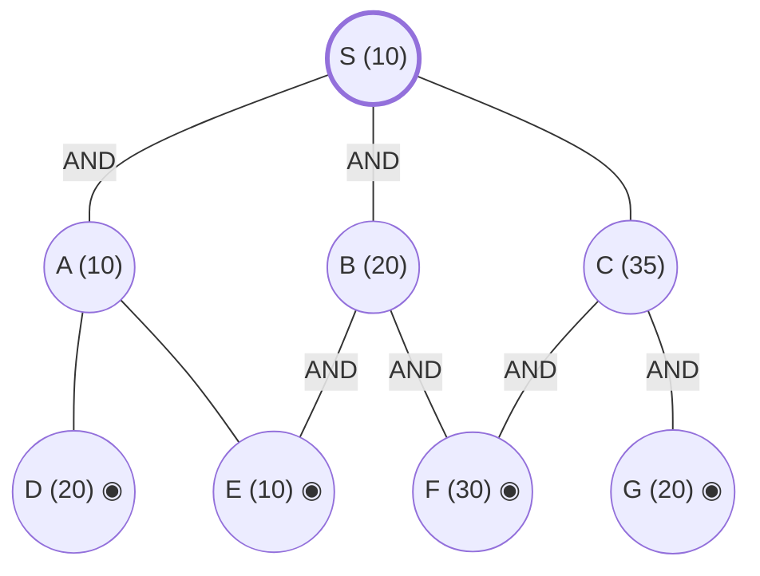

## The Question

AND–OR decomposition. Double circles = primitive. **Every edge costs 10.** Tie-breakers: node labels; for AND nodes expand the **highest-cost unsolved branch** first.

AND arcs: **S** = AND(A, B) *or* OR(C). **B** = AND(E, F). **C** = AND(F, G). **A is an OR node** over D and E. All of D, E, F, G are primitive.

| # | Question | Official answer |
|---|----------|-----------------|
| 4.1 | Nodes expanded (incl. S) | `S,C,B` (also accepted `C,B`) |
| 4.2 | Value of S after each expansion | `45,50,80` |
| 4.3 | Final value of S | `80` |

## The Topic in 60 Seconds

AO* = expand along **marked arcs** + revise (OR: min child+edge; AND: sum children+edges). Markers can switch whenever a refined cost overtakes a rival option. Primitive children make a node instantly SOLVED.

> Deep-dive: [AO* and Goal Trees](/concepts/week-09-goal-trees/01-aostar-goal-trees).

## The Trace — three expansions

h: S=10, A=10, B=20, C=35; D=20, E=10, F=30, G=20 primitive. **Edge = 10.**

**Expansion 1 — S.**
- AND(A, B): $(10+10) + (20+10) = 50$
- OR(C): $35 + 10 = 45$

Mark OR(C) → **S = 45** ✓

**Expansion 2 — C.**
C: AND(F, G) $= (30+10)+(20+10) = 70$; F, G primitive → **C = 70, SOLVED**.
Propagate: $S = \min(50,\ 70+10) = \mathbf{50}$ ✓ — still via AND(A, B) (50 < 80). **Marker switches to AND(A, B).**

**Expansion 3 — B** (marked path A(10), B(20); B costlier → tie-breaker 2).
B: AND(E, F) $= (10+10)+(30+10) = 60$; E, F primitive → **B = 60, SOLVED**.
Propagate: AND(A, B) $= (10+10) + (60+10) = 90$; OR(C) $= 70+10 = 80$:
$$S = \min(90,\ 80) = \mathbf{80}$$ ✓
C is solved → **S SOLVED = 80**. (A was never expanded!)

**Final value of S = 80.** Solution subtree: S → C → F,G.

Interactive trace:

<StepGraph
  height={420}
  nodeWidth={110}
  nodeHeight={52}
  nodeFontSize={12}
  legend={[
    { color: "#b45309", label: "expanding now" },
    { color: "#0369a1", label: "live on marked path" },
    { color: "#52525b", label: "primitive (born SOLVED)" },
    { color: "#16a34a", label: "marked arcs" },
  ]}
  steps={[
    {
      label: "0 · setup",
      note: "h: S=10, A=10, B=20, C=35; D=20, E=10, F=30, G=20 primitive. Edge = 10.\nS: AND(A,B) = (10+10)+(20+10) = 50 | OR(C) = 35+10 = 45\n→ mark OR(C). S = 45",
      elements: [
        { data: { id: "S", label: "S =45", type: "frontier" }, position: { x: 400, y: 30 } },
        { data: { id: "A", label: "A 10", type: "frontier" }, position: { x: 150, y: 150 } },
        { data: { id: "B", label: "B 20", type: "frontier" }, position: { x: 400, y: 150 } },
        { data: { id: "C", label: "C 35 ←marked", type: "frontier" }, position: { x: 660, y: 150 } },
        { data: { id: "D", label: "D 20", type: "primitive" }, position: { x: 60, y: 280 } },
        { data: { id: "E", label: "E 10", type: "primitive" }, position: { x: 260, y: 280 } },
        { data: { id: "F", label: "F 30", type: "primitive" }, position: { x: 520, y: 280 } },
        { data: { id: "G", label: "G 20", type: "primitive" }, position: { x: 760, y: 280 } },
        { data: { id: "e1", source: "S", target: "A", label: "AND" } },
        { data: { id: "e2", source: "S", target: "B", label: "AND" } },
        { data: { id: "e3", source: "S", target: "C", label: "OR", type: "path" } },
        { data: { id: "e4", source: "A", target: "D" } },
        { data: { id: "e5", source: "A", target: "E" } },
        { data: { id: "e6", source: "B", target: "E" } },
        { data: { id: "e7", source: "B", target: "F" } },
        { data: { id: "e8", source: "C", target: "F" } },
        { data: { id: "e9", source: "C", target: "G" } },
      ],
    },
    {
      label: "1 · expand S → 45",
      note: "Marked path: C. Expand C next.",
      elements: [
        { data: { id: "S", label: "S =45", type: "explored" }, position: { x: 400, y: 30 } },
        { data: { id: "A", label: "A 10", type: "explored" }, position: { x: 150, y: 150 } },
        { data: { id: "B", label: "B 20", type: "explored" }, position: { x: 400, y: 150 } },
        { data: { id: "C", label: "C 35", type: "current" }, position: { x: 660, y: 150 } },
        { data: { id: "D", label: "D 20", type: "primitive" }, position: { x: 60, y: 280 } },
        { data: { id: "E", label: "E 10", type: "primitive" }, position: { x: 260, y: 280 } },
        { data: { id: "F", label: "F 30", type: "primitive" }, position: { x: 520, y: 280 } },
        { data: { id: "G", label: "G 20", type: "primitive" }, position: { x: 760, y: 280 } },
        { data: { id: "e1", source: "S", target: "A", label: "AND" } },
        { data: { id: "e2", source: "S", target: "B", label: "AND" } },
        { data: { id: "e3", source: "S", target: "C", label: "OR", type: "path" } },
        { data: { id: "e4", source: "A", target: "D" } },
        { data: { id: "e5", source: "A", target: "E" } },
        { data: { id: "e6", source: "B", target: "E" } },
        { data: { id: "e7", source: "B", target: "F" } },
        { data: { id: "e8", source: "C", target: "F" } },
        { data: { id: "e9", source: "C", target: "G" } },
      ],
    },
    {
      label: "2 · expand C → 50 (marker flips)",
      note: "C: AND(F,G) = (30+10)+(20+10) = 70, primitive children → C = 70 SOLVED.\nS = min(AND(A,B)=50, 70+10=80) = 50 → marker switches to AND(A,B).\nMarked path: A(10), B(20) → expand costlier B.",
      elements: [
        { data: { id: "S", label: "S =50", type: "current" }, position: { x: 400, y: 30 } },
        { data: { id: "A", label: "A 10 ←marked", type: "frontier" }, position: { x: 150, y: 150 } },
        { data: { id: "B", label: "B 20 ←marked", type: "frontier" }, position: { x: 400, y: 150 } },
        { data: { id: "C", label: "C =70 ✓", type: "path" }, position: { x: 660, y: 150 } },
        { data: { id: "D", label: "D 20", type: "primitive" }, position: { x: 60, y: 280 } },
        { data: { id: "E", label: "E 10", type: "primitive" }, position: { x: 260, y: 280 } },
        { data: { id: "F", label: "F 30", type: "primitive" }, position: { x: 520, y: 280 } },
        { data: { id: "G", label: "G 20", type: "primitive" }, position: { x: 760, y: 280 } },
        { data: { id: "e1", source: "S", target: "A", label: "AND", type: "path" } },
        { data: { id: "e2", source: "S", target: "B", label: "AND", type: "path" } },
        { data: { id: "e3", source: "S", target: "C", label: "OR" } },
        { data: { id: "e4", source: "A", target: "D" } },
        { data: { id: "e5", source: "A", target: "E" } },
        { data: { id: "e6", source: "B", target: "E" } },
        { data: { id: "e7", source: "B", target: "F" } },
        { data: { id: "e8", source: "C", target: "F", type: "path" } },
        { data: { id: "e9", source: "C", target: "G", type: "path" } },
      ],
    },
    {
      label: "3 · expand B → 80 ✓ SOLVED",
      note: "B: AND(E,F) = (10+10)+(30+10) = 60, primitive → B = 60 SOLVED.\nAND(A,B) = (10+10)+(60+10) = 90 > OR(C) = 80 → marker back to C (SOLVED).\nS = 80 SOLVED. Final = 80. (A never expanded!)",
      elements: [
        { data: { id: "S", label: "S =80 ✓", type: "path" }, position: { x: 400, y: 30 } },
        { data: { id: "A", label: "A 10", type: "explored" }, position: { x: 150, y: 150 } },
        { data: { id: "B", label: "B =60 ✓", type: "explored" }, position: { x: 400, y: 150 } },
        { data: { id: "C", label: "C =70 ✓", type: "path" }, position: { x: 660, y: 150 } },
        { data: { id: "D", label: "D 20", type: "primitive" }, position: { x: 60, y: 280 } },
        { data: { id: "E", label: "E 10", type: "primitive" }, position: { x: 260, y: 280 } },
        { data: { id: "F", label: "F 30", type: "primitive" }, position: { x: 520, y: 280 } },
        { data: { id: "G", label: "G 20", type: "primitive" }, position: { x: 760, y: 280 } },
        { data: { id: "e1", source: "S", target: "A", label: "AND" } },
        { data: { id: "e2", source: "S", target: "B", label: "AND" } },
        { data: { id: "e3", source: "S", target: "C", label: "OR", type: "path" } },
        { data: { id: "e4", source: "A", target: "D" } },
        { data: { id: "e5", source: "A", target: "E" } },
        { data: { id: "e6", source: "B", target: "E" } },
        { data: { id: "e7", source: "B", target: "F" } },
        { data: { id: "e8", source: "C", target: "F", type: "path" } },
        { data: { id: "e9", source: "C", target: "G", type: "path" } },
      ],
    },
  ]}
/>

<Callout type="important" title="Two marker flips in three expansions">
C wins at step 1 (45 < 50); after C is priced at 70, the AND(A,B) branch (50) briefly takes the marker; after B is priced at 60, that branch balloons to 90 and the marker returns to the now-solved C. If you expand A instead of B at step 3 (wrong tie-break — B is costlier), you get 4.2 wrong.
</Callout>

## Answers, decoded

- **4.1** — expansions: **S, C, B** (the accepted `C,B` drops S from the count).
- **4.2** — S after each: **45, 50, 80**.
- **4.3** — final: **80** via S → C → F,G.

## Tricks & Tips

<Accordion title="Fast method">
1. Edge cost 10 (not 2!) — read it from the question, not from memory.
2. Keep both S options on paper from step 1 (50 vs 45) — you need them at every revision.
3. Primitive AND-children ⇒ instant SOLVED; a solved child makes its parent's OR option final.
4. Tie-breaker 2 picks the costlier AND branch — B before A here.
</Accordion>

**Answers:** 4.1 `S,C,B` · 4.2 `45,50,80` · 4.3 `80`
