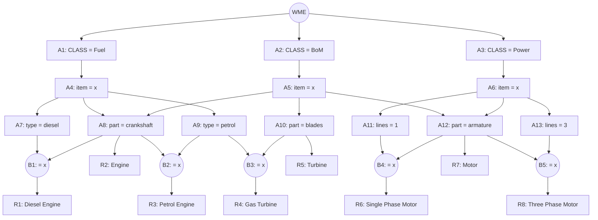

## The Question

A Rete net classifying engines/motors. Working memory:

```text
101. (Fuel  ^item M59 ^type diesel)
102. (Fuel  ^item M26 ^type petrol)
103. (Fuel  ^item M37)
104. (BoM   ^item M48 ^part armature)
105. (Power ^item M48 ^lines 1)
106. (BoM   ^item M37 ^part armature)
107. (BoM   ^item M15 ^part crankshaft)
```

| # | Question | Official answer |
|---|----------|-----------------|
| 5.1 | Tuples in the conflict set (A: (Diesel-Engine,101,107) · B: (Petrol-Engine,107,102) · C: (Engine,107) · D: (Single-Phase-Motor,105,104) · E: (Motor,104) · F: (Motor,106)) | **C, D, E, F** |
| 5.2 | Specificity fires | **D** |
| 5.3 | Recency fires | **C** |

## The Topic in 60 Seconds

Alpha nodes filter single WMEs; beta nodes join on the shared `^item` variable. Conflict set = all full tuples. **Specificity** = most WMEs wins; **Recency** = highest max-timestamp wins.

> Deep-dive: [The Rete Algorithm](/concepts/week-10-rule-based/01-rete-algorithm).

## The Rete Net (from the figure)



## Step 1 — Locate every WME

| WME | Facts | Alpha node |
|-----|-------|------------|
| 101 | Fuel, M59, diesel | **A7** |
| 102 | Fuel, M26, petrol | **A9** |
| 103 | Fuel, M37 (no type/part) | **A4** |
| 104 | BoM, M48, armature | **A12** |
| 105 | Power, M48, lines 1 | **A11** |
| 106 | BoM, M37, armature | **A12** |
| 107 | BoM, M15, crankshaft | **A8** |

## Step 2 — Fire the joins (on `^item`)

- **R1 Diesel Engine** (diesel ⋈ crankshaft): 101 (M59) vs 107 (M15) → no match
- **R2 Engine** (crankshaft alone): 107 → **(Engine, 107)** ✓
- **R3 Petrol Engine** (crankshaft ⋈ petrol): no petrol → empty
- **R4 Gas Turbine** (petrol ⋈ blades): empty
- **R5 Turbine** (blades): none → empty
- **R6 Single Phase Motor** (lines-1 ⋈ armature): 105 (M48) ⋈ 104 (M48) → **(SPM, 105, 104)** ✓
- **R7 Motor** (armature alone): 104, 106 → **(Motor, 104)** ✓, **(Motor, 106)** ✓
- **R8 Three Phase Motor** (armature ⋈ lines-3): no lines-3 → empty

**Conflict set** = (Engine, 107), (SPM, 105, 104), (Motor, 104), (Motor, 106) → options **C, D, E, F** ✓

## 5.2 — Specificity → **D**

WME counts: (Engine,107) = 1; **(SPM, 105, 104) = 2**; (Motor,·) = 1 each. Most specific → **D**.

## 5.3 — Recency → **C**

Max timestamps: (Engine,107) → **107**; (SPM,·) → 105; (Motor,104) → 104; (Motor,106) → 106. Highest → **C**.

<Callout type="tip" title="Same flip as the AN paper">
Specificity loves the two-condition tuple; recency loves whatever holds the newest fact (107, the crankshaft BoM). When a fresh fact feeds a *general* rule, the two strategies split — that's the examiner's favourite trick.
</Callout>

## Tricks & Tips

<Accordion title="4-step recipe">
1. WME → alpha table first.
2. Join betas on `^item`; mismatched ids die instantly ((Diesel-Engine,101,107): M59 ≠ M15).
3. Don't forget **single-alpha rules** (R2 Engine, R7 Motor) — they produce tuples too.
4. Specificity = count; recency = max timestamp; ties → rule label order.
</Accordion>

**Answers:** 5.1 **C, D, E, F** · 5.2 **D** · 5.3 **C**
