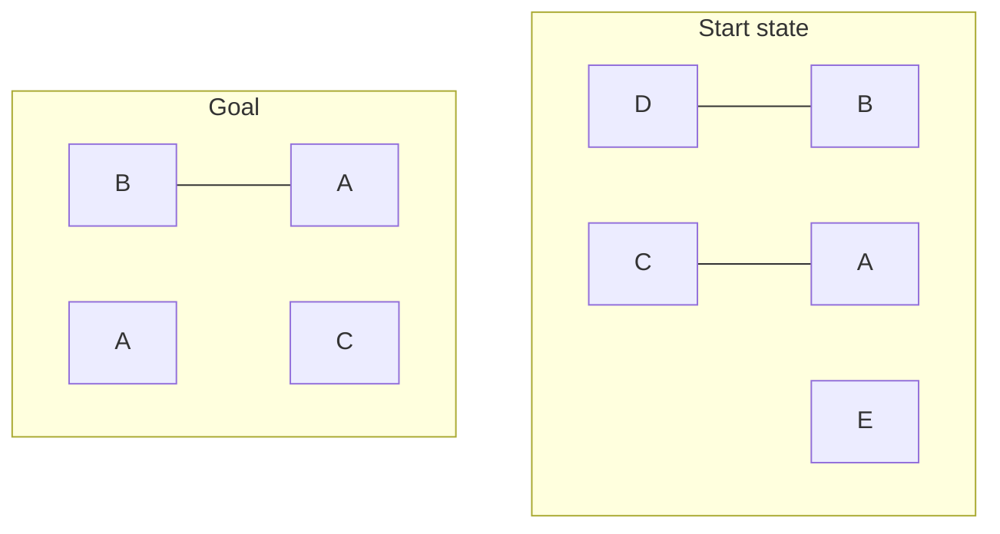

## The Question

Standard one-armed Blocks World operators.

**Start state:** $\{$ onTable(B), onTable(A), onTable(E), clear(D), clear(C), clear(E), on(D,B), on(C,A), armEmpty $\}$

**Goal:** $\{$ on(A,C), on(B,A) $\}$ — tower B/A on C.

| # | Question | Official answer |
|---|----------|-----------------|
| 6.1 | Applicable in start (A: Putdown(D) · B: Unstack(D,B) · C: Unstack(C,A) · D: Pickup(E) · E: Pickup(A) · F: Stack(B,A) · G: Stack(A,C)) | **B, C, D** |
| 6.2 | Relevant in goal | **F, G** |
| 6.3 | Mutex action pairs in layer 1 (A: Unstack(D,B),Pickup(E) · B: Unstack(D,B),Unstack(C,A) · C: Pickup(E),Stack(B,A) · D: Pickup(E),Stack(A,C)) | **A, B** |
| 6.4 | Mutex propositions in layer 1 (A: clear(B),holding(C) · B: clear(B),clear(A) · C: clear(E),on(D,B) · D: clear(E),holding(D)) | **A, B** |

## The Topic in 60 Seconds

**Applicable** = preconditions ⊆ state. **Relevant** = add-list hits the goal. $A_1$ = applicable in $P_0$ (+no-ops). **Action mutex** (ANY): inconsistent effects / interference / competing needs. **Proposition mutex** (ALL): every producer pair mutex.

> Deep-dive: [Blocks World & STRIPS](/concepts/week-08-planning/01-blocks-world-strips), [GraphPlan Mutexes](/concepts/week-09-goal-trees/02-graphplan-mutexes).

## 6.1 — Applicable → **B, C, D**

armEmpty holds, so unstacks/pickups are live:

| Action | Preconditions | Verdict |
|--------|---------------|---------|
| Putdown(D) | holding(D) | ✗ |
| **Unstack(D,B)** | armEmpty, clear(D), on(D,B) | **✓** |
| **Unstack(C,A)** | armEmpty, clear(C), on(C,A) | **✓** |
| **Pickup(E)** | armEmpty, clear(E), onTable(E) | **✓** |
| Pickup(A) | clear(A) | ✗ (C sits on A) |
| Stack(B,A) / Stack(A,C) | holding(·) | ✗ |

## 6.2 — Relevant → **F, G**

Goal = on(A,C), on(B,A). Stack(A,C) adds on(A,C) ✓; Stack(B,A) adds on(B,A) ✓. Nothing else adds a goal fact → **F, G**.

## 6.3 — Mutex action pairs → **A, B**

$A_1$ = Unstack(D,B), Unstack(C,A), Pickup(E) (+ no-ops) (options C, D name inapplicable Stacks → out).

- Unstack(D,B) ⊕ Pickup(E): both **delete armEmpty** (each other's precondition) → interference ✓
- Unstack(D,B) ⊕ Unstack(C,A): same ✓

## 6.4 — Mutex propositions → **A, B**

$P_1$ = start facts (nops) ∪ adds: clear(B), clear(A), holding(D), holding(C), holding(E).

| Pair | Producers | Verdict |
|------|-----------|---------|
| clear(B), holding(C) | clear(B): *only* Unstack(D,B) (D sits on B — not a start fact). holding(C): only Unstack(C,A). Producers mutex (6.3) | **Mutex** ✓ |
| clear(B), clear(A) | clear(A): only Unstack(C,A). Same mutex pair | **Mutex** ✓ |
| clear(E), on(D,B) | clear(E) is a **start fact** → nop producer is non-mutex | Not mutex |
| clear(E), holding(D) | nop(clear(E)) again breaks it | Not mutex |

## Tricks & Tips

<Accordion title="One minute each">
1. Applicable: armEmpty ⇒ look at unstacks/pickups only; check each block's clear/on facts.
2. Relevant: add-list ∩ goal.
3. Layer-1 mutex: armEmpty interference is the usual culprit; inapplicable options are free eliminations.
4. Proposition mutex: start-state facts escape (no-op producer); facts with a single mutex producer are locked.
</Accordion>

**Answers:** 6.1 **B, C, D** · 6.2 **F, G** · 6.3 **A, B** · 6.4 **A, B**
