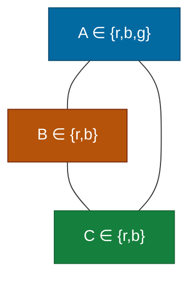
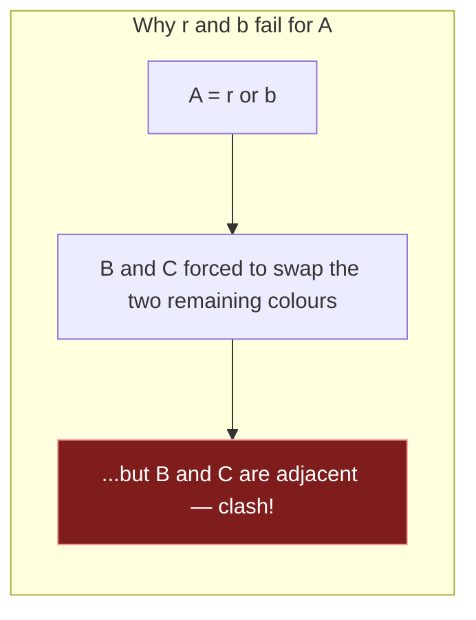

## The Question

Map colouring with 3 regions $\{A, B, C\}$, **all three pairwise adjacent**, processed in order A, B, C.

$$D_A = \{r, b, g\}, \qquad D_B = \{r, b\}, \qquad D_C = \{r, b\}$$

Constraint: adjacent regions must take **different** colours.

| # | Question | Official answer |
|---|----------|-----------------|
| 7.1 | Is the CSP arc consistent? | **A** — Yes |
| 7.2 | Is the CSP path consistent? | **A** — No |
| 7.3 | Solution (A,B,C) | `g,r,b` |

## The Topic in 60 Seconds

- **Arc consistent** (per directed arc $X \to Y$): every $x \in D_X$ has *some* $y \in D_Y$ with $(x,y)$ allowed. Prunes **values**.
- **Path consistent** (per triple): for every allowed pair $(x,y)$ on arc $X \!-\! Y$ there is some $z \in D_Z$ compatible with **both**. Prunes **relations** (tuples).
- Arc consistency does **not** imply path consistency — this question is the counter-example.

> Deep-dive: [Arc Consistency](/concepts/week-11-constraint-satisfaction/03-csp-relations-arc-consistency), [Forward Checking](/concepts/week-11-constraint-satisfaction/01-forward-checking).

## The constraint graph

## 7.1 — Arc consistency → **Yes**

Check every directed arc; "compatible" = different colours:

| Arc | Value | Support in neighbour? |
|-----|-------|------------------------|
| A→B | r | b ✓ · b: r ✓ · g: r ✓ |
| B→A | r | g ✓ · b: g ✓ |
| A→C | r, b, g | b ✓, r ✓, r ✓ |
| C→A | r, b | g ✓, g ✓ |
| B→C | r, b | b/r ✓ |
| C→B | r, b | g ✓ |

Every value has a support → **arc consistent** ✓. (Easy to miss: $g \notin D_B$, but arc consistency only needs *some* compatible neighbour value, not the same colour.)

## 7.2 — Path consistency → **No**

Take the pair (A, C) with the allowed tuple $(r, b)$ — is there $z = b' \in D_B$ compatible with **both**?

- $(a, z) = (r, b')$: needs $b' \ne r$ → $b' = b$
- $(z, c) = (b, b)$: needs $b \ne b$ — **impossible!**

The other $D_B$ value $r$ fails the first test ($(r,r)$). So the tuple $(r,b)$ on arc A–C has **no middle support** through B → **not path consistent** → option **A** ✓

## 7.3 — Solution → `g,r,b`

Assign in order A, B, C with all-different:

- $A = r$: then $B = b$, and $C \in \{r,b\}$ must differ from both $r$ and $b$ → **dead end** (this is exactly the path-inconsistency above).
- $A = b$: symmetric dead end.
- $A = g$: $B = r$ (or b), $C = b$ (or r) → $g \ne r \ne b \ne g$ ✓

**Solution: A=g, B=r, C=b** → `g,r,b` ✓

## Tricks & Tips

Interactive trace — the all-different triangle:

<PaperTrace
  height={380}
  nodeWidth={130}
  nodeHeight={54}
  nodeFontSize={12}
  legend={[
    { color: "#b45309", label: "under examination" },
    { color: "#15803d", label: "consistent assignment" },
    { color: "#7f1d1d", label: "dead end" },
  ]}
  nodes={[
    { id: "A", label: "A ∈ {r,b,g}", x: 60, y: 170 },
    { id: "B", label: "B ∈ {r,b}", x: 430, y: 50 },
    { id: "C", label: "C ∈ {r,b}", x: 430, y: 290 },
  ]}
  edges={[
    { id: "e1", from: "A", to: "B", label: "≠" },
    { id: "e2", from: "A", to: "C", label: "≠" },
    { id: "e3", from: "B", to: "C", label: "≠" },
  ]}
  steps={[
    {
      label: "1 · arc consistency ✓",
      note: "Every value needs just ONE differing neighbour value:\nr → b or g ✓ · b → r ✓ · g → r ✓ (g ∉ D_B is fine — only difference matters)\nAll arcs pass → arc consistent → 7.1 = A.",
      nodes: { A: "path", B: "path", C: "path" },
      edges: { e1: "path", e2: "path", e3: "path" },
    },
    {
      label: "2 · path test on (r, b)",
      note: "Take allowed tuple (A,C) = (r,b). Middle z = b' ∈ {r,b} must differ from BOTH:\n(z ≠ r) forces z = b, but then (z,c) = (b,b) violates B ≠ C!\nz = r fails immediately on (r,r).\nNo middle support → NOT path consistent → 7.2 = A.",
      nodes: { A: "current", B: "current", C: "current" },
      edges: { e2: "active", e3: "pruned" },
    },
    {
      label: "3 · try A = r",
      note: "Assign in order A, B, C:\nA = r → B ≠ r → B = b → C must differ from BOTH r and b,\nbut D_C = {r, b} — nothing left. Dead end (this IS the path inconsistency).",
      nodes: { A: "pruned", B: "pruned", C: "pruned" },
      edges: { e1: "pruned", e2: "pruned", e3: "pruned" },
    },
    {
      label: "4 · A = g solves it",
      note: "A = g → B = r (or b) → C = b (or r): the two remaining colours differ ✓\nSolution: A = g, B = r, C = b → 7.3 = g,r,b.",
      nodes: { A: "path", B: "path", C: "goal" },
      edges: { e1: "path", e2: "path", e3: "path" },
    },
  ]}
/>

## Tricks & Tips

<Accordion title="Fast method">
1. **Arc consistency:** for each value, find *one* differing neighbour value. With inequality constraints and 2-value neighbours, almost everything passes — don't overthink.
2. **Path consistency:** hunt a tuple on a triangle edge whose two colours force the middle variable into a contradiction. With $D_B = \{r,b\}$ and tuple $(r,b)$ on A–C: B would need to be "not r and not b" — instant kill.
3. **Solution:** try A's values in order; the odd colour out (g) is the only one that leaves a 2-colouring for B, C.
4. Remember: arc consistent ⇏ path consistent ⇏ solvable — each is strictly stronger information.
</Accordion>

<Quiz
  question="Why does A=r fail despite the CSP being arc consistent?"
  options={[
    { label: "A", text: "r has no support in B" },
    { label: "B", text: "After B=b, C has no legal colour left" },
    { label: "C", text: "Arc consistency guarantees a solution" },
    { label: "D", text: "The tie-breaker forbids r" },
  ]}
  correctAnswer="B"
  explanation="Arc consistency is per-arc; the pairwise squeeze between adjacent B and C only shows up when you assign — that's path consistency's job."
/>

**Answers:** 7.1 **A (Yes)** · 7.2 **A (No)** · 7.3 `g,r,b`
