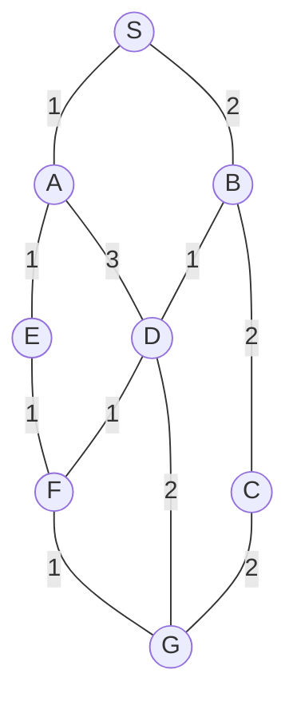

## The Question

1×1-tile grid. Start **S** (top), goal **G**. MoveGen alphabetical. Heuristic = Manhattan Distance. Tie-breaker: node labels.

| # | Question | Official answer |
|---|----------|-----------------|
| 1.1 | Best First Search path | `S,B,C,G` |
| 1.2 | A* path | `S,B,D,G` |
| 1.3 | Branch-and-Bound path | `S,A,E,F,G` |
| 1.4 | Who finds the shortest path? | **B** — Branch-and-Bound only |
| 1.5 | Admissibility | **B** — not admissible |

## The Topic in 60 Seconds

| Algorithm | Sorts OPEN by | Ignores |
|-----------|---------------|---------|
| Best First | $h(n)$ | $g(n)$ |
| A* | $f(n) = g(n) + h(n)$ | nothing |
| Branch-and-Bound | $g(n)$ | $h(n)$ |

> Deep-dive: [A* Search](/concepts/week-03-heuristic-search/01-a-star-search), [Best First Search](/concepts/week-03-heuristic-search/09-best-first-search), [Branch and Bound](/concepts/week-03-heuristic-search/05-branch-and-bound).

## Step 0 — Heuristic table (Manhattan to G)

| Node | $h$ | Node | $h$ |
|------|-----|------|-----|
| S | 4 | D | 2 |
| A | 5 | E | 5 |
| B | 2 | F | 3 |
| C | 2 | G | 0 |

## 1.1 — Best First Search → `S,B,C,G`

| Step | OPEN (node : $h$) | Pick |
|------|-------------------|------|
| 1 | S : 4 | **S** → A(5), B(2) |
| 2 | B : 2, A : 5 | **B** → D(2), C(2) |
| 3 | C : 2, D : 2, A : 5 | **C** (tie with D → label order!) |
| 4 | G : 0, D : 2, A : 5 | **G** — goal! |

Path: **S → B → C → G**. The C-vs-D tie at $h = 2$ is the whole question — labels send the search to C.

## 1.2 — A* → `S,B,D,G`

| Step | OPEN (node : $f$) | Pick |
|------|-------------------|------|
| 1 | S : 0+4 = **4** | **S** → A : 1+5 = 6, B : 2+2 = **4** |
| 2 | B : **4**, A : 6 | **B** → D : 3+2 = **5**, C : 4+2 = 6 |
| 3 | D : **5**, A : 6, C : 6 | **D** → F : 4+3 = 7, G : 5+0 = **5** |
| 4 | G : **5**, A : 6, C : 6, F : 7 | **G** — goal! |

Path: **S → B → D → G**, cost $2+1+2 = 5$. (Not optimal — see 1.5.)

## 1.3 — Branch-and-Bound → `S,A,E,F,G`

| Pop | OPEN (path : $g$) | Extend |
|-----|-------------------|--------|
| S : 0 | SA : 1, SB : 2 | |
| SA : 1 | SAE : 2, SAD : 4 | |
| SAE : 2 | SAEF : 3 | |
| SB : 2 | SBD : 3, SBC : 4 | |
| SAEF : 3 (tie with SBD — S-A before S-B) | SAEFG : **4** ← goal on queue | |
| SBD : 3 | SBDA : 4, SBDF : 5, SBDG : 5, SBDC : 5 | |
| SAEFG : **4** | all open ≥ 4 → **optimal** | |

Path: **S → A → E → F → G**, cost $1+1+1+1 = 4$ ✓ the true shortest path.

## 1.4 — Shortest path → **B (Branch-and-Bound only)**

Routes: S-A-E-F-G = **4** · S-B-D-G = 5 · S-B-C-G = 6 · S-A-D-G = 6. A* returned 5, BnB returned 4 → **B**.

## 1.5 — Admissibility → **B (not admissible)**

$h(A) = 5$ but the true cheapest cost from A is $A \to E \to F \to G = 3$ — **overestimate!** → not admissible → **B**. (Exactly why A* missed the optimal path in 1.4.)

## Interactive A* trace

<StepGraph
  height={400}
  nodeWidth={100}
  nodeHeight={50}
  nodeFontSize={13}
  legend={[
    { color: "#b45309", label: "expanding" },
    { color: "#0369a1", label: "in OPEN (f = g+h)" },
    { color: "#4b5563", label: "expanded" },
    { color: "#16a34a", label: "returned path" },
  ]}
  steps={[
    {
      label: "Init",
      note: "OPEN = { S(g=0, h=4, f=4) }",
      elements: [
        { data: { id: "S", label: "S f=4", type: "frontier" }, position: { x: 300, y: 30 } },
        { data: { id: "A", label: "A", type: "explored" }, position: { x: 120, y: 140 } },
        { data: { id: "B", label: "B", type: "explored" }, position: { x: 500, y: 140 } },
        { data: { id: "E", label: "E", type: "explored" }, position: { x: 40, y: 250 } },
        { data: { id: "D", label: "D", type: "explored" }, position: { x: 300, y: 250 } },
        { data: { id: "C", label: "C", type: "explored" }, position: { x: 580, y: 250 } },
        { data: { id: "F", label: "F", type: "explored" }, position: { x: 150, y: 360 } },
        { data: { id: "G", label: "G", type: "explored" }, position: { x: 450, y: 360 } },
        { data: { id: "e1", source: "S", target: "A", label: "1" } },
        { data: { id: "e2", source: "S", target: "B", label: "2" } },
        { data: { id: "e3", source: "A", target: "E", label: "1" } },
        { data: { id: "e4", source: "A", target: "D", label: "3" } },
        { data: { id: "e5", source: "B", target: "D", label: "1" } },
        { data: { id: "e6", source: "B", target: "C", label: "2" } },
        { data: { id: "e7", source: "E", target: "F", label: "1" } },
        { data: { id: "e8", source: "D", target: "F", label: "1" } },
        { data: { id: "e9", source: "D", target: "G", label: "2" } },
        { data: { id: "e10", source: "C", target: "G", label: "2" } },
        { data: { id: "e11", source: "F", target: "G", label: "1" } },
      ],
    },
    {
      label: "Expand S",
      note: "A: g=1, h=5 → f=6\nB: g=2, h=2 → f=4\nOPEN = { B(4), A(6) }",
      elements: [
        { data: { id: "S", label: "S", type: "explored" }, position: { x: 300, y: 30 } },
        { data: { id: "A", label: "A f=6", type: "frontier" }, position: { x: 120, y: 140 } },
        { data: { id: "B", label: "B f=4", type: "frontier" }, position: { x: 500, y: 140 } },
        { data: { id: "E", label: "E", type: "explored" }, position: { x: 40, y: 250 } },
        { data: { id: "D", label: "D", type: "explored" }, position: { x: 300, y: 250 } },
        { data: { id: "C", label: "C", type: "explored" }, position: { x: 580, y: 250 } },
        { data: { id: "F", label: "F", type: "explored" }, position: { x: 150, y: 360 } },
        { data: { id: "G", label: "G", type: "explored" }, position: { x: 450, y: 360 } },
        { data: { id: "e1", source: "S", target: "A", label: "1" } },
        { data: { id: "e2", source: "S", target: "B", label: "2" } },
        { data: { id: "e3", source: "A", target: "E", label: "1" } },
        { data: { id: "e4", source: "A", target: "D", label: "3" } },
        { data: { id: "e5", source: "B", target: "D", label: "1" } },
        { data: { id: "e6", source: "B", target: "C", label: "2" } },
        { data: { id: "e7", source: "E", target: "F", label: "1" } },
        { data: { id: "e8", source: "D", target: "F", label: "1" } },
        { data: { id: "e9", source: "D", target: "G", label: "2" } },
        { data: { id: "e10", source: "C", target: "G", label: "2" } },
        { data: { id: "e11", source: "F", target: "G", label: "1" } },
      ],
    },
    {
      label: "Expand B",
      note: "Pick B (f=4).\nD: g=3, h=2 → f=5\nC: g=4, h=2 → f=6\nOPEN = { D(5), A(6), C(6) }",
      elements: [
        { data: { id: "S", label: "S", type: "explored" }, position: { x: 300, y: 30 } },
        { data: { id: "A", label: "A f=6", type: "frontier" }, position: { x: 120, y: 140 } },
        { data: { id: "B", label: "B", type: "current" }, position: { x: 500, y: 140 } },
        { data: { id: "E", label: "E", type: "explored" }, position: { x: 40, y: 250 } },
        { data: { id: "D", label: "D f=5", type: "frontier" }, position: { x: 300, y: 250 } },
        { data: { id: "C", label: "C f=6", type: "frontier" }, position: { x: 580, y: 250 } },
        { data: { id: "F", label: "F", type: "explored" }, position: { x: 150, y: 360 } },
        { data: { id: "G", label: "G", type: "explored" }, position: { x: 450, y: 360 } },
        { data: { id: "e1", source: "S", target: "A", label: "1" } },
        { data: { id: "e2", source: "S", target: "B", label: "2" } },
        { data: { id: "e3", source: "A", target: "E", label: "1" } },
        { data: { id: "e4", source: "A", target: "D", label: "3" } },
        { data: { id: "e5", source: "B", target: "D", label: "1" } },
        { data: { id: "e6", source: "B", target: "C", label: "2" } },
        { data: { id: "e7", source: "E", target: "F", label: "1" } },
        { data: { id: "e8", source: "D", target: "F", label: "1" } },
        { data: { id: "e9", source: "D", target: "G", label: "2" } },
        { data: { id: "e10", source: "C", target: "G", label: "2" } },
        { data: { id: "e11", source: "F", target: "G", label: "1" } },
      ],
    },
    {
      label: "Expand D",
      note: "Pick D (f=5).\nF: g=4, h=3 → f=7\nG: g=5, h=0 → f=5\nOPEN = { G(5), A(6), C(6), F(7) }",
      elements: [
        { data: { id: "S", label: "S", type: "explored" }, position: { x: 300, y: 30 } },
        { data: { id: "A", label: "A f=6", type: "frontier" }, position: { x: 120, y: 140 } },
        { data: { id: "B", label: "B", type: "explored" }, position: { x: 500, y: 140 } },
        { data: { id: "E", label: "E", type: "explored" }, position: { x: 40, y: 250 } },
        { data: { id: "D", label: "D", type: "current" }, position: { x: 300, y: 250 } },
        { data: { id: "C", label: "C f=6", type: "frontier" }, position: { x: 580, y: 250 } },
        { data: { id: "F", label: "F f=7", type: "frontier" }, position: { x: 150, y: 360 } },
        { data: { id: "G", label: "G f=5", type: "frontier" }, position: { x: 450, y: 360 } },
        { data: { id: "e1", source: "S", target: "A", label: "1" } },
        { data: { id: "e2", source: "S", target: "B", label: "2" } },
        { data: { id: "e3", source: "A", target: "E", label: "1" } },
        { data: { id: "e4", source: "A", target: "D", label: "3" } },
        { data: { id: "e5", source: "B", target: "D", label: "1" } },
        { data: { id: "e6", source: "B", target: "C", label: "2" } },
        { data: { id: "e7", source: "E", target: "F", label: "1" } },
        { data: { id: "e8", source: "D", target: "F", label: "1" } },
        { data: { id: "e9", source: "D", target: "G", label: "2" } },
        { data: { id: "e10", source: "C", target: "G", label: "2" } },
        { data: { id: "e11", source: "F", target: "G", label: "1" } },
      ],
    },
    {
      label: "Goal: S,B,D,G",
      note: "Pick G (f=5) → GOAL.\nPath: S,B,D,G   cost = 2+1+2 = 5\nNot optimal! h(A)=5 overestimates h*(A)=3 (see 1.5).\nBnB finds the real shortest: S,A,E,F,G = 4.",
      elements: [
        { data: { id: "S", label: "S", type: "path" }, position: { x: 300, y: 30 } },
        { data: { id: "A", label: "A", type: "explored" }, position: { x: 120, y: 140 } },
        { data: { id: "B", label: "B", type: "path" }, position: { x: 500, y: 140 } },
        { data: { id: "E", label: "E", type: "explored" }, position: { x: 40, y: 250 } },
        { data: { id: "D", label: "D", type: "path" }, position: { x: 300, y: 250 } },
        { data: { id: "C", label: "C", type: "explored" }, position: { x: 580, y: 250 } },
        { data: { id: "F", label: "F", type: "explored" }, position: { x: 150, y: 360 } },
        { data: { id: "G", label: "G ✓", type: "goal" }, position: { x: 450, y: 360 } },
        { data: { id: "e1", source: "S", target: "A", label: "1" } },
        { data: { id: "e2", source: "S", target: "B", label: "2", type: "path" } },
        { data: { id: "e3", source: "A", target: "E", label: "1" } },
        { data: { id: "e4", source: "A", target: "D", label: "3" } },
        { data: { id: "e5", source: "B", target: "D", label: "1", type: "path" } },
        { data: { id: "e6", source: "B", target: "C", label: "2" } },
        { data: { id: "e7", source: "E", target: "F", label: "1" } },
        { data: { id: "e8", source: "D", target: "F", label: "1" } },
        { data: { id: "e9", source: "D", target: "G", label: "2", type: "path" } },
        { data: { id: "e10", source: "C", target: "G", label: "2" } },
        { data: { id: "e11", source: "F", target: "G", label: "1" } },
      ],
    },
  ]}
/>

## Tricks & Tips

<Accordion title="Exam shortcuts">
1. h-table first — here the **C/D tie at h = 2** decides 1.1; labels pick C.
2. A* = sort by g+h; BnB = sort by g on full paths.
3. 1.4/1.5 agree: A* suboptimal ⇒ h inadmissible. Find the overestimated node (A: h=5 vs true 3).
</Accordion>

**Answers:** 1.1 `S,B,C,G` · 1.2 `S,B,D,G` · 1.3 `S,A,E,F,G` · 1.4 **B** · 1.5 **B**
