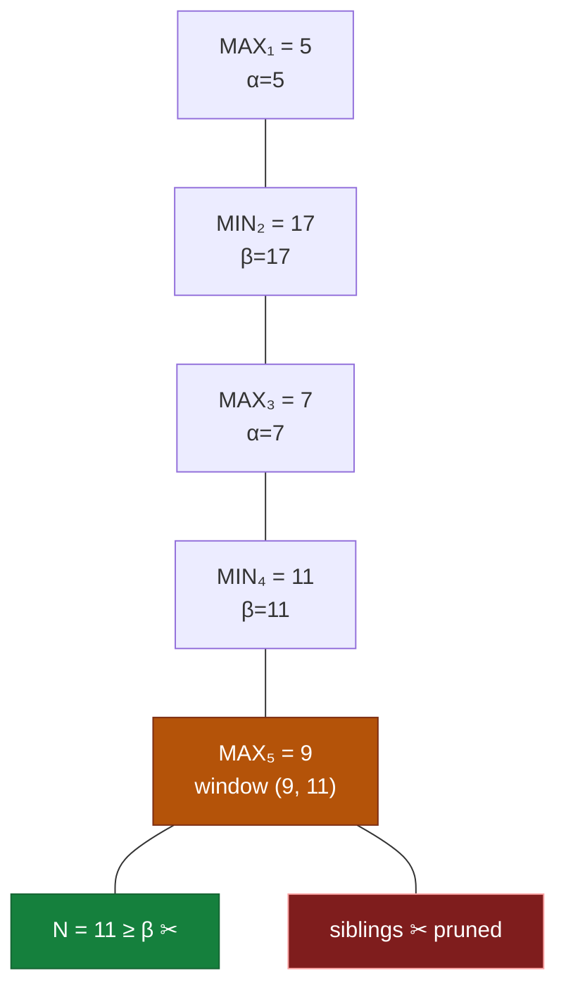

## The Question

Alpha-Beta is mid-flight on a MAX-root tree. Evals along the current path (root → N): **5, 17, 7, 11, 9, N** — all odd, $0 < n < 15$.

| # | Question | Official answer |
|---|----------|-----------------|
| 2.1 | Eval of N that induces a cutoff (pruning N's siblings) | `11` |
| 2.2 | Type of cutoff | **B** — Beta cutoff |

## The Topic in 60 Seconds

Levels alternate from the MAX root: MAX(5) → MIN(17) → MAX(7) → MIN(11) → MAX(9) → **N**.

The window slides down the path:

- $\alpha(\text{MAX}_1) = 5$
- $\beta(\text{MIN}_2) = 17$
- $\alpha(\text{MAX}_3) = \max(5, 7) = 7$
- $\beta(\text{MIN}_4) = \min(17, 11) = 11$
- $\alpha(\text{MAX}_5) = \max(7, 9) = 9$

**N is a child of MAX₅**, whose window is $(\alpha, \beta) = (9, 11)$.

> Deep-dive: [Alpha-Beta Pruning](/concepts/week-07-game-search/02-alpha-beta-pruning).

## 2.1 — The cutoff value → `11`

A cutoff at MAX₅ fires the moment a child's value reaches $\beta = 11$ (equal counts!). N must satisfy:

$$N \ge \beta = 11, \qquad N \text{ odd}, \quad 0 < N < 15$$

Candidates: 11, 13. The cutoff value is the **boundary** — the smallest eval that triggers the prune: **N = 11** ✓

## 2.2 — Cutoff type → **B (Beta cutoff)**

The cutoff happens at **MAX₅** — a MAX node hitting $\beta$. Per the course convention:

| value reached | node type | cutoff name |
|---------------|-----------|-------------|
| $\ge \beta$ | MAX | **β-cutoff** ✓ |
| $\le \alpha$ | MIN | α-cutoff |

→ **Beta cutoff** ✓

## Tricks & Tips

<Accordion title="Fast method">
1. **Write the window at each path node** — alternate α (MAX) / β (MIN), each tightening: α = max(α, eval), β = min(β, eval).
2. **N's parent type decides everything**: child of MAX → need $N \ge \beta$ (β-cutoff); child of MIN → need $N \le \alpha$ (α-cutoff).
3. Pick the **boundary value** (smallest that triggers) — that's always the keyed answer.
4. Sanity check: the cutoff prunes N's *siblings*, i.e. the rest of MAX₅'s children.
</Accordion>

**Answers:** 2.1 `11` · 2.2 **B (Beta cutoff)**
