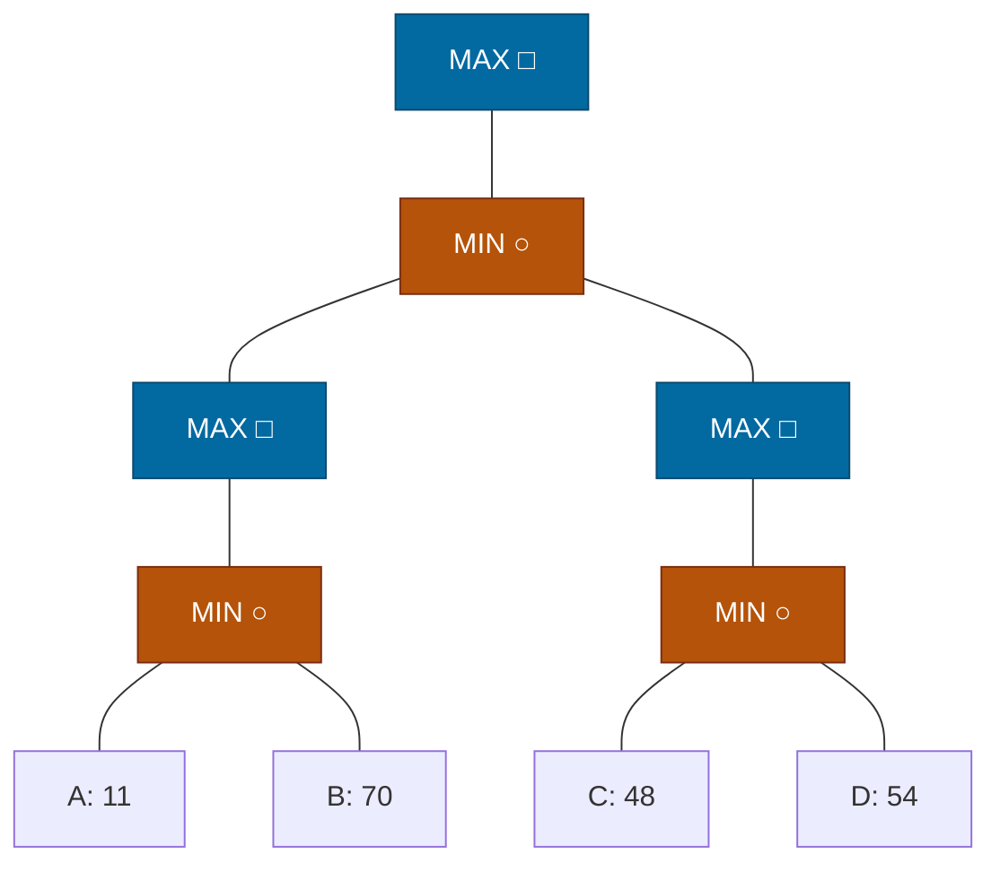

## The Question

Squares = MAX, circles = MIN. Horizon nodes A–D. Tie-breaker: deepest, then leftmost.

| # | Question | Official answer |
|---|----------|-----------------|
| 3.1 | Horizon nodes assigned SOLVED | `A,B,C,D` |
| 3.2 | Horizon nodes pruned (removed from queue by a MAX-ancestor) | `NIL` |

## The Topic in 60 Seconds

The course's SSS\* loop: process the highest-merit node —
- **LIVE leaf** → mark SOLVED with its eval.
- **LIVE MAX** → insert **all** children; **LIVE MIN** → insert **first child only**.
- **SOLVED node**: MAX parent → parent SOLVED once **all** its children are solved (**purge** any leftover siblings from OPEN); MIN parent → update merit and insert the **next** sibling.

> Deep-dive: [SSS*](/concepts/week-03-heuristic-search/03-sss-star), [Game Strategies](/concepts/week-07-game-search/03-game-strategies).

## The trace — everyone gets solved

Backups first (**MIN circles take minima, MAX squares take maxima**):

$$C_1 = \min(11, 70) = 11 \qquad C_2 = \min(48, 54) = 48$$
$$SQ_1 = C_1 = 11 \ (\text{only child}) \qquad SQ_2 = C_2 = 48$$
$$N = \min(SQ_1, SQ_2) = \min(11, 48) = 11 \qquad \text{Root} = \max(N) = \mathbf{11}$$

| Step | Processed | Effect |
|------|-----------|--------|
| 1 | Root (LIVE MAX, ∞) | insert N (∞). OPEN = \{ N(∞) \} |
| 2 | N (LIVE MIN, ∞) | insert first child SQ1 (∞). OPEN = \{ SQ1(∞) \} |
| 3 | SQ1 (LIVE MAX, ∞) | insert all children → C1 (∞). OPEN = \{ C1(∞) \} |
| 4 | C1 (LIVE MIN, ∞) | insert first child A (∞). OPEN = \{ A(∞) \} |
| 5 | A (leaf) | **A SOLVED = 11** |
| 6 | A SOLVED → C1 (MIN parent) | merit ← min(∞, 11) = 11; insert next sibling **B (LIVE, 11)**. OPEN = \{ B(11) \} |
| 7 | B (leaf, merit 11 — highest in OPEN) | **B SOLVED = 70** |
| 8 | B SOLVED → C1 (MIN) | both children solved → **C₁ SOLVED = min(11, 70) = 11** |
| 9 | C1 SOLVED → SQ1 (MAX) | only child → **SQ₁ SOLVED = 11**, nothing to purge |
| 10 | SQ1 SOLVED → N (MIN) | merit ← 11; insert next child **SQ2 (LIVE, 11)**. OPEN = \{ SQ2(11) \} |
| 11 | SQ2 (LIVE MAX, 11) | insert all children → C2 (LIVE, 11) |
| 12 | C2 (LIVE MIN, 11) | insert first child C (LIVE, 11) |
| 13 | C (leaf) | **C SOLVED = 48** |
| 14 | C SOLVED → C2 (MIN) | merit stays 11; insert sibling **D (LIVE, 11)** |
| 15 | D (leaf, 11) | **D SOLVED = 54** |
| 16 | D SOLVED → C2 (MIN) | both solved → **C₂ SOLVED = min(48, 54) = 48** |
| 17 | C2 SOLVED → SQ2 (MAX) | only child → **SQ₂ SOLVED = 48** |
| 18 | SQ2 SOLVED → N (MIN) | both children solved → **N SOLVED = min(11, 48) = 11** |
| 19 | N SOLVED → Root (MAX) | only child → **Root SOLVED = 11**. Done |

The key structural fact: N and both SQ nodes are **only children**, so SSS* simply walks the chain — left line first (A at step 5, B at step 7), across to the right line once N demands its second subtree (steps 10–15), then back up. Nothing is ever pruned because no MAX node ever has a second branch sitting in OPEN when it resolves. **Every leaf is assigned SOLVED: A, B, C, D** ✓

Interactive trace — watch the queue walk the chain (squares = MAX, circles = MIN):

<PaperTrace
  height={420}
  nodeWidth={92}
  nodeHeight={52}
  nodeFontSize={11}
  legend={[
    { color: "#b45309", label: "processing now" },
    { color: "#0369a1", label: "waiting in OPEN" },
    { color: "#15803d", label: "SOLVED" },
    { color: "#334155", label: "not yet reached" },
  ]}
  nodes={[
    { id: "R", label: "R □", x: 400, y: 20, kind: "terminal" },
    { id: "N", label: "N ○", x: 400, y: 105, kind: "terminal" },
    { id: "SQ1", label: "SQ₁ □", x: 210, y: 190, kind: "terminal" },
    { id: "SQ2", label: "SQ₂ □", x: 590, y: 190, kind: "terminal" },
    { id: "C1", label: "C₁ ○", x: 110, y: 275, kind: "terminal" },
    { id: "C2", label: "C₂ ○", x: 500, y: 275, kind: "terminal" },
    { id: "A", label: "A: 11", x: 35, y: 360, kind: "terminal" },
    { id: "B", label: "B: 70", x: 185, y: 360, kind: "terminal" },
    { id: "C", label: "C: 48", x: 430, y: 360, kind: "terminal" },
    { id: "D", label: "D: 54", x: 575, y: 360, kind: "terminal" },
  ]}
  edges={[
    { id: "x1", from: "R", to: "N" },
    { id: "x2", from: "N", to: "SQ1" },
    { id: "x3", from: "N", to: "SQ2" },
    { id: "x4", from: "SQ1", to: "C1" },
    { id: "x5", from: "SQ2", to: "C2" },
    { id: "x6", from: "C1", to: "A" },
    { id: "x7", from: "C1", to: "B" },
    { id: "x8", from: "C2", to: "C" },
    { id: "x9", from: "C2", to: "D" },
  ]}
  steps={[
    {
      label: "1 · insert N",
      note: "Root (LIVE MAX) → insert its child.\nOPEN = { N(∞) }",
      nodes: { R: "current", N: "frontier" },
    },
    {
      label: "2 · dive left",
      note: "N (LIVE MIN): insert FIRST child SQ1(∞)\nSQ1 (LIVE MAX): insert C1(∞)\nC1 (LIVE MIN): insert FIRST child A(∞)\nOPEN = { A(∞) }",
      nodes: { R: "explored", N: "explored", SQ1: "explored", C1: "explored", A: "frontier" },
    },
    {
      label: "3 · A SOLVED = 11",
      note: "A is a LIVE leaf → mark SOLVED with eval 11.",
      nodes: { R: "explored", N: "explored", SQ1: "explored", C1: "explored", A: "path" },
    },
    {
      label: "4 · insert B (11)",
      note: "A SOLVED → parent C1 (MIN):\nmerit ← min(∞, 11) = 11; insert next sibling B(LIVE, 11).\nOPEN = { B(11) } — nothing else!",
      nodes: { R: "explored", N: "explored", SQ1: "explored", C1: "frontier", A: "path", B: "frontier" },
    },
    {
      label: "5 · B SOLVED = 70",
      note: "Highest merit = B(11) → LIVE leaf → SOLVED 70.\n(C₁'s true value becomes min(11, 70) = 11.)",
      nodes: { R: "explored", N: "explored", SQ1: "explored", C1: "frontier", A: "path", B: "path" },
    },
    {
      label: "6 · left line resolves",
      note: "C1: all children solved → SOLVED min(11, 70) = 11\nSQ1 (MAX, only child): SOLVED 11 — no siblings to purge.",
      nodes: { R: "explored", N: "explored", SQ1: "path", C1: "path", A: "path", B: "path" },
    },
    {
      label: "7 · N inserts SQ2 (11)",
      note: "SQ1 SOLVED → parent N (MIN):\nmerit ← min(∞, 11) = 11; insert next child SQ2(LIVE, 11).\nSQ2 (MAX) → C2(11); C2 (MIN) → first child C(11).",
      nodes: { N: "frontier", SQ1: "path", C1: "path", A: "path", B: "path", SQ2: "explored", C2: "explored", C: "frontier" },
    },
    {
      label: "8 · C and D solved",
      note: "C (leaf) → SOLVED 48; sibling D inserted (11).\nD (leaf) → SOLVED 54.\nC2: all children solved → SOLVED min(48, 54) = 48.",
      nodes: { N: "frontier", SQ1: "path", C1: "path", A: "path", B: "path", SQ2: "explored", C2: "path", C: "path", D: "path" },
    },
    {
      label: "9 · Root = 11 ✓ done",
      note: "C2 SOLVED → SQ2 (only child) → SOLVED 48.\nSQ2 → N: both subtrees done → N = min(11, 48) = 11 SOLVED.\nN → Root → SOLVED 11.\nSOLVED leaves: A, B, C, D. Pruned: NIL.",
      nodes: { R: "path", N: "path", SQ1: "path", C1: "path", A: "path", B: "path", SQ2: "path", C2: "path", C: "path", D: "path" },
    },
  ]}
/>

## 3.2 — Pruned → `NIL`

A MAX-ancestor purge happens when a MAX node is solved while **siblings still sit in OPEN**. Here: SQ1 and SQ2 are *only* children; N is an only child. Nobody gets purged → **NIL** ✓

<Callout type="tip" title="Why nothing is pruned">
The tree is a single chain of only-children — there are no alternative branches for a MAX node to discard. Compare with the FN paper's version of this question, where the root has two MIN children and the cheap left line lets MAX purge the other side.
</Callout>

## Tricks & Tips

<Accordion title="Fast method">
1. Draw the tree with shapes first — the MIN "insert first child only" rule is what makes SSS* dive left.
2. Track OPEN as (node, LIVE/SOLVED, merit); a SOLVED leaf under a MIN parent inserts its sibling with merit = min(parent merit, eval).
3. "Pruned by MAX-ancestor" = purged siblings. Only-children chains ⇒ nothing to purge ⇒ NIL.
4. The minimax value here = min over everything = 11 (the single MIN under the root minifies the entire tree).
</Accordion>

**Answers:** 3.1 `A,B,C,D` · 3.2 `NIL`
