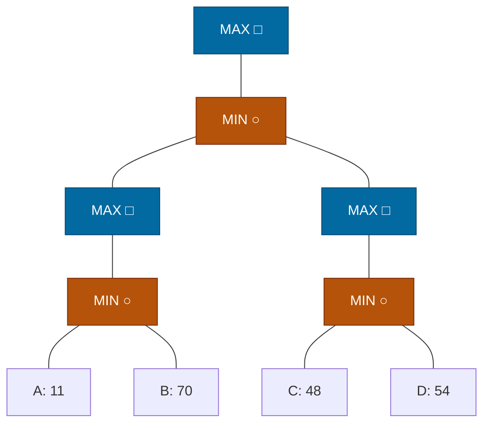

## The Question

Squares = MAX, circles = MIN. Horizon nodes A–D. Tie-breaker: deepest, then leftmost.

| # | Question | Official answer |
|---|----------|-----------------|
| 3.1 | Horizon nodes assigned SOLVED | `A,B,C,D` |
| 3.2 | Horizon nodes pruned (removed from queue by a MAX-ancestor) | `NIL` |

## The Topic in 60 Seconds

The course's SSS\* loop: process the highest-merit node —
- **LIVE leaf** → mark SOLVED with its eval.
- **LIVE MAX** → insert **all** children; **LIVE MIN** → insert **first child only**.
- **SOLVED node**: MAX parent → parent SOLVED, **purge siblings** from OPEN; MIN parent → update merit, insert next sibling when all children solved.

> Deep-dive: [SSS*](/concepts/week-03-heuristic-search/03-sss-star), [Game Strategies](/concepts/week-07-game-search/03-game-strategies).

## The trace — everyone gets solved

Backups: $C_1 = \min(11, 70) = 11$; $C_2 = \min(48, 54) = 48$; $SQ_1 = 11$; $SQ_2 = 48$; $N = \min(11, 48) = 11$; Root $= \mathbf{11}$.

| Step | Processed | Effect |
|------|-----------|--------|
| 1 | Root (LIVE MAX) | insert N (∞) |
| 2 | N (LIVE MIN, ∞) | insert first child SQ1 (∞) |
| 3 | SQ1 (LIVE MAX, ∞) | insert C1 (∞) |
| 4 | C1 (LIVE MIN, ∞) | insert first child A (∞) |
| 5 | A (leaf) | **A SOLVED = 11** |
| 6 | A SOLVED → C1 (MIN) | merit 11; insert sibling B (LIVE, 11) |
| 7 | N2-subtree has merit ∞ > 11 → process SQ2 line | C2 → C → **C SOLVED = 48**; D inserted (48) |
| 8 | D (leaf, 48) | **D SOLVED = 54** |
| 9 | D SOLVED → C2 (MIN) | all children solved → C2 SOLVED 48 |
| 10 | C2 SOLVED → SQ2 (MAX) | SQ2 SOLVED 48 (no siblings to purge) |
| 11 | SQ2 SOLVED → N (MIN) | all children solved → N SOLVED = min(11, 48) = 11 |
| 12 | N SOLVED → Root (MAX) | Root SOLVED = 11. **Done.** |

Back at step 6–7: B sat in OPEN with merit 11 while the ∞-merit right side was processed — and when N was solved, B was evaluated too (its 70 completes $C_1 = \min(11, 70)$). **Every leaf is assigned SOLVED: A, B, C, D** ✓

## 3.2 — Pruned → `NIL`

A MAX-ancestor purge happens when a MAX node is solved while **siblings still sit in OPEN**. Here: SQ1 and SQ2 are *only* children; N is an only child. Nobody gets purged → **NIL** ✓

<Callout type="tip" title="Why nothing is pruned">
The tree is a single chain of only-children — there are no alternative branches for a MAX node to discard. Compare with the FN paper's version of this question, where the root has two MIN children and the cheap left line lets MAX purge the other side.
</Callout>

## Tricks & Tips

<Accordion title="Fast method">
1. Draw the tree with shapes first — the MIN "insert first child only" rule is what makes SSS* dive left.
2. Track OPEN as (node, LIVE/SOLVED, merit); a SOLVED leaf under a MIN parent inserts its sibling with merit = min(parent merit, eval).
3. "Pruned by MAX-ancestor" = purged siblings. Only-children chains ⇒ nothing to purge ⇒ NIL.
4. The minimax value here = min over everything = 11 (the single MIN under the root minifies the entire tree).
</Accordion>

**Answers:** 3.1 `A,B,C,D` · 3.2 `NIL`
