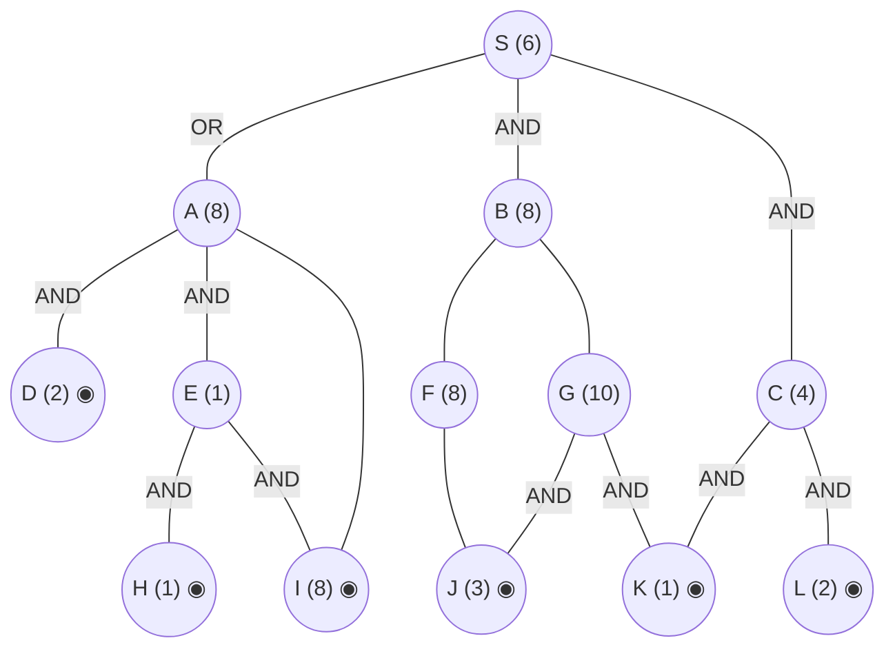

## The Question

AND–OR decomposition. Double circles = primitive. Every edge costs **2**. Tie-breakers: node labels; AND nodes expand the **highest-cost unsolved branch** first.

AND arcs: **S** = AND(B, C) *or* OR(A). **A** = AND(D, E) *or* OR(I). **E** = AND(H, I). **B** = OR(F, G). **G** = AND(J, K). **C** = AND(K, L). Primitives: D, H, I, J, K, L.

| # | Question | Official answer |
|---|----------|-----------------|
| 4.1 | Nodes expanded | `S,A,D,E` (also `A,D,E`) |
| 4.2 | Value of S after each expansion | `10,9,10,12` (also `9,10,12`) |
| 4.3 | Conclusion about the heuristic | **B** — inadmissible |

## The Topic in 60 Seconds

AO* = expand along **marked arcs** + revise (OR: min child+edge; AND: sum children+edges). Markers switch when refined costs overtake rivals. Primitive children make a node instantly SOLVED.

> Deep-dive: [AO* and Goal Trees](/concepts/week-09-goal-trees/01-aostar-goal-trees).

## The Trace

h: S=6, A=8, B=8, C=4, E=1, F=8, G=10; D=2, H=1, I=8, J=3, K=1, L=2 primitive. Edge = 2.

**Expansion 1 — S.**
- AND(B, C): $(8+2)+(4+2) = 16$
- OR(A): $8+2 = 10$

Mark OR(A) → **S = 10** ✓

**Expansion 2 — A.**
- AND(D, E): $(2+2)+(1+2) = 7$
- OR(I): $8+2 = 10$

Mark AND(D, E) → **A = 7** → $S = \min(16, 9) = \mathbf{9}$ ✓

**Expansion 3 — D** (marked path S→A→D,E; costliest branch D(2) first). D is **primitive** → immediately SOLVED (no cost change — the paper counts this selection step, giving the third value).

**Expansion 4 — E.**
E: AND(H, I) $= (1+2)+(8+2) = 13$; H, I primitive → **E = 13, SOLVED**.
Propagate: AND(D, E) $= (2+2)+(13+2) = 19$ — now worse than OR(I) $= 10$! Marker flips:
$$A = \min(19, 10) = \mathbf{10} \text{ via primitive } I \Rightarrow \text{A SOLVED}$$
$$S = \min(16,\ 10+2) = \mathbf{12} \Rightarrow \text{S SOLVED} ✓$$

**Final value of S = 12.** Solution subtree: S → A → I.

Interactive trace:

<StepGraph
  height={430}
  nodeWidth={100}
  nodeHeight={50}
  nodeFontSize={12}
  legend={[
    { color: "#b45309", label: "expanding now" },
    { color: "#0369a1", label: "live on marked path" },
    { color: "#52525b", label: "primitive (born SOLVED)" },
    { color: "#16a34a", label: "marked arcs" },
  ]}
  steps={[
    {
      label: "0 · setup",
      note: "h: S=6, A=8, B=8, C=4, E=1, F=8, G=10; D=2, H=1, I=8, J=3, K=1, L=2 primitive. Edge = 2.\nS: AND(B,C) = (8+2)+(4+2) = 16 | OR(A) = 8+2 = 10 → mark OR(A). S = 10",
      elements: [
        { data: { id: "S", label: "S =10", type: "frontier" }, position: { x: 400, y: 20 } },
        { data: { id: "A", label: "A 8 ←marked", type: "frontier" }, position: { x: 150, y: 130 } },
        { data: { id: "B", label: "B 8", type: "explored" }, position: { x: 400, y: 130 } },
        { data: { id: "C", label: "C 4", type: "explored" }, position: { x: 650, y: 130 } },
        { data: { id: "D", label: "D 2", type: "primitive" }, position: { x: 60, y: 240 } },
        { data: { id: "E", label: "E 1", type: "frontier" }, position: { x: 220, y: 240 } },
        { data: { id: "I", label: "I 8", type: "primitive" }, position: { x: 380, y: 240 } },
        { data: { id: "H", label: "H 1", type: "primitive" }, position: { x: 300, y: 350 } },
        { data: { id: "F", label: "F 8", type: "explored" }, position: { x: 520, y: 240 } },
        { data: { id: "G", label: "G 10", type: "explored" }, position: { x: 640, y: 240 } },
        { data: { id: "J", label: "J 3", type: "primitive" }, position: { x: 580, y: 350 } },
        { data: { id: "K", label: "K 1", type: "primitive" }, position: { x: 720, y: 350 } },
        { data: { id: "L", label: "L 2", type: "primitive" }, position: { x: 850, y: 240 } },
        { data: { id: "e1", source: "S", target: "A", label: "OR", type: "path" } },
        { data: { id: "e2", source: "S", target: "B", label: "AND" } },
        { data: { id: "e3", source: "S", target: "C", label: "AND" } },
        { data: { id: "e4", source: "A", target: "D", label: "AND" } },
        { data: { id: "e5", source: "A", target: "E", label: "AND", type: "path" } },
        { data: { id: "e6", source: "A", target: "I", label: "OR" } },
        { data: { id: "e7", source: "E", target: "H", label: "AND" } },
        { data: { id: "e8", source: "E", target: "I", label: "AND" } },
        { data: { id: "e9", source: "B", target: "F" } },
        { data: { id: "e10", source: "B", target: "G" } },
        { data: { id: "e11", source: "F", target: "J" } },
        { data: { id: "e12", source: "G", target: "J", label: "AND" } },
        { data: { id: "e13", source: "G", target: "K", label: "AND" } },
        { data: { id: "e14", source: "C", target: "K", label: "AND" } },
        { data: { id: "e15", source: "C", target: "L", label: "AND" } },
      ],
    },
    {
      label: "1 · expand S → 10",
      note: "Marked path: A. Expand A next.",
      elements: [
        { data: { id: "S", label: "S =10", type: "explored" }, position: { x: 400, y: 20 } },
        { data: { id: "A", label: "A 8", type: "current" }, position: { x: 150, y: 130 } },
        { data: { id: "B", label: "B 8", type: "explored" }, position: { x: 400, y: 130 } },
        { data: { id: "C", label: "C 4", type: "explored" }, position: { x: 650, y: 130 } },
        { data: { id: "D", label: "D 2", type: "primitive" }, position: { x: 60, y: 240 } },
        { data: { id: "E", label: "E 1", type: "frontier" }, position: { x: 220, y: 240 } },
        { data: { id: "I", label: "I 8", type: "primitive" }, position: { x: 380, y: 240 } },
        { data: { id: "H", label: "H 1", type: "primitive" }, position: { x: 300, y: 350 } },
        { data: { id: "F", label: "F 8", type: "explored" }, position: { x: 520, y: 240 } },
        { data: { id: "G", label: "G 10", type: "explored" }, position: { x: 640, y: 240 } },
        { data: { id: "J", label: "J 3", type: "primitive" }, position: { x: 580, y: 350 } },
        { data: { id: "K", label: "K 1", type: "primitive" }, position: { x: 720, y: 350 } },
        { data: { id: "L", label: "L 2", type: "primitive" }, position: { x: 850, y: 240 } },
        { data: { id: "e1", source: "S", target: "A", label: "OR", type: "path" } },
        { data: { id: "e2", source: "S", target: "B", label: "AND" } },
        { data: { id: "e3", source: "S", target: "C", label: "AND" } },
        { data: { id: "e4", source: "A", target: "D", label: "AND" } },
        { data: { id: "e5", source: "A", target: "E", label: "AND", type: "path" } },
        { data: { id: "e6", source: "A", target: "I", label: "OR" } },
        { data: { id: "e7", source: "E", target: "H", label: "AND" } },
        { data: { id: "e8", source: "E", target: "I", label: "AND" } },
        { data: { id: "e9", source: "B", target: "F" } },
        { data: { id: "e10", source: "B", target: "G" } },
        { data: { id: "e11", source: "F", target: "J" } },
        { data: { id: "e12", source: "G", target: "J", label: "AND" } },
        { data: { id: "e13", source: "G", target: "K", label: "AND" } },
        { data: { id: "e14", source: "C", target: "K", label: "AND" } },
        { data: { id: "e15", source: "C", target: "L", label: "AND" } },
      ],
    },
    {
      label: "2 · expand A → 9",
      note: "A: AND(D,E) = (2+2)+(1+2) = 7 | OR(I) = 8+2 = 10 → mark AND(D,E).\nA = 7 → S = min(16, 7+2) = 9.\nMarked path: D(2), E(1) → costliest branch D first.",
      elements: [
        { data: { id: "S", label: "S =9", type: "current" }, position: { x: 400, y: 20 } },
        { data: { id: "A", label: "A =7", type: "explored" }, position: { x: 150, y: 130 } },
        { data: { id: "B", label: "B 8", type: "explored" }, position: { x: 400, y: 130 } },
        { data: { id: "C", label: "C 4", type: "explored" }, position: { x: 650, y: 130 } },
        { data: { id: "D", label: "D 2", type: "current" }, position: { x: 60, y: 240 } },
        { data: { id: "E", label: "E 1", type: "frontier" }, position: { x: 220, y: 240 } },
        { data: { id: "I", label: "I 8", type: "primitive" }, position: { x: 380, y: 240 } },
        { data: { id: "H", label: "H 1", type: "primitive" }, position: { x: 300, y: 350 } },
        { data: { id: "F", label: "F 8", type: "explored" }, position: { x: 520, y: 240 } },
        { data: { id: "G", label: "G 10", type: "explored" }, position: { x: 640, y: 240 } },
        { data: { id: "J", label: "J 3", type: "primitive" }, position: { x: 580, y: 350 } },
        { data: { id: "K", label: "K 1", type: "primitive" }, position: { x: 720, y: 350 } },
        { data: { id: "L", label: "L 2", type: "primitive" }, position: { x: 850, y: 240 } },
        { data: { id: "e1", source: "S", target: "A", label: "OR", type: "path" } },
        { data: { id: "e2", source: "S", target: "B", label: "AND" } },
        { data: { id: "e3", source: "S", target: "C", label: "AND" } },
        { data: { id: "e4", source: "A", target: "D", label: "AND", type: "path" } },
        { data: { id: "e5", source: "A", target: "E", label: "AND", type: "path" } },
        { data: { id: "e6", source: "A", target: "I", label: "OR" } },
        { data: { id: "e7", source: "E", target: "H", label: "AND" } },
        { data: { id: "e8", source: "E", target: "I", label: "AND" } },
        { data: { id: "e9", source: "B", target: "F" } },
        { data: { id: "e10", source: "B", target: "G" } },
        { data: { id: "e11", source: "F", target: "J" } },
        { data: { id: "e12", source: "G", target: "J", label: "AND" } },
        { data: { id: "e13", source: "G", target: "K", label: "AND" } },
        { data: { id: "e14", source: "C", target: "K", label: "AND" } },
        { data: { id: "e15", source: "C", target: "L", label: "AND" } },
      ],
    },
    {
      label: "3 · D selected (primitive)",
      note: "D is primitive → SOLVED immediately, no cost change.\nAND(D,E) = (2+2)+(1+2) = 7 still; S stays 9.\nNext branch on the marked path: E.",
      elements: [
        { data: { id: "S", label: "S =9", type: "current" }, position: { x: 400, y: 20 } },
        { data: { id: "A", label: "A =7", type: "explored" }, position: { x: 150, y: 130 } },
        { data: { id: "B", label: "B 8", type: "explored" }, position: { x: 400, y: 130 } },
        { data: { id: "C", label: "C 4", type: "explored" }, position: { x: 650, y: 130 } },
        { data: { id: "D", label: "D 2 ✓", type: "primitive" }, position: { x: 60, y: 240 } },
        { data: { id: "E", label: "E 1", type: "current" }, position: { x: 220, y: 240 } },
        { data: { id: "I", label: "I 8", type: "primitive" }, position: { x: 380, y: 240 } },
        { data: { id: "H", label: "H 1", type: "primitive" }, position: { x: 300, y: 350 } },
        { data: { id: "F", label: "F 8", type: "explored" }, position: { x: 520, y: 240 } },
        { data: { id: "G", label: "G 10", type: "explored" }, position: { x: 640, y: 240 } },
        { data: { id: "J", label: "J 3", type: "primitive" }, position: { x: 580, y: 350 } },
        { data: { id: "K", label: "K 1", type: "primitive" }, position: { x: 720, y: 350 } },
        { data: { id: "L", label: "L 2", type: "primitive" }, position: { x: 850, y: 240 } },
        { data: { id: "e1", source: "S", target: "A", label: "OR", type: "path" } },
        { data: { id: "e2", source: "S", target: "B", label: "AND" } },
        { data: { id: "e3", source: "S", target: "C", label: "AND" } },
        { data: { id: "e4", source: "A", target: "D", label: "AND", type: "path" } },
        { data: { id: "e5", source: "A", target: "E", label: "AND", type: "path" } },
        { data: { id: "e6", source: "A", target: "I", label: "OR" } },
        { data: { id: "e7", source: "E", target: "H", label: "AND" } },
        { data: { id: "e8", source: "E", target: "I", label: "AND" } },
        { data: { id: "e9", source: "B", target: "F" } },
        { data: { id: "e10", source: "B", target: "G" } },
        { data: { id: "e11", source: "F", target: "J" } },
        { data: { id: "e12", source: "G", target: "J", label: "AND" } },
        { data: { id: "e13", source: "G", target: "K", label: "AND" } },
        { data: { id: "e14", source: "C", target: "K", label: "AND" } },
        { data: { id: "e15", source: "C", target: "L", label: "AND" } },
      ],
    },
    {
      label: "4 · expand E → 12 ✓ SOLVED",
      note: "E: AND(H,I) = (1+2)+(8+2) = 13 → E = 13 SOLVED.\nAND(D,E) = (2+2)+(13+2) = 19 > OR(I) = 10 → marker flips to I!\nA = 10 SOLVED (I primitive) → S = min(16, 12) = 12 SOLVED. Final = 12.",
      elements: [
        { data: { id: "S", label: "S =12 ✓", type: "path" }, position: { x: 400, y: 20 } },
        { data: { id: "A", label: "A =10 ✓", type: "path" }, position: { x: 150, y: 130 } },
        { data: { id: "B", label: "B 8", type: "explored" }, position: { x: 400, y: 130 } },
        { data: { id: "C", label: "C 4", type: "explored" }, position: { x: 650, y: 130 } },
        { data: { id: "D", label: "D 2", type: "primitive" }, position: { x: 60, y: 240 } },
        { data: { id: "E", label: "E =13", type: "explored" }, position: { x: 220, y: 240 } },
        { data: { id: "I", label: "I 8", type: "primitive" }, position: { x: 380, y: 240 } },
        { data: { id: "H", label: "H 1", type: "primitive" }, position: { x: 300, y: 350 } },
        { data: { id: "F", label: "F 8", type: "explored" }, position: { x: 520, y: 240 } },
        { data: { id: "G", label: "G 10", type: "explored" }, position: { x: 640, y: 240 } },
        { data: { id: "J", label: "J 3", type: "primitive" }, position: { x: 580, y: 350 } },
        { data: { id: "K", label: "K 1", type: "primitive" }, position: { x: 720, y: 350 } },
        { data: { id: "L", label: "L 2", type: "primitive" }, position: { x: 850, y: 240 } },
        { data: { id: "e1", source: "S", target: "A", label: "OR", type: "path" } },
        { data: { id: "e2", source: "S", target: "B", label: "AND" } },
        { data: { id: "e3", source: "S", target: "C", label: "AND" } },
        { data: { id: "e4", source: "A", target: "D", label: "AND" } },
        { data: { id: "e5", source: "A", target: "E", label: "AND" } },
        { data: { id: "e6", source: "A", target: "I", label: "OR", type: "path" } },
        { data: { id: "e7", source: "E", target: "H" } },
        { data: { id: "e8", source: "E", target: "I" } },
        { data: { id: "e9", source: "B", target: "F" } },
        { data: { id: "e10", source: "B", target: "G" } },
        { data: { id: "e11", source: "F", target: "J" } },
        { data: { id: "e12", source: "G", target: "J", label: "AND" } },
        { data: { id: "e13", source: "G", target: "K", label: "AND" } },
        { data: { id: "e14", source: "C", target: "K", label: "AND" } },
        { data: { id: "e15", source: "C", target: "L", label: "AND" } },
      ],
    },
  ]}
/>

## Answers, decoded

- **4.1** — expansions: **S, A, D, E** (D is selected on the marked path and immediately SOLVED as primitive; the alternate `A,D,E` drops S).
- **4.2** — S after each: **10, 9, 10, 12** (alternate `9,10,12` reports from A onwards — after A: 9, after E flips A: 10, final: 12).
- **4.3** — **B (inadmissible)**: $h(F) = 8 > h^*(F) = 5$ ($F \to J$) and $h(G) = 10 > h^*(G) = 8$ — overestimates ⇒ inadmissible.

## Tricks & Tips

<Accordion title="Fast method">
1. Read the arcs first: S's arc spans (B,C); A's spans (D,E) — with the OR escape to primitive I.
2. Keep both A options visible: AND(D,E) = 7 vs OR(I) = 10. E's refinement (13) is what flips the marker.
3. A primitive child of an OR option = instant SOLVED for that option.
4. Inadmissibility: hunt for h > true cost at the leaves' parents (F and G here).
</Accordion>

**Answers:** 4.1 `S,A,D,E` · 4.2 `10,9,10,12` · 4.3 **B**
