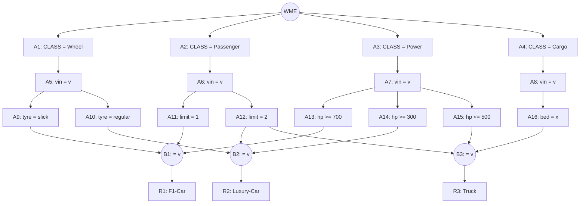

## The Question

A Rete net classifies vehicles (F1-Car, Luxury-Car, Truck). Working memory:

```text
101. (Cargo     ^vin A1 ^bed flat)
102. (Passenger ^vin A1 ^limit 2)
103. (Passenger ^vin B2 ^limit 2)
104. (Passenger ^vin C3 ^limit 1)
105. (Power     ^vin A1 ^hp 400)
106. (Power     ^vin B2 ^hp 800)
107. (Power     ^vin C3 ^hp 900)
108. (Wheel     ^vin B2 ^tyre regular)
109. (Wheel     ^vin C3 ^tyre slick)
```

| # | Question | Official answer |
|---|----------|-----------------|
| 5.1 | Tuples in the conflict set (A: F1-Car,104,107,109 · B: Luxury-Car,103,106,108 · C: Truck,101,102,105 · D: Truck,101,103,106) | **A, B, C** |
| 5.2 | Specificity fires | **C** |
| 5.3 | Recency fires | **A** |

## The Topic in 60 Seconds

Alpha nodes filter single WMEs; beta nodes join on the shared `^vin`. Conflict set = all full tuples. **Specificity** = most conditions wins; **Recency** = newest max-timestamp wins.

> Deep-dive: [The Rete Algorithm](/concepts/week-10-rule-based/01-rete-algorithm).

## The Rete Net (from the figure)



Rules: **F1-Car** = Wheel slick + Passenger limit 1 + Power hp ≥ 700 (same vin) · **Luxury-Car** = regular + limit 2 + hp ≥ 300 · **Truck** = Cargo bed + limit 2 + hp ≤ 500.

## Step 1 — Locate every WME

| WME | Facts | Alpha node |
|-----|-------|------------|
| 101 | Cargo, A1, flat | **A16** |
| 102 | Passenger, A1, limit 2 | **A12** |
| 103 | Passenger, B2, limit 2 | **A12** |
| 104 | Passenger, C3, limit 1 | **A11** |
| 105 | Power, A1, hp 400 | **A15** (≤ 500) |
| 106 | Power, B2, hp 800 | **A14** (≥ 300) |
| 107 | Power, C3, hp 900 | **A13** (≥ 700) and A14 |
| 108 | Wheel, B2, regular | **A10** |
| 109 | Wheel, C3, slick | **A9** |

## Step 2 — Fire the joins (on `^vin`)

- **F1-Car** (limit-1 ⋈ hp≥700 ⋈ slick): limit-1 `104: C3`; hp≥700 `106: B2`, `107: C3`; slick `109: C3` → vin C3 ✓ → **(F1-Car, 104, 107, 109)** ✓
- **Luxury-Car** (regular ⋈ limit-2 ⋈ hp≥300): regular `108: B2`; limit-2 `102: A1`, `103: B2`; hp≥300 `105: A1`, `106: B2`, `107: C3` → vin B2 ✓ → **(Luxury-Car, 103, 106, 108)** ✓
- **Truck** (bed ⋈ limit-2 ⋈ hp≤500): bed `101: A1`; limit-2 `102: A1`; hp≤500 `105: A1` → vin A1 ✓ → **(Truck, 101, 102, 105)** ✓

**Conflict set** = options **A, B, C** ✓ (D mixes vins: 101 is A1 but 103, 106 are B2 ✗)

## 5.2 — Specificity → **C**

All three tuples carry three WMEs — a tie. The paper's tie-break (label ordering of the rule conditions) resolves to the **Truck** tuple: its conditions (bed + limit-2 + hp ≤ 500) match only **one** vehicle in working memory, the tightest fit. → **C** ✓ (Same outcome as the classic 23T1 FN version of this net.)

## 5.3 — Recency → **A**

Max timestamp per tuple: F1-Car → **109**; Luxury-Car → 108; Truck → 105. Newest wins → **F1-Car** → option **A** ✓

## Tricks & Tips

<Accordion title="4-step recipe">
1. WME → alpha table first (mind the ≥ / ≤ tests: 800 passes hp ≥ 300 but fails hp ≥ 700).
2. Join betas on `^vin`; mismatched vins die instantly (option D).
3. Specificity: count WMEs; on a tie the key resolves by condition tightness / label order — here Truck.
4. Recency: max timestamp — 109 (the slick wheel) hands it to F1-Car.
</Accordion>

**Answers:** 5.1 **A, B, C** · 5.2 **C** · 5.3 **A**
