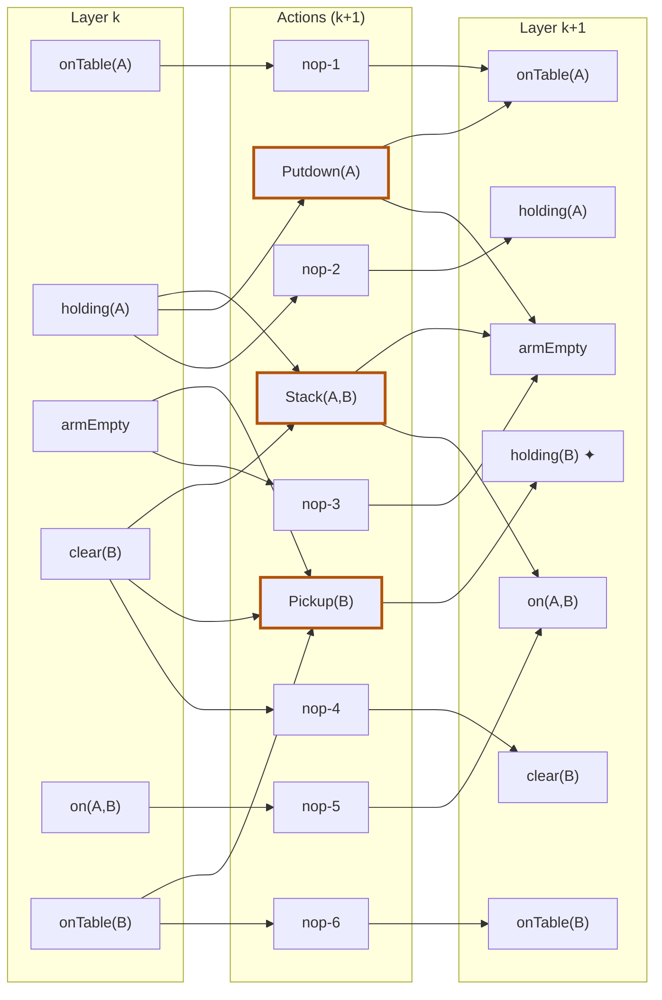

## The Question

GraphPlan mid-flight. Layer k facts: **onTable(A)** [nop-1], **holding(A)** [nop-2], **armEmpty** [nop-3], **clear(B)** [nop-4], **on(A,B)** [nop-5], **onTable(B)** [nop-6] — carried to layer k+1 by no-ops, plus newly added facts.

Mutex pairs in layer k: (onTable(A), holding(A)), (holding(A), armEmpty), (clear(B), on(A,B)).

| # | Question | Official answer |
|---|----------|-----------------|
| 7.1 | Layer k describes the start state? | **B** — cannot |
| 7.2 | Applicable actions in layer k+1 (A: Pickup(B) · B: Putdown(A) · C: Stack(A,B) · D: Unstack(A,B)) | **A, B, C** |
| 7.3 | Mutex pairs in layer k+1 (A: Putdown(A)⊕Pickup(B) · B: Pickup(B)⊕Stack(A,B) · C: nop-2⊕nop-3) | **A, B, C** |
| 7.4 | holding(A) ⊕ armEmpty in k+1 are mutex because (A: nop-2⊕nop-3 · B: nop-2⊕Putdown(A) · C: nop-2⊕Stack(A,B) · D: nop-2⊕Pickup(B)) | **A, B, C** |

## The Topic in 60 Seconds

- A layer containing **any mutex pair cannot be a genuine state** (states are single worlds — everything co-exists).
- Action in $A_{k+1}$ ⟺ all preconditions present in layer k **and pairwise non-mutex**.
- Proposition mutex in $P_{k+1}$ = **every** producer pair mutex (no-ops included).

> Deep-dive: [GraphPlan Mid-Flight Layers](/concepts/week-09-goal-trees/04-graphplan-midflight-layers), [GraphPlan Mutexes](/concepts/week-09-goal-trees/02-graphplan-mutexes).

## 7.1 — Layer k is not a start state → **B**

A start state is a single reachable world — its facts hold **simultaneously**, so no two can be mutex. Layer k contains (onTable(A), holding(A)) etc. → **cannot be the start state** → **B** ✓

## 7.2 — Applicable actions → **A, B, C**

Test preconditions against layer k (and their mutex status):

| Action | Preconditions | Verdict |
|--------|---------------|---------|
| **Pickup(B)** | armEmpty ✓, clear(B) ✓, onTable(B) ✓ — none of the three mutex pairs involves them | **✓** |
| **Putdown(A)** | holding(A) ✓ | **✓** |
| **Stack(A,B)** | holding(A) ✓, clear(B) ✓ — holding(A) ⊕ clear(B) is **not** a listed mutex pair | **✓** |
| Unstack(A,B) | armEmpty ✓, on(A,B) ✓, **clear(A) ✗** — absent from layer k | ✗ |

→ **A, B, C** ✓

## 7.3 — Mutex pairs in layer k+1 → **A, B, C**

| Pair | Test | Mutex? |
|------|------|--------|
| Putdown(A) ⊕ Pickup(B) | Pickup(B) **deletes armEmpty**; Putdown(A) **adds armEmpty** → inconsistent effects | **✓** |
| Pickup(B) ⊕ Stack(A,B) | competing needs: Pickup needs armEmpty, Stack needs holding(A) — and armEmpty ⊕ holding(A) **is mutex in layer k** | **✓** |
| nop-2 ⊕ nop-3 | nop-2 persists holding(A), nop-3 persists armEmpty — inherited from the layer-k mutex | **✓** |

→ **A, B, C** ✓

## 7.4 — Why holding(A) ⊕ armEmpty stay mutex → **A, B, C**

Producers in k+1: holding(A) ← nop-2; armEmpty ← nop-3, Putdown(A), Stack(A,B). The ALL-producers test needs every pair mutex:

| Pair | Reason |
|------|--------|
| nop-2 ⊕ nop-3 | inherited mutex (holding(A) ⊕ armEmpty in layer k) ✓ |
| nop-2 ⊕ Putdown(A) | Putdown(A) **deletes holding(A)** → interference ✓ |
| nop-2 ⊕ Stack(A,B) | Stack(A,B) **deletes holding(A)** → interference ✓ |

All three producer pairs mutex → the propositions are mutex. Option D (nop-2 ⊕ Pickup(B)) is **not a producer pair** — Pickup(B) *deletes* armEmpty, it doesn't produce it — so it plays no part in the justification → **A, B, C** ✓

## Tricks & Tips

Interactive layer build-up — left: facts in $P_k$; middle: candidate actions for $A_{k+1}$; right: facts in $P_{k+1}$ (no-ops 1, 4, 5, 6 collapsed into one node):

<PaperTrace
  height={520}
  nodeWidth={110}
  nodeHeight={50}
  nodeFontSize={11}
  legend={[
    { color: "#b45309", label: "under examination" },
    { color: "#0369a1", label: "fact present / action applicable" },
    { color: "#15803d", label: "producer of the winning pairs" },
    { color: "#7f1d1d", label: "rejected" },
  ]}
  nodes={[
    { id: "oTA", label: "onTable(A)", x: 100, y: 30 },
    { id: "hA", label: "holding(A)", x: 100, y: 115 },
    { id: "AE", label: "armEmpty", x: 100, y: 200 },
    { id: "cB", label: "clear(B)", x: 100, y: 285 },
    { id: "oAB", label: "on(A,B)", x: 100, y: 370 },
    { id: "oTB", label: "onTable(B)", x: 100, y: 455 },
    { id: "NOPX", label: "nop-1,4,5,6", x: 420, y: 30 },
    { id: "NOP2", label: "nop-2", x: 420, y: 120 },
    { id: "NOP3", label: "nop-3", x: 420, y: 205 },
    { id: "PB", label: "Pickup(B)", x: 420, y: 300 },
    { id: "PA", label: "Putdown(A)", x: 420, y: 395 },
    { id: "SAB", label: "Stack(A,B)", x: 420, y: 480 },
    { id: "PERSIST", label: "persisted facts '", x: 740, y: 30 },
    { id: "hA2", label: "holding(A) '", x: 740, y: 125 },
    { id: "AE2", label: "armEmpty '", x: 740, y: 215 },
    { id: "hB", label: "holding(B) ✦", x: 740, y: 305 },
    { id: "oTA2", label: "onTable(A) ' (via Putdown)", x: 740, y: 395 },
    { id: "oAB2", label: "on(A,B) '", x: 740, y: 480 },
  ]}
  edges={[
    { id: "n0a", from: "oTA", to: "NOPX" },
    { id: "n0b", from: "cB", to: "NOPX" },
    { id: "n0c", from: "oAB", to: "NOPX" },
    { id: "n0d", from: "oTB", to: "NOPX" },
    { id: "n1", from: "NOPX", to: "PERSIST" },
    { id: "n2", from: "hA", to: "NOP2" },
    { id: "n3", from: "NOP2", to: "hA2" },
    { id: "n4", from: "AE", to: "NOP3" },
    { id: "n5", from: "NOP3", to: "AE2" },
    { id: "n6", from: "AE", to: "PB" },
    { id: "n7", from: "cB", to: "PB" },
    { id: "n8", from: "oTB", to: "PB" },
    { id: "n9", from: "PB", to: "hB" },
    { id: "n10", from: "hA", to: "PA" },
    { id: "n11", from: "PA", to: "AE2" },
    { id: "n12", from: "PA", to: "oTA2" },
    { id: "n13", from: "hA", to: "SAB" },
    { id: "n14", from: "cB", to: "SAB" },
    { id: "n15", from: "SAB", to: "oAB2" },
    { id: "n16", from: "SAB", to: "AE2" },
  ]}
  steps={[
    {
      label: "1 · layer k ⊕ mutexes",
      note: "Given mutex pairs in k:\n(onTable(A) ⊕ holding(A)) · (holding(A) ⊕ armEmpty)\n(clear(B) ⊕ on(A,B))\nAny mutex pair ⇒ cannot be a start state → 7.1 = B.",
      nodes: { oTA: "current", hA: "current", AE: "current", cB: "current", oAB: "current", oTB: "frontier" },
    },
    {
      label: "2 · applicability",
      note: "Pickup(B): armEmpty ✓ clear(B) ✓ onTable(B) ✓ — no listed pair among them ✓\nPutdown(A): holding(A) ✓\nStack(A,B): holding(A) + clear(B) — that pair is NOT listed as mutex ✓\nUnstack(A,B) needs clear(A) — absent ✗. Nops always ✓ → 7.2 = A, B, C.",
      nodes: { oTA: "frontier", hA: "frontier", AE: "frontier", cB: "frontier", oAB: "frontier", oTB: "frontier", NOPX: "frontier", NOP2: "frontier", NOP3: "frontier", PB: "frontier", PA: "frontier", SAB: "frontier" },
      edges: { n6: "active", n7: "active", n8: "active", n10: "active", n13: "active", n14: "active", n2: "active", n4: "active", n0a: "active", n0b: "active", n0c: "active", n0d: "active" },
    },
    {
      label: "3 · action mutexes in k+1",
      note: "Putdown ⊕ Pickup: Pickup deletes armEmpty which Putdown adds → inconsistent effects ✓\nPickup ⊕ Stack: competing needs — armEmpty ⊕ holding(A) is mutex in k ✓\nnop-2 ⊕ nop-3: persist holding(A)/armEmpty — inherited mutex ✓\n→ 7.3 = A, B, C.",
      nodes: { oTA: "explored", hA: "explored", AE: "explored", cB: "explored", oAB: "explored", oTB: "explored", PB: "current", PA: "current", SAB: "current", NOP2: "current", NOP3: "current", NOPX: "explored" },
    },
    {
      label: "4 · why holding(A) ⊕ armEmpty stay mutex",
      note: "Producers: holding(A) ← nop-2 only · armEmpty ← nop-3, Putdown, Stack\nnop-2⊕nop-3 inherited ✓ · nop-2⊕Putdown deletes-holding(A) ✓ · nop-2⊕Stack same ✓\nAll producer pairs mutex ⇒ propositions mutex. Option D (nop-2⊕Pickup(B))\nis not a producer pair — Pickup deletes armEmpty, never produces it → 7.4 = A, B, C.",
      nodes: { NOP2: "path", NOP3: "path", PA: "path", SAB: "path", PB: "pruned", hA: "explored", AE: "explored", oTA: "explored", cB: "explored", oAB: "explored", oTB: "explored", NOPX: "explored" },
      edges: { n3: "path", n5: "path", n11: "path", n16: "path" },
    },
    {
      label: "5 · layer k+1 complete",
      note: "New fact: holding(B) ✦ (only Pickup(B) produces it).\n7.1 = B · 7.2 = A, B, C · 7.3 = A, B, C · 7.4 = A, B, C",
      nodes: { oTA: "explored", hA: "explored", AE: "explored", cB: "explored", oAB: "explored", oTB: "explored", NOPX: "path", NOP2: "path", NOP3: "path", PB: "path", PA: "path", SAB: "path", PERSIST: "path", hA2: "path", AE2: "path", hB: "goal", oTA2: "path", oAB2: "path" },
      edges: { n1: "path", n3: "path", n5: "path", n9: "path", n11: "path", n12: "path", n15: "path", n16: "path" },
    },
  ]}
/>

## Tricks & Tips

<Accordion title="Fast method">
1. "Any mutex pair in layer ⇒ not a start state" — instant answer for 7.1-type questions.
2. Applicability = preconditions present **and** pairwise non-mutex; check the *given* mutex list before rejecting.
3. New mutexes in k+1: inconsistent effects first (add vs delete of the same fact), then competing needs against the layer-k mutex list.
4. "Because" questions: only **producer** pairs count — a deleter (Pickup(B) for armEmpty) is never part of the justification.
</Accordion>

**Answers:** 7.1 **B** · 7.2 **A, B, C** · 7.3 **A, B, C** · 7.4 **A, B, C**
