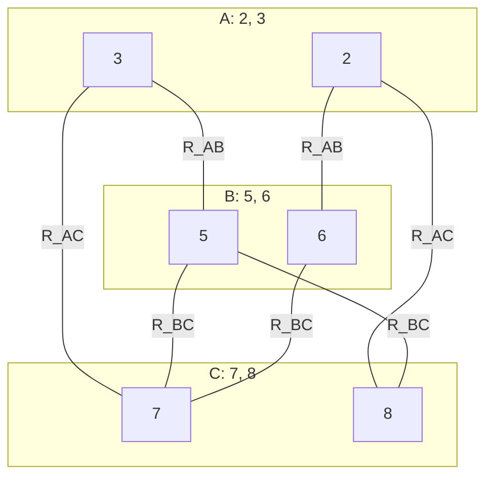

## The Question

CSP over A, B, C (processed in that order), $D_A = D_B = D_C = \{1, \dots, 9\}$:

$$R_{AB} = \{(2,6), (3,5)\} \qquad R_{AC} = \{(2,8), (3,7)\} \qquad R_{BC} = \{(5,7), (5,8), (6,7)\}$$

| # | Question | Official answer |
|---|----------|-----------------|
| 8.1 | Is the CSP arc consistent? | **A** — Yes |
| 8.2 | After making it arc consistent (if needed): path consistent? | **B** — not path consistent |
| 8.3 | Solution (A,B,C) | `3,5,7` |

## The Topic in 60 Seconds

- **Arc consistent**: every domain value on the matching diagram has a support in each neighbour.
- **Path consistent**: every allowed pair $(x, y)$ on an arc has a middle value $z$ compatible with both.
- Arc consistency does **not** imply path consistency.

> Deep-dive: [Arc Consistency](/concepts/week-11-constraint-satisfaction/03-csp-relations-arc-consistency), [Forward Checking](/concepts/week-11-constraint-satisfaction/01-forward-checking).

## The matching diagram

Only the values that appear in the relations can ever be used — draw them:

## 8.1 — Arc consistent → **Yes**

On the matching diagram, every value has support in each neighbour:

| Value | Supports |
|-------|----------|
| A = 2 | B = 6 ✓, C = 8 ✓ |
| A = 3 | B = 5 ✓, C = 7 ✓ |
| B = 5 | A = 3 ✓, C = 7, 8 ✓ |
| B = 6 | A = 2 ✓, C = 7 ✓ |
| C = 7 | A = 3 ✓, B = 5, 6 ✓ |
| C = 8 | A = 2 ✓, B = 5 ✓ |

No value pruned → **arc consistent** ✓ (values outside the relations — 1, 4, 9, … — are already excluded by the constraints themselves.)

## 8.2 — Path consistency → **B (not path consistent)**

Test the pair (A, B) with tuple $(2, 6)$ — need $c \in D_C$ with $(2, c) \in R_{AC}$ and $(c, 6) \in R_{BC}$:

- $(2, c) \in \{(2,8), (3,7)\}$ → $c = 8$
- $(8, 6) \in R_{BC}$? $R_{BC} = \{(5,7), (5,8), (6,7)\}$ → **no!**

Tuple $(2,6)$ has **no middle support** through C → **not path consistent** → **B** ✓

## 8.3 — Solution → `3,5,7`

Try the tuples: $(3, 5)$ on A–B, then $C$ must satisfy $(3, c) \in R_{AC}$ → $c = 7$, and $(5, 7) \in R_{BC}$ ✓

$$A = 3,\quad B = 5,\quad C = 7 \Rightarrow \texttt{3,5,7}\ ✓$$

(Check the other branch: $(2,6)$ forces $c = 8$, but $(6,8) \notin R_{BC}$ — dead end, exactly the path-inconsistency found above.)

## Tricks & Tips

<Accordion title="Fast method">
1. **Draw the matching diagram** — only values appearing in the relations matter; check each has support on every incident edge set.
2. **Path consistency = tuple hunting**: for each relation tuple, chase a middle value through BOTH neighbouring relations. One failure ⇒ not path consistent.
3. The failed tuple usually *is* the solution's sibling branch — (2,6) fails, (3,5) works here.
4. Solution: walk the matching diagram; verify all three relations.
</Accordion>

<Quiz
  question="Why does the tuple (2,6) on R_AB break path consistency?"
  options={[
    { label: "A", text: "6 has no support in R_BC" },
    { label: "B", text: "The only C compatible with A=2 is 8, and (8,6) ∉ R_BC" },
    { label: "C", text: "2 is not in D_A" },
    { label: "D", text: "R_BC is cyclic" },
  ]}
  correctAnswer="B"
  explanation="Path consistency needs a middle value working for both arcs; 8 works for A=2 but (8,6) is not in R_BC."
/>

**Answers:** 8.1 **A (Yes)** · 8.2 **B (not path consistent)** · 8.3 `3,5,7`
