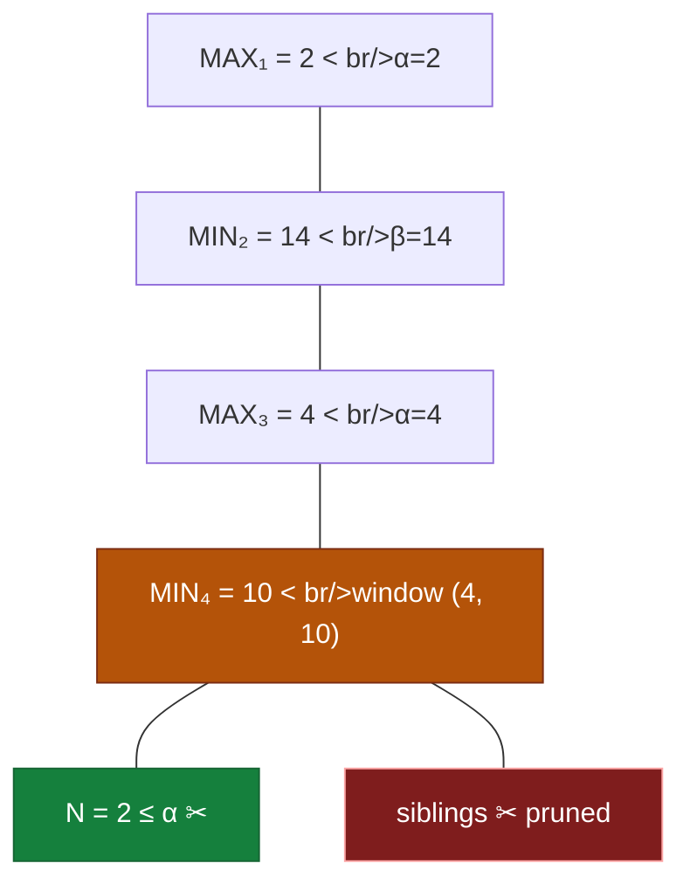

## The Question

Alpha-Beta is mid-flight on a MAX-root tree. Evals along the current path (root → N): **2, 14, 4, 10, N** — all even, $0 < n < 15$.

| # | Question | Official answer |
|---|----------|-----------------|
| 2.1 | Eval of N that induces a cutoff (pruning N's siblings) | `2` |
| 2.2 | Type of cutoff | **A** — Alpha cutoff |

## The Topic in 60 Seconds

Levels alternate from the MAX root: MAX(2) → MIN(14) → MAX(4) → MIN(10) → **N**.

The window slides down the path:

- $\alpha(\text{MAX}_1) = 2$
- $\beta(\text{MIN}_2) = 14$
- $\alpha(\text{MAX}_3) = \max(2, 4) = 4$
- $\beta(\text{MIN}_4) = \min(14, 10) = 10$

**N is a child of MIN₄**, whose window is $(\alpha, \beta) = (4, 10)$.

> Deep-dive: [Alpha-Beta Pruning](/concepts/week-07-game-search/02-alpha-beta-pruning).

## 2.1 — The cutoff value → `2`

A cutoff at MIN₄ fires the moment a child's value drops to $\alpha = 4$ or below. N must satisfy:

$$N \le \alpha = 4, \qquad N \text{ even}, \quad 0 < N < 15$$

The smallest (and keyed) value that forces the prune: **N = 2** ✓ — MIN₄'s value collapses to 2, which MAX₃ (already holding 4) will never take, so N's siblings are pruned.

## 2.2 — Cutoff type → **A (Alpha cutoff)**

The cutoff happens at **MIN₄** — a MIN node crashing through $\alpha$. Per the course convention:

| value reached | node type | cutoff name |
|---------------|-----------|-------------|
| $\ge \beta$ | MAX | β-cutoff |
| $\le \alpha$ | MIN | **α-cutoff** ✓ |

→ **Alpha cutoff** ✓

## Tricks & Tips

<Accordion title="Fast method">
1. Write the window down the path: α tightens at MAX nodes, β at MIN nodes.
2. **N's parent type decides the test**: child of MIN → $N \le \alpha$ (α-cutoff); child of MAX → $N \ge \beta$ (β-cutoff).
3. Pick the smallest qualifying value — the keyed boundary answer.
</Accordion>

**Answers:** 2.1 `2` · 2.2 **A (Alpha cutoff)**
