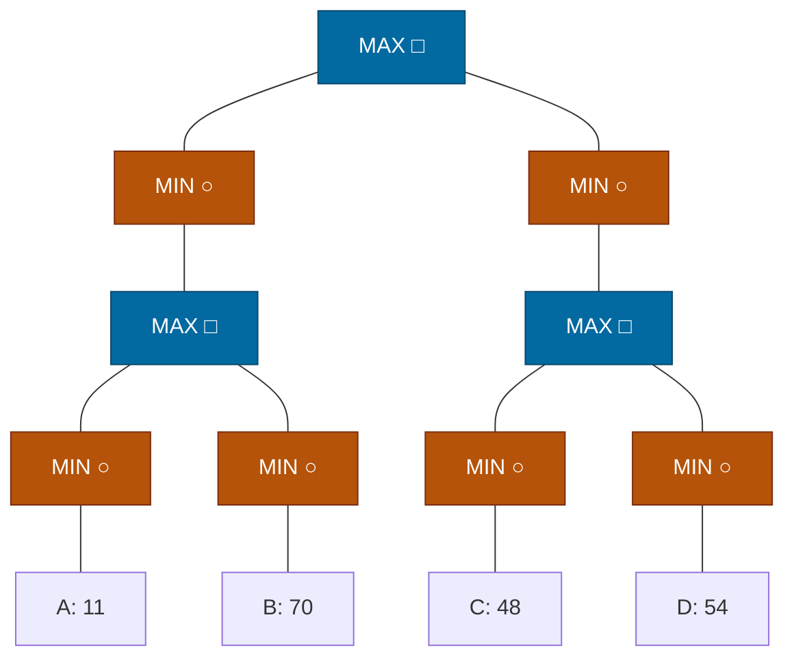

## The Question

Squares = MAX, circles = MIN. Horizon nodes A–D. Tie-breaker: deepest, then leftmost.

| # | Question | Official answer |
|---|----------|-----------------|
| 3.1 | Horizon nodes assigned SOLVED | `A,B,C,D` |
| 3.2 | Horizon nodes pruned (removed from queue by a MAX-ancestor) | `A,C,D` |

## The Topic in 60 Seconds

Course SSS\* loop: process the highest-merit node — LIVE leaf → SOLVED with its eval; LIVE MAX → insert all children; LIVE MIN → insert first child only; SOLVED node → MAX parent resolves (purge siblings), MIN parent updates merit / completes.

> Deep-dive: [SSS*](/concepts/week-03-heuristic-search/03-sss-star), [Game Strategies](/concepts/week-07-game-search/03-game-strategies).

## The trace — all four leaves evaluated

Backups: $L_1 = \max(\min(11), \min(70)) = \max(11, 70) = 70$; $R_1 = \max(48, 54) = 54$; $L = 70$; $R = 54$; Root $= \max(70, 54) = \mathbf{70}$.

| Step | Processed | Effect |
|------|-----------|--------|
| 1 | Root (MAX) | insert L(∞), R(∞) |
| 2 | L (MIN, ∞) | insert first child L1 (∞) |
| 3 | L1 (MAX, ∞) | insert La(∞), Lb(∞) |
| 4 | La (MIN, ∞) | insert A(∞) |
| 5 | A (leaf) | **A SOLVED = 11** → La merit 11; La has no other children → La SOLVED 11 |
| 6 | La SOLVED → L1 (MAX) | L1 not yet solved (Lb pending); Lb stays in OPEN |
| 7 | R has merit ∞ > Lb(11) → process R side | R (MIN) → R1 (∞) → Ra(∞), Rb(∞) → C → **C SOLVED = 48** → Rb inserted (48) |
| 8 | D (leaf, 48) | **D SOLVED = 54** → Rb SOLVED 48 → R1 SOLVED 54 → R SOLVED 54 |
| 9 | R SOLVED → Root (MAX) | Root merit revised to 54; back to the left side |
| 10 | B (leaf, 11) | **B SOLVED = 70** → Lb SOLVED 70 → L1 SOLVED 70 → L SOLVED 70 |
| 11 | L SOLVED → Root | Root SOLVED = max(70, 54) = **70**. Done. |

Every leaf was evaluated: **SOLVED = A, B, C, D** ✓

Interactive trace — squares = MAX, circles = MIN; green = SOLVED:

<PaperTrace
  height={430}
  nodeWidth={84}
  nodeHeight={52}
  nodeFontSize={11}
  legend={[
    { color: "#b45309", label: "processing now" },
    { color: "#0369a1", label: "waiting in OPEN" },
    { color: "#15803d", label: "SOLVED" },
    { color: "#334155", label: "not yet reached" },
  ]}
  nodes={[
    { id: "R", label: "R □", x: 400, y: 20, kind: "terminal" },
    { id: "L", label: "L ○", x: 250, y: 105, kind: "terminal" },
    { id: "Rt", label: "Rt ○", x: 550, y: 105, kind: "terminal" },
    { id: "L1", label: "L₁ □", x: 250, y: 195, kind: "terminal" },
    { id: "R1", label: "R₁ □", x: 550, y: 195, kind: "terminal" },
    { id: "LA", label: "La ○", x: 130, y: 285, kind: "terminal" },
    { id: "LB", label: "Lb ○", x: 360, y: 285, kind: "terminal" },
    { id: "RA", label: "Ra ○", x: 460, y: 285, kind: "terminal" },
    { id: "RB", label: "Rb ○", x: 660, y: 285, kind: "terminal" },
    { id: "A", label: "A: 11", x: 50, y: 375, kind: "terminal" },
    { id: "B", label: "B: 70", x: 215, y: 375, kind: "terminal" },
    { id: "C", label: "C: 48", x: 420, y: 375, kind: "terminal" },
    { id: "D", label: "D: 54", x: 585, y: 375, kind: "terminal" },
  ]}
  edges={[
    { id: "x1", from: "R", to: "L" },
    { id: "x2", from: "R", to: "Rt" },
    { id: "x3", from: "L", to: "L1" },
    { id: "x4", from: "Rt", to: "R1" },
    { id: "x5", from: "L1", to: "LA" },
    { id: "x6", from: "L1", to: "LB" },
    { id: "x7", from: "R1", to: "RA" },
    { id: "x8", from: "R1", to: "RB" },
    { id: "x9", from: "LA", to: "A" },
    { id: "x10", from: "LB", to: "B" },
    { id: "x11", from: "RA", to: "C" },
    { id: "x12", from: "RB", to: "D" },
  ]}
  steps={[
    {
      label: "1 · insert both sides",
      note: "Root (MAX) → insert ALL children.\nOPEN = { L(∞), Rt(∞) }",
      nodes: { R: "current", L: "frontier", Rt: "frontier" },
    },
    {
      label: "2 · dive left",
      note: "Tie ∞/∞ → left first.\nL (MIN): FIRST child L1(∞)\nL1 (MAX): La(∞), Lb(∞)\nLa (MIN): FIRST child A(∞)\nOPEN = { A(∞), Lb(∞), Rt(∞) }",
      nodes: { R: "explored", L: "explored", Rt: "frontier", L1: "explored", LA: "explored", LB: "frontier", A: "frontier" },
    },
    {
      label: "3 · A SOLVED = 11",
      note: "A (leaf) → SOLVED 11.\nParent La (MIN) has no other children → La SOLVED 11.",
      nodes: { R: "explored", L: "explored", Rt: "frontier", L1: "explored", LA: "path", LB: "frontier", A: "path" },
    },
    {
      label: "4 · jump to the ∞ side",
      note: "La SOLVED → L1 (MAX): Lb still pending, Lb stays.\nOPEN = { Rt(∞), Lb(11) } → process Rt:\nRt (MIN) → R1(∞); R1 (MAX) → Ra(∞), Rb(∞); Ra (MIN) → C(∞).",
      nodes: { R: "explored", L: "explored", Rt: "explored", L1: "frontier", LA: "path", LB: "frontier", A: "path", R1: "explored", RA: "explored", RB: "frontier", C: "frontier" },
    },
    {
      label: "5 · C SOLVED = 48",
      note: "C (leaf) → SOLVED 48.\nParent Ra (MIN) has no other children.\nSibling Rb inserted (LIVE, 48).",
      nodes: { L1: "frontier", LB: "frontier", LA: "path", A: "path", Rt: "explored", R1: "explored", RA: "frontier", RB: "frontier", C: "path" },
    },
    {
      label: "6 · right line resolves",
      note: "D (leaf) → SOLVED 54.\nRb: children done → SOLVED min(48, 54) = 48.\nR1 (MAX): SOLVED max(48, 54) = 54.\nRt (MIN): SOLVED min(54) = 54.",
      nodes: { Rt: "path", R1: "path", RA: "path", RB: "path", C: "path", D: "path", L1: "frontier", LB: "frontier", LA: "path", A: "path" },
    },
    {
      label: "7 · Root revised to 54",
      note: "Rt SOLVED → Root (MAX): merit revised 70 → 54.\nBack left: OPEN still holds Lb(11).",
      nodes: { R: "frontier", L: "explored", Rt: "path", L1: "frontier", LA: "path", LB: "frontier", A: "path", R1: "path", RA: "path", RB: "path", C: "path", D: "path" },
    },
    {
      label: "8 · B SOLVED = 70, left resolves",
      note: "B (leaf) → SOLVED 70.\nLb (MIN): SOLVED min(70) = 70.\nL1 (MAX): SOLVED max(11, 70) = 70.\nL (MIN): SOLVED min(70) = 70.",
      nodes: { R: "frontier", L: "path", Rt: "path", L1: "path", LA: "path", LB: "path", A: "path", B: "path", R1: "path", RA: "path", RB: "path", C: "path", D: "path" },
    },
    {
      label: "9 · Root = 70 ✓ done",
      note: "L SOLVED → Root: SOLVED = max(70, 54) = 70 via the left line.\nSOLVED leaves: A, B, C, D. Pruned by MAX-ancestors: A, C, D.",
      nodes: { R: "path", L: "path", Rt: "path", L1: "path", LA: "path", LB: "path", A: "path", B: "path", R1: "path", RA: "path", RB: "path", C: "path", D: "path" },
    },
  ]}
/>

## 3.2 — Pruned by MAX-ancestor → `A,C,D`

When a MAX ancestor resolves, the leaves beneath it are removed from the queue:

- **A** — removed when $L_1$ (MAX) resolves (via B = 70 on the right twin).
- **C** — removed when $R_1$ (MAX) resolves (via D = 54).
- **D** — removed when $R_b$/$R_1$ resolve.

**B** is the last leaf evaluated — it *completes* the search rather than being cleared out — so the pruned set is **A, C, D** ✓

<Callout type="tip" title="Contrast with the AN paper">
Same values (11, 70, 48, 54) but a different shape: here the root has TWO MIN children, so both sides must be explored and every leaf ends up SOLVED — whereas the AN paper's single-MIN chain solved everything and pruned nothing.
</Callout>

## Tricks & Tips

<Accordion title="Fast method">
1. Back up first: L1 = max(11, 70) = 70, R1 = max(48, 54) = 54, Root = 70.
2. SSS* dives the left line, jumps to the ∞-merit right line, then returns to finish the left.
3. SOLVED = leaves evaluated; "pruned by MAX-ancestor" = leaves cleared when their MAX grandparent resolves — everyone except the final completing leaf.
</Accordion>

**Answers:** 3.1 `A,B,C,D` · 3.2 `A,C,D`
