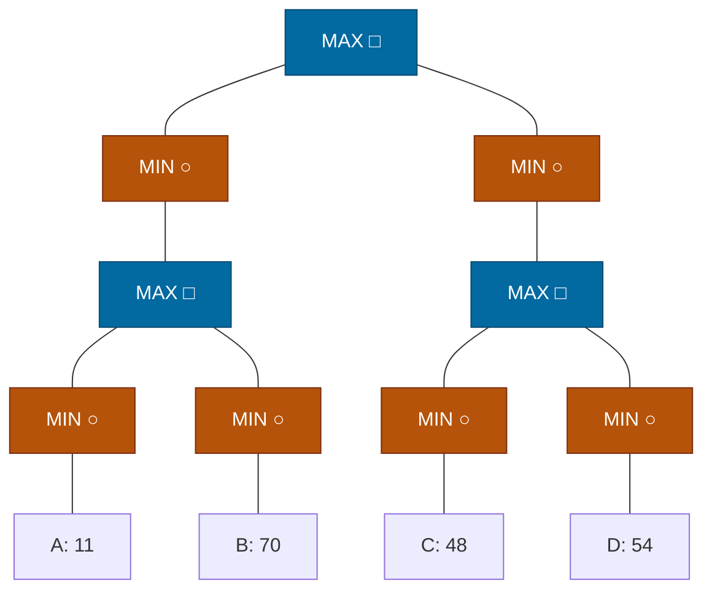

## The Question

Squares = MAX, circles = MIN. Horizon nodes A–D. Tie-breaker: deepest, then leftmost.

| # | Question | Official answer |
|---|----------|-----------------|
| 3.1 | Horizon nodes assigned SOLVED | `A,B,C,D` |
| 3.2 | Horizon nodes pruned (removed from queue by a MAX-ancestor) | `A,C,D` |

## The Topic in 60 Seconds

Course SSS\* loop: process the highest-merit node — LIVE leaf → SOLVED with its eval; LIVE MAX → insert all children; LIVE MIN → insert first child only; SOLVED node → MAX parent resolves (purge siblings), MIN parent updates merit / completes.

> Deep-dive: [SSS*](/concepts/week-03-heuristic-search/03-sss-star), [Game Strategies](/concepts/week-07-game-search/03-game-strategies).

## The trace — all four leaves evaluated

Backups: $L_1 = \max(\min(11), \min(70)) = \max(11, 70) = 70$; $R_1 = \max(48, 54) = 54$; $L = 70$; $R = 54$; Root $= \max(70, 54) = \mathbf{70}$.

| Step | Processed | Effect |
|------|-----------|--------|
| 1 | Root (MAX) | insert L(∞), R(∞) |
| 2 | L (MIN, ∞) | insert first child L1 (∞) |
| 3 | L1 (MAX, ∞) | insert La(∞), Lb(∞) |
| 4 | La (MIN, ∞) | insert A(∞) |
| 5 | A (leaf) | **A SOLVED = 11** → La merit 11; La has no other children → La SOLVED 11 |
| 6 | La SOLVED → L1 (MAX) | L1 not yet solved (Lb pending); Lb stays in OPEN |
| 7 | R has merit ∞ > Lb(11) → process R side | R (MIN) → R1 (∞) → Ra(∞), Rb(∞) → C → **C SOLVED = 48** → Rb inserted (48) |
| 8 | D (leaf, 48) | **D SOLVED = 54** → Rb SOLVED 48 → R1 SOLVED 54 → R SOLVED 54 |
| 9 | R SOLVED → Root (MAX) | Root merit revised to 54; back to the left side |
| 10 | B (leaf, 11) | **B SOLVED = 70** → Lb SOLVED 70 → L1 SOLVED 70 → L SOLVED 70 |
| 11 | L SOLVED → Root | Root SOLVED = max(70, 54) = **70**. Done. |

Every leaf was evaluated: **SOLVED = A, B, C, D** ✓

## 3.2 — Pruned by MAX-ancestor → `A,C,D`

When a MAX ancestor resolves, the leaves beneath it are removed from the queue:

- **A** — removed when $L_1$ (MAX) resolves (via B = 70 on the right twin).
- **C** — removed when $R_1$ (MAX) resolves (via D = 54).
- **D** — removed when $R_b$/$R_1$ resolve.

**B** is the last leaf evaluated — it *completes* the search rather than being cleared out — so the pruned set is **A, C, D** ✓

<Callout type="tip" title="Contrast with the AN paper">
Same values (11, 70, 48, 54) but a different shape: here the root has TWO MIN children, so both sides must be explored and every leaf ends up SOLVED — whereas the AN paper's single-MIN chain solved everything and pruned nothing.
</Callout>

## Tricks & Tips

<Accordion title="Fast method">
1. Back up first: L1 = max(11, 70) = 70, R1 = max(48, 54) = 54, Root = 70.
2. SSS* dives the left line, jumps to the ∞-merit right line, then returns to finish the left.
3. SOLVED = leaves evaluated; "pruned by MAX-ancestor" = leaves cleared when their MAX grandparent resolves — everyone except the final completing leaf.
</Accordion>

**Answers:** 3.1 `A,B,C,D` · 3.2 `A,C,D`
