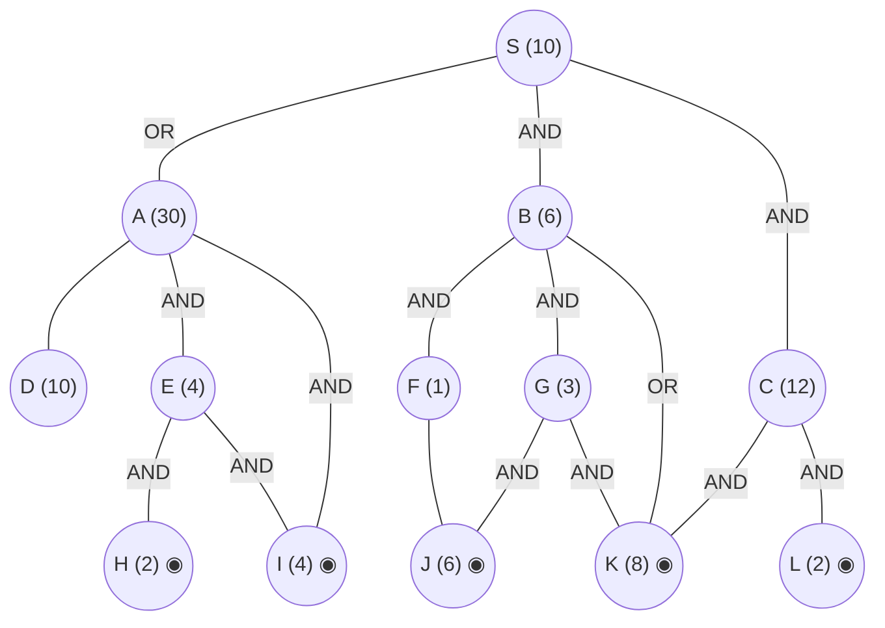

## The Question

AND–OR decomposition. Double circles = primitive. Every edge costs **2**. Tie-breakers: node labels; AND nodes expand the **highest-cost unsolved branch** first.

AND arcs: **S** = AND(B, C) *or* OR(A). **A** = AND(E, I) *or* OR(D). **E** = AND(H, I). **B** = AND(F, G) *or* OR(K). **G** = AND(J, K). **C** = AND(K, L). Primitives: H, I, J, K, L.

| # | Question | Official answer |
|---|----------|-----------------|
| 4.1 | Nodes expanded | `S,C,B,G` (also `C,B,G`) |
| 4.2 | Value of S after each expansion | `22,24,26,28` (also `24,26,28`) |
| 4.3 | Conclusion about the heuristic | **B** — inadmissible |

## The Topic in 60 Seconds

AO* = expand along **marked arcs** + revise (OR: min child+edge; AND: sum children+edges). Markers switch whenever a rival option undercuts the marked one. Primitive children make a node instantly SOLVED.

> Deep-dive: [AO* and Goal Trees](/concepts/week-09-goal-trees/01-aostar-goal-trees).

## The Trace — four expansions

h: S=10, A=30, B=6, C=12, E=4, F=1, G=3; H=2, I=4, J=6, K=8, L=2 primitive. Edge = 2.

**Expansion 1 — S.**
- AND(B, C): $(6+2)+(12+2) = 22$
- OR(A): $30+2 = 32$

Mark AND(B, C) → **S = 22** ✓

**Expansion 2 — C** (costlier AND branch: 12 > 6).
C: AND(K, L) $= (8+2)+(2+2) = 14$; K, L primitive → **C = 14, SOLVED**.
Propagate: $S = (6+2)+(14+2) = \mathbf{24}$ ✓

**Expansion 3 — B.**
B: AND(F, G) $= (1+2)+(3+2) = 8$ vs OR(K) $= 8+2 = 10$ → mark AND(F, G), **B = 8**.
Propagate: $S = (8+2)+(14+2) = \mathbf{26}$ ✓

**Expansion 4 — G** (marked path S→B→F,G; G(3) costlier than F(1)).
G: AND(J, K) $= (6+2)+(8+2) = 18$; J, K primitive → **G = 18, SOLVED**.
Propagate: AND(F, G) $= (1+2)+(18+2) = 23$ — worse than OR(K) $= 10$! Marker flips:
$$B = \min(23, 10) = \mathbf{10} \text{ via primitive } K \Rightarrow \text{B SOLVED}$$
$$S = \min\big(\underbrace{(10+2)+(14+2)}_{\text{AND(B,C)} = 28},\ 32\big) = \mathbf{28}$$
B and C both solved → **S SOLVED = 28** ✓✓

**Final value of S = 28.** Solution subtree: S → B→K and C→K,L.

Interactive trace:

<StepGraph
  height={430}
  nodeWidth={100}
  nodeHeight={50}
  nodeFontSize={12}
  legend={[
    { color: "#b45309", label: "expanding now" },
    { color: "#0369a1", label: "live on marked path" },
    { color: "#52525b", label: "primitive (born SOLVED)" },
    { color: "#16a34a", label: "marked arcs" },
  ]}
  steps={[
    {
      label: "0 · setup",
      note: "h: S=10, A=30, B=6, C=12, E=4, F=1, G=3; H=2, I=4, J=6, K=8, L=2 primitive. Edge = 2.\nS: AND(B,C) = (6+2)+(12+2) = 22 | OR(A) = 30+2 = 32 → mark AND(B,C). S = 22",
      elements: [
        { data: { id: "S", label: "S =22", type: "frontier" }, position: { x: 400, y: 20 } },
        { data: { id: "A", label: "A 30", type: "explored" }, position: { x: 120, y: 130 } },
        { data: { id: "B", label: "B 6", type: "frontier" }, position: { x: 400, y: 130 } },
        { data: { id: "C", label: "C 12", type: "frontier" }, position: { x: 660, y: 130 } },
        { data: { id: "D", label: "D 10", type: "explored" }, position: { x: 40, y: 240 } },
        { data: { id: "E", label: "E 4", type: "explored" }, position: { x: 180, y: 240 } },
        { data: { id: "I", label: "I 4", type: "primitive" }, position: { x: 320, y: 240 } },
        { data: { id: "H", label: "H 2", type: "primitive" }, position: { x: 250, y: 350 } },
        { data: { id: "F", label: "F 1", type: "frontier" }, position: { x: 480, y: 240 } },
        { data: { id: "G", label: "G 3", type: "frontier" }, position: { x: 600, y: 240 } },
        { data: { id: "K", label: "K 8", type: "primitive" }, position: { x: 720, y: 240 } },
        { data: { id: "J", label: "J 6", type: "primitive" }, position: { x: 540, y: 350 } },
        { data: { id: "L", label: "L 2", type: "primitive" }, position: { x: 850, y: 240 } },
        { data: { id: "e1", source: "S", target: "A", label: "OR" } },
        { data: { id: "e2", source: "S", target: "B", label: "AND", type: "path" } },
        { data: { id: "e3", source: "S", target: "C", label: "AND", type: "path" } },
        { data: { id: "e4", source: "A", target: "D" } },
        { data: { id: "e5", source: "A", target: "E", label: "AND" } },
        { data: { id: "e6", source: "A", target: "I", label: "AND" } },
        { data: { id: "e7", source: "E", target: "H", label: "AND" } },
        { data: { id: "e8", source: "E", target: "I", label: "AND" } },
        { data: { id: "e9", source: "B", target: "F", label: "AND", type: "path" } },
        { data: { id: "e10", source: "B", target: "G", label: "AND", type: "path" } },
        { data: { id: "e11", source: "B", target: "K", label: "OR" } },
        { data: { id: "e12", source: "F", target: "J" } },
        { data: { id: "e13", source: "G", target: "J", label: "AND" } },
        { data: { id: "e14", source: "G", target: "K", label: "AND" } },
        { data: { id: "e15", source: "C", target: "K", label: "AND" } },
        { data: { id: "e16", source: "C", target: "L", label: "AND" } },
      ],
    },
    {
      label: "1 · expand S → 22",
      note: "Marked path: B(6), C(12) → costliest branch C first.",
      elements: [
        { data: { id: "S", label: "S =22", type: "explored" }, position: { x: 400, y: 20 } },
        { data: { id: "A", label: "A 30", type: "explored" }, position: { x: 120, y: 130 } },
        { data: { id: "B", label: "B 6", type: "frontier" }, position: { x: 400, y: 130 } },
        { data: { id: "C", label: "C 12", type: "current" }, position: { x: 660, y: 130 } },
        { data: { id: "D", label: "D 10", type: "explored" }, position: { x: 40, y: 240 } },
        { data: { id: "E", label: "E 4", type: "explored" }, position: { x: 180, y: 240 } },
        { data: { id: "I", label: "I 4", type: "primitive" }, position: { x: 320, y: 240 } },
        { data: { id: "H", label: "H 2", type: "primitive" }, position: { x: 250, y: 350 } },
        { data: { id: "F", label: "F 1", type: "frontier" }, position: { x: 480, y: 240 } },
        { data: { id: "G", label: "G 3", type: "frontier" }, position: { x: 600, y: 240 } },
        { data: { id: "K", label: "K 8", type: "primitive" }, position: { x: 720, y: 240 } },
        { data: { id: "J", label: "J 6", type: "primitive" }, position: { x: 540, y: 350 } },
        { data: { id: "L", label: "L 2", type: "primitive" }, position: { x: 850, y: 240 } },
        { data: { id: "e1", source: "S", target: "A", label: "OR" } },
        { data: { id: "e2", source: "S", target: "B", label: "AND", type: "path" } },
        { data: { id: "e3", source: "S", target: "C", label: "AND", type: "path" } },
        { data: { id: "e4", source: "A", target: "D" } },
        { data: { id: "e5", source: "A", target: "E", label: "AND" } },
        { data: { id: "e6", source: "A", target: "I", label: "AND" } },
        { data: { id: "e7", source: "E", target: "H", label: "AND" } },
        { data: { id: "e8", source: "E", target: "I", label: "AND" } },
        { data: { id: "e9", source: "B", target: "F", label: "AND" } },
        { data: { id: "e10", source: "B", target: "G", label: "AND" } },
        { data: { id: "e11", source: "B", target: "K", label: "OR" } },
        { data: { id: "e12", source: "F", target: "J" } },
        { data: { id: "e13", source: "G", target: "J", label: "AND" } },
        { data: { id: "e14", source: "G", target: "K", label: "AND" } },
        { data: { id: "e15", source: "C", target: "K", label: "AND" } },
        { data: { id: "e16", source: "C", target: "L", label: "AND" } },
      ],
    },
    {
      label: "2 · expand C → 24",
      note: "C: AND(K,L) = (8+2)+(2+2) = 14, primitive → C = 14 SOLVED.\nS = (6+2)+(14+2) = 24. Next branch: B.",
      elements: [
        { data: { id: "S", label: "S =24", type: "current" }, position: { x: 400, y: 20 } },
        { data: { id: "A", label: "A 30", type: "explored" }, position: { x: 120, y: 130 } },
        { data: { id: "B", label: "B 6", type: "frontier" }, position: { x: 400, y: 130 } },
        { data: { id: "C", label: "C =14 ✓", type: "path" }, position: { x: 660, y: 130 } },
        { data: { id: "D", label: "D 10", type: "explored" }, position: { x: 40, y: 240 } },
        { data: { id: "E", label: "E 4", type: "explored" }, position: { x: 180, y: 240 } },
        { data: { id: "I", label: "I 4", type: "primitive" }, position: { x: 320, y: 240 } },
        { data: { id: "H", label: "H 2", type: "primitive" }, position: { x: 250, y: 350 } },
        { data: { id: "F", label: "F 1", type: "frontier" }, position: { x: 480, y: 240 } },
        { data: { id: "G", label: "G 3", type: "frontier" }, position: { x: 600, y: 240 } },
        { data: { id: "K", label: "K 8", type: "primitive" }, position: { x: 720, y: 240 } },
        { data: { id: "J", label: "J 6", type: "primitive" }, position: { x: 540, y: 350 } },
        { data: { id: "L", label: "L 2", type: "primitive" }, position: { x: 850, y: 240 } },
        { data: { id: "e1", source: "S", target: "A", label: "OR" } },
        { data: { id: "e2", source: "S", target: "B", label: "AND", type: "path" } },
        { data: { id: "e3", source: "S", target: "C", label: "AND", type: "path" } },
        { data: { id: "e4", source: "A", target: "D" } },
        { data: { id: "e5", source: "A", target: "E", label: "AND" } },
        { data: { id: "e6", source: "A", target: "I", label: "AND" } },
        { data: { id: "e7", source: "E", target: "H", label: "AND" } },
        { data: { id: "e8", source: "E", target: "I", label: "AND" } },
        { data: { id: "e9", source: "B", target: "F", label: "AND" } },
        { data: { id: "e10", source: "B", target: "G", label: "AND" } },
        { data: { id: "e11", source: "B", target: "K", label: "OR" } },
        { data: { id: "e12", source: "F", target: "J" } },
        { data: { id: "e13", source: "G", target: "J", label: "AND" } },
        { data: { id: "e14", source: "G", target: "K", label: "AND" } },
        { data: { id: "e15", source: "C", target: "K", label: "AND", type: "path" } },
        { data: { id: "e16", source: "C", target: "L", label: "AND", type: "path" } },
      ],
    },
    {
      label: "3 · expand B → 26",
      note: "B: AND(F,G) = (1+2)+(3+2) = 8 vs OR(K) = 10 → mark AND(F,G). B = 8.\nS = (8+2)+(14+2) = 26. Marked path: F(1), G(3) → costliest G first.",
      elements: [
        { data: { id: "S", label: "S =26", type: "current" }, position: { x: 400, y: 20 } },
        { data: { id: "A", label: "A 30", type: "explored" }, position: { x: 120, y: 130 } },
        { data: { id: "B", label: "B =8", type: "explored" }, position: { x: 400, y: 130 } },
        { data: { id: "C", label: "C =14 ✓", type: "path" }, position: { x: 660, y: 130 } },
        { data: { id: "D", label: "D 10", type: "explored" }, position: { x: 40, y: 240 } },
        { data: { id: "E", label: "E 4", type: "explored" }, position: { x: 180, y: 240 } },
        { data: { id: "I", label: "I 4", type: "primitive" }, position: { x: 320, y: 240 } },
        { data: { id: "H", label: "H 2", type: "primitive" }, position: { x: 250, y: 350 } },
        { data: { id: "F", label: "F 1", type: "frontier" }, position: { x: 480, y: 240 } },
        { data: { id: "G", label: "G 3", type: "current" }, position: { x: 600, y: 240 } },
        { data: { id: "K", label: "K 8", type: "primitive" }, position: { x: 720, y: 240 } },
        { data: { id: "J", label: "J 6", type: "primitive" }, position: { x: 540, y: 350 } },
        { data: { id: "L", label: "L 2", type: "primitive" }, position: { x: 850, y: 240 } },
        { data: { id: "e1", source: "S", target: "A", label: "OR" } },
        { data: { id: "e2", source: "S", target: "B", label: "AND", type: "path" } },
        { data: { id: "e3", source: "S", target: "C", label: "AND", type: "path" } },
        { data: { id: "e4", source: "A", target: "D" } },
        { data: { id: "e5", source: "A", target: "E", label: "AND" } },
        { data: { id: "e6", source: "A", target: "I", label: "AND" } },
        { data: { id: "e7", source: "E", target: "H", label: "AND" } },
        { data: { id: "e8", source: "E", target: "I", label: "AND" } },
        { data: { id: "e9", source: "B", target: "F", label: "AND", type: "path" } },
        { data: { id: "e10", source: "B", target: "G", label: "AND", type: "path" } },
        { data: { id: "e11", source: "B", target: "K", label: "OR" } },
        { data: { id: "e12", source: "F", target: "J" } },
        { data: { id: "e13", source: "G", target: "J", label: "AND", type: "path" } },
        { data: { id: "e14", source: "G", target: "K", label: "AND", type: "path" } },
        { data: { id: "e15", source: "C", target: "K", label: "AND", type: "path" } },
        { data: { id: "e16", source: "C", target: "L", label: "AND", type: "path" } },
      ],
    },
    {
      label: "4 · expand G → 28 ✓ SOLVED",
      note: "G: AND(J,K) = (6+2)+(8+2) = 18, primitive → G = 18 SOLVED.\nAND(F,G) = (1+2)+(18+2) = 23 > OR(K) = 10 → B flips to K! B = 10 SOLVED.\nS = min( (10+2)+(14+2)=28, OR(A)=32 ) = 28 SOLVED. Final = 28.",
      elements: [
        { data: { id: "S", label: "S =28 ✓", type: "path" }, position: { x: 400, y: 20 } },
        { data: { id: "A", label: "A 30", type: "explored" }, position: { x: 120, y: 130 } },
        { data: { id: "B", label: "B =10 ✓", type: "path" }, position: { x: 400, y: 130 } },
        { data: { id: "C", label: "C =14 ✓", type: "path" }, position: { x: 660, y: 130 } },
        { data: { id: "D", label: "D 10", type: "explored" }, position: { x: 40, y: 240 } },
        { data: { id: "E", label: "E 4", type: "explored" }, position: { x: 180, y: 240 } },
        { data: { id: "I", label: "I 4", type: "primitive" }, position: { x: 320, y: 240 } },
        { data: { id: "H", label: "H 2", type: "primitive" }, position: { x: 250, y: 350 } },
        { data: { id: "F", label: "F 1", type: "explored" }, position: { x: 480, y: 240 } },
        { data: { id: "G", label: "G =18", type: "explored" }, position: { x: 600, y: 240 } },
        { data: { id: "K", label: "K 8", type: "primitive" }, position: { x: 720, y: 240 } },
        { data: { id: "J", label: "J 6", type: "primitive" }, position: { x: 540, y: 350 } },
        { data: { id: "L", label: "L 2", type: "primitive" }, position: { x: 850, y: 240 } },
        { data: { id: "e1", source: "S", target: "A", label: "OR" } },
        { data: { id: "e2", source: "S", target: "B", label: "AND", type: "path" } },
        { data: { id: "e3", source: "S", target: "C", label: "AND", type: "path" } },
        { data: { id: "e4", source: "A", target: "D" } },
        { data: { id: "e5", source: "A", target: "E", label: "AND" } },
        { data: { id: "e6", source: "A", target: "I", label: "AND" } },
        { data: { id: "e7", source: "E", target: "H", label: "AND" } },
        { data: { id: "e8", source: "E", target: "I", label: "AND" } },
        { data: { id: "e9", source: "B", target: "F", label: "AND" } },
        { data: { id: "e10", source: "B", target: "G", label: "AND" } },
        { data: { id: "e11", source: "B", target: "K", label: "OR", type: "path" } },
        { data: { id: "e12", source: "F", target: "J" } },
        { data: { id: "e13", source: "G", target: "J", label: "AND" } },
        { data: { id: "e14", source: "G", target: "K", label: "AND" } },
        { data: { id: "e15", source: "C", target: "K", label: "AND", type: "path" } },
        { data: { id: "e16", source: "C", target: "L", label: "AND", type: "path" } },
      ],
    },
  ]}
/>

## Answers, decoded

- **4.1** — expansions: **S, C, B, G** (alternate `C,B,G` drops S).
- **4.2** — S after each: **22, 24, 26, 28** (alternate `24,26,28` from C onwards).
- **4.3** — **B (inadmissible)**: $h(A) = 30 > h^*(A) = 18$. A's only solvable option is AND(E, I), and E's *true* cost is $E = \text{AND}(H,I) = (2+2)+(4+2) = 10$, so $A = (10+2)+(4+2) = 18$ — a massive overestimate.

## Tricks & Tips

<Accordion title="Fast method">
1. Arcs first: S's AND spans (B,C); B has THREE children — AND(F,G) plus the OR escape to primitive K.
2. The +2-per-step rhythm (22 → 24 → 26 → 28) is a good self-check: each expansion refines exactly one branch by its edge cost.
3. G = AND(J,K) = 18 is the bomb: it blows up AND(F,G) to 23 and flips B onto K = 10.
4. Inadmissibility: h(A) = 30 vs true 18 (E alone really costs AND(H,I) = 10) — the giveaway.
</Accordion>

**Answers:** 4.1 `S,C,B,G` · 4.2 `22,24,26,28` · 4.3 **B**
