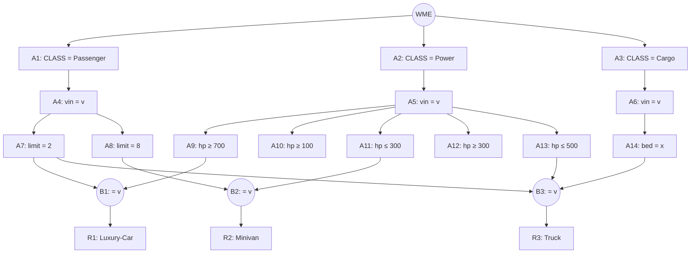

## The Question

A Rete net classifies vehicles (Luxury-Car, Minivan, Truck). Working memory:

```text
101. (Cargo     ^vin A1 ^bed flat)
102. (Passenger ^vin A1 ^limit 2)
103. (Passenger ^vin B2 ^limit 8)
104. (Passenger ^vin C3 ^limit 2)
105. (Power     ^vin A1 ^hp 400)
106. (Power     ^vin B2 ^hp 250)
107. (Power     ^vin C3 ^hp 900)
108. (Wheel     ^vin B2 ^tyre regular)
109. (Wheel     ^vin C3 ^tyre regular)
```

| # | Question | Official answer |
|---|----------|-----------------|
| 5.1 | Tuples in the conflict set (A: Luxury-Car,104,107 · B: Minivan,103,106 · C: Truck,101,102,105 · D: Minivan,103,106,108) | **A, B, C** |
| 5.2 | Specificity fires | **C** |
| 5.3 | Recency fires | **A** |

## The Topic in 60 Seconds

Alpha nodes filter single WMEs; beta nodes join on the shared `^vin`. Conflict set = all full tuples. **Specificity** = most conditions; **Recency** = newest max-timestamp.

> Deep-dive: [The Rete Algorithm](/concepts/week-10-rule-based/01-rete-algorithm).

## The Rete Net (from the figure)



Rules: **Luxury-Car** = Passenger limit 2 + Power hp ≥ 700 · **Minivan** = limit 8 + hp ≤ 300 · **Truck** = Cargo bed + Passenger limit 2 + Power hp ≤ 500 (same `^vin` throughout).

## Step 1 — Locate every WME

| WME | Facts | Alpha node |
|-----|-------|------------|
| 101 | Cargo, A1, flat | **A14** |
| 102 | Passenger, A1, limit 2 | **A7** |
| 103 | Passenger, B2, limit 8 | **A8** |
| 104 | Passenger, C3, limit 2 | **A7** |
| 105 | Power, A1, hp 400 | **A13** (≤ 500) |
| 106 | Power, B2, hp 250 | **A11** (≤ 300) |
| 107 | Power, C3, hp 900 | **A9** (≥ 700) |

(108, 109 are Wheel WMEs — no CLASS = Wheel node in this net, they stay unused.)

## Step 2 — Fire the joins (on `^vin`)

- **Luxury-Car** (limit-2 ⋈ hp≥700): limit-2 `102: A1`, `104: C3`; hp≥700 `107: C3` → vin C3 ✓ → **(Luxury-Car, 104, 107)** ✓
- **Minivan** (limit-8 ⋈ hp≤300): limit-8 `103: B2`; hp≤300 `106: B2` → vin B2 ✓ → **(Minivan, 103, 106)** ✓
- **Truck** (bed ⋈ limit-2 ⋈ hp≤500): bed `101: A1`; limit-2 `102: A1`; hp≤500 `105: A1` → vin A1 ✓ → **(Truck, 101, 102, 105)** ✓

**Conflict set** = options **A, B, C** ✓ (D is invalid — Minivan has no Wheel condition, so 108 can't be in its tuple.)

Interactive trace of the beta net — each step fires one join on a shared `^vin`:

<PaperTrace
  height={430}
  nodeWidth={110}
  nodeHeight={52}
  nodeFontSize={11}
  legend={[
    { color: "#0f766e", label: "alpha test (WMEs passing)" },
    { color: "#9d174d", label: "beta join (on ^vin)" },
    { color: "#15803d", label: "rule fired" },
    { color: "#b45309", label: "join being tested" },
  ]}
  nodes={[
    { id: "A14", label: "bed = x\n101:A1", x: 80, y: 30, kind: "alpha" },
    { id: "A7", label: "limit = 2\n102:A1·104:C3", x: 250, y: 30, kind: "alpha" },
    { id: "A13", label: "hp ≤ 500\n105:A1", x: 420, y: 30, kind: "alpha" },
    { id: "A9", label: "hp ≥ 700\n107:C3", x: 620, y: 30, kind: "alpha" },
    { id: "A8", label: "limit = 8\n103:B2", x: 800, y: 30, kind: "alpha" },
    { id: "A11", label: "hp ≤ 300\n106:B2", x: 620, y: 140, kind: "alpha" },
    { id: "B3", label: "B3 ⋈ vin", x: 160, y: 250, kind: "beta" },
    { id: "B1", label: "B1 ⋈ vin", x: 520, y: 250, kind: "beta" },
    { id: "B2", label: "B2 ⋈ vin", x: 760, y: 250, kind: "beta" },
    { id: "R3", label: "Truck", x: 160, y: 360, kind: "unassigned" },
    { id: "R1", label: "Luxury-Car", x: 520, y: 360, kind: "unassigned" },
    { id: "R2", label: "Minivan", x: 760, y: 360, kind: "unassigned" },
  ]}
  edges={[
    { id: "g1", from: "A14", to: "B3" },
    { id: "g2", from: "A7", to: "B3" },
    { id: "g3", from: "A13", to: "B3" },
    { id: "g4", from: "B3", to: "R3" },
    { id: "g5", from: "A7", to: "B1" },
    { id: "g6", from: "A9", to: "B1" },
    { id: "g7", from: "B1", to: "R1" },
    { id: "g8", from: "A8", to: "B2" },
    { id: "g9", from: "A11", to: "B2" },
    { id: "g10", from: "B2", to: "R2" },
  ]}
  steps={[
    {
      label: "0 · alpha pass",
      note: "102→A7 · 104→A7 · 103→A8 (Passenger)\n107→A9 · 106→A11 · 105→A13 (Power)\n101→A14 (Cargo). Wheels 108/109: no CLASS = Wheel node → dead.",
      edges: {},
    },
    {
      label: "1 · Luxury-Car fires",
      note: "limit-2 {102:A1, 104:C3} ⋈ hp≥700 {107:C3}\nvin match: C3 ✓ → tuple (Luxury-Car, 104, 107)",
      nodes: { B1: "current", R1: "path" },
      edges: { g5: "active", g6: "active", g7: "path" },
    },
    {
      label: "2 · Minivan fires",
      note: "limit-8 {103:B2} ⋈ hp≤300 {106:B2}\nvin match: B2 ✓ → tuple (Minivan, 103, 106)",
      nodes: { B1: "explored", R1: "path", B2: "current", R2: "path" },
      edges: { g5: "active", g6: "active", g7: "path", g8: "active", g9: "active", g10: "path" },
    },
    {
      label: "3 · Truck fires",
      note: "bed {101:A1} ⋈ limit-2 {102:A1} ⋈ hp≤500 {105:A1}\nvin match: A1 across all three ✓ → (Truck, 101, 102, 105)",
      nodes: { B1: "explored", R1: "path", B2: "explored", R2: "path", B3: "current", R3: "path" },
      edges: { g7: "path", g10: "path", g1: "active", g2: "active", g3: "active", g4: "path" },
    },
    {
      label: "4 · conflict set = A, B, C",
      note: "(Luxury-Car,104,107) · (Minivan,103,106) · (Truck,101,102,105)\nOption D dies: 108 is Wheel — Minivan has no Wheel condition.\nSpecificity → Truck (3 conditions). Recency → Luxury-Car (max ts 107).",
      nodes: { R1: "path", R2: "path", R3: "path", B1: "path", B2: "path", B3: "path" },
      edges: { g4: "path", g7: "path", g10: "path" },
    },
  ]}
/>

## 5.2 — Specificity → **C**

Count conditions: Luxury-Car = 2, Minivan = 2, **Truck = 3** (bed + limit-2 + hp ≤ 500). Most conditions → **(Truck, 101, 102, 105)** → option **C** ✓

## 5.3 — Recency → **A**

Max timestamp per tuple: Luxury-Car → **107**; Minivan → 106; Truck → 105. Newest wins → **(Luxury-Car, 104, 107)** → option **A** ✓

<Callout type="tip" title="Watch the thresholds">
hp 250 passes hp ≤ 300 (Minivan) but fails hp ≤ 500? No — 250 ≤ 500 too, but B2 has no bed, so only the Minivan join catches it. Always test the JOIN (same vin), not each alpha in isolation.
</Callout>

## Tricks & Tips

<Accordion title="4-step recipe">
1. WME → alpha table (note the Wheel WMEs 108/109: no Wheel alpha node here → dead).
2. Join on `^vin`; a tuple is only as valid as its weakest vin match.
3. Specificity: Truck's three conditions beat the two-condition rivals.
4. Recency: max timestamp — 107 (the hp-900 Power WME) hands it to Luxury-Car.
</Accordion>

**Answers:** 5.1 **A, B, C** · 5.2 **C** · 5.3 **A**
