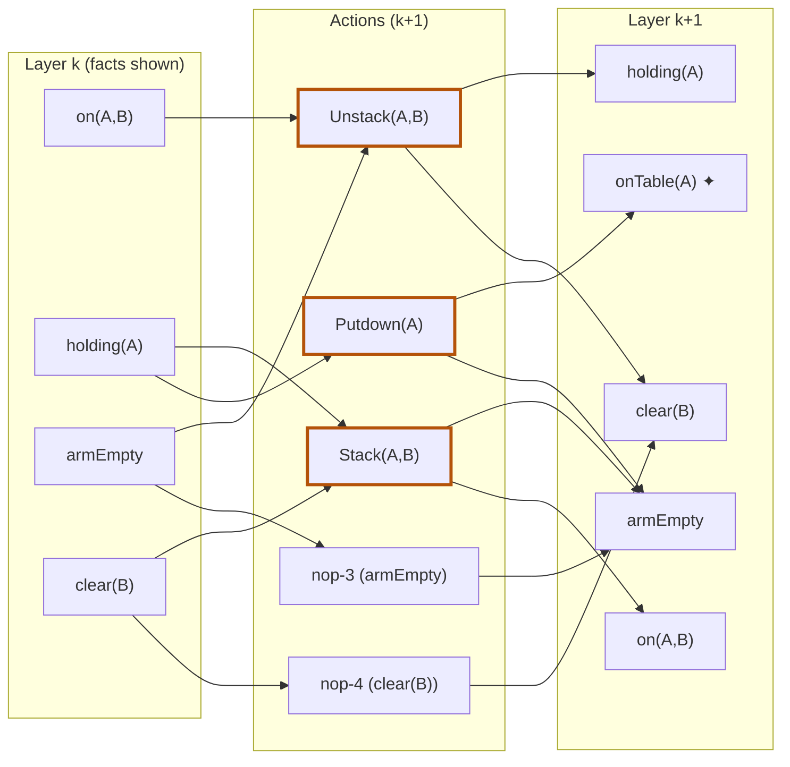

## The Question

GraphPlan mid-flight. Layer k facts include **on(A,B)**, **holding(A)**, **armEmpty**, **clear(B)** (plus others), carried forward by no-ops.

Mutex pairs in layer k: (on(A,B), holding(A)), (on(A,B), clear(B)), (armEmpty, clear(B)), (armEmpty, holding(A)).

| # | Question | Official answer |
|---|----------|-----------------|
| 7.1 | Layer k describes the start state? | **B** — cannot |
| 7.2 | Applicable actions in layer k+1 (A: Putdown(A) · B: Stack(A,B) · C: Unstack(A,B) · D: Unstack(B,C)) | **A, B, C** |
| 7.3 | Mutex pairs in layer k+1 (A: Putdown(A)⊕Stack(A,B) · B: Stack(A,B)⊕Unstack(A,B) · C: nop-3⊕nop-4) | **A, B, C** |
| 7.4 | armEmpty ⊕ clear(B) in k+1 are NON-mutex because (A: nop-3⊕nop-4 non-mutex · B: Putdown(A)⊕nop-4 non-mutex · C: none) | **B** |

## The Topic in 60 Seconds

- A layer with **any mutex pair** cannot be a genuine state.
- Action in $A_{k+1}$ ⟺ preconditions present **and** pairwise non-mutex.
- Proposition mutex = **every** producer pair mutex; one clean pair breaks it.

> Deep-dive: [GraphPlan Mid-Flight Layers](/concepts/week-09-goal-trees/04-graphplan-midflight-layers), [GraphPlan Mutexes](/concepts/week-09-goal-trees/02-graphplan-mutexes).

## 7.1 — Layer k is not a start state → **B**

Layer k contains four mutex pairs (e.g. on(A,B) ⊕ holding(A)). A start state is one reachable world — no mutexes possible → **B** ✓

## 7.2 — Applicable actions → **A, B, C**

| Action | Preconditions | Verdict |
|--------|---------------|---------|
| **Putdown(A)** | holding(A) ✓ | **✓** |
| **Stack(A,B)** | holding(A) ✓, clear(B) ✓ — holding(A) ⊕ clear(B) **not** in the mutex list | **✓** |
| **Unstack(A,B)** | armEmpty ✓, clear(A) ✓ (in layer k), on(A,B) ✓ — no listed mutex pair among them | **✓** |
| Unstack(B,C) | on(B,C) ✗ absent | ✗ |

→ **A, B, C** ✓

## 7.3 — Mutex pairs in layer k+1 → **A, B, C**

| Pair | Test | Mutex? |
|------|------|--------|
| Putdown(A) ⊕ Stack(A,B) | Stack deletes **holding(A)** = Putdown's precondition → interference | **✓** |
| Stack(A,B) ⊕ Unstack(A,B) | Stack adds on(A,B)/armEmpty which Unstack deletes; Unstack deletes holding(A) which Stack needs → inconsistent effects + interference | **✓** |
| nop-3 ⊕ nop-4 | nop-3 persists armEmpty, nop-4 persists clear(B) — armEmpty ⊕ clear(B) **is mutex in layer k** → inherited | **✓** |

→ **A, B, C** ✓

## 7.4 — Why armEmpty ⊕ clear(B) are NON-mutex → **B**

Producers in k+1: armEmpty ← nop-3, Putdown(A), Stack(A,B); clear(B) ← nop-4, Unstack(A,B). The pairs:

| Pair | Mutex? |
|------|--------|
| nop-3 ⊕ nop-4 | mutex (inherited) ✗ |
| nop-3 ⊕ Unstack(A,B) | Unstack deletes armEmpty → mutex ✗ |
| Stack(A,B) ⊕ nop-4 | Stack deletes clear(B) → mutex ✗ |
| Stack(A,B) ⊕ Unstack(A,B) | mutex (7.3) ✗ |
| **Putdown(A) ⊕ nop-4** | Putdown adds armEmpty/onTable(A), deletes holding(A) — **no clash with clear(B)**; competing needs? holding(A) ⊕ clear(B) is **not** mutex → **NON-MUTEX** ✓ |

One clean pair breaks the ALL test → the propositions are **non-mutex**, and the reason is **Putdown(A) ⊕ nop-4** → **B** ✓

## Tricks & Tips

<Accordion title="Fast method">
1. Any mutex pair in layer ⇒ not a start state.
2. Applicability: preconditions present + pairwise non-mutex (check the *given* list).
3. New action mutexes: interference on shared facts (holding(A) is the usual suspect).
4. "Why non-mutex": hunt the ONE producer pair with no add/delete/needs conflict — here Putdown(A) ⊕ nop-4.
</Accordion>

**Answers:** 7.1 **B** · 7.2 **A, B, C** · 7.3 **A, B, C** · 7.4 **B**
