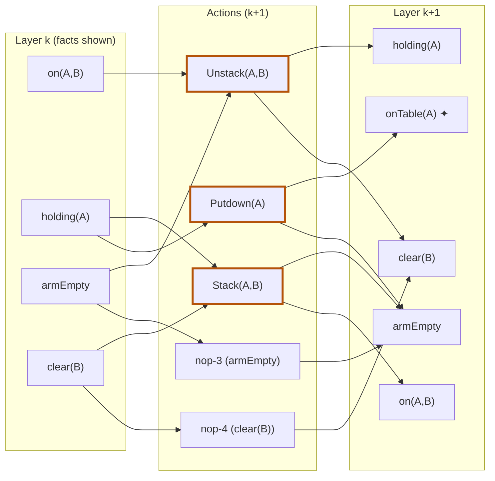

## The Question

GraphPlan mid-flight. Layer k facts include **on(A,B)**, **holding(A)**, **armEmpty**, **clear(B)** (plus others), carried forward by no-ops.

Mutex pairs in layer k: (on(A,B), holding(A)), (on(A,B), clear(B)), (armEmpty, clear(B)), (armEmpty, holding(A)).

| # | Question | Official answer |
|---|----------|-----------------|
| 7.1 | Layer k describes the start state? | **B** — cannot |
| 7.2 | Applicable actions in layer k+1 (A: Putdown(A) · B: Stack(A,B) · C: Unstack(A,B) · D: Unstack(B,C)) | **A, B, C** |
| 7.3 | Mutex pairs in layer k+1 (A: Putdown(A)⊕Stack(A,B) · B: Stack(A,B)⊕Unstack(A,B) · C: nop-3⊕nop-4) | **A, B, C** |
| 7.4 | armEmpty ⊕ clear(B) in k+1 are NON-mutex because (A: nop-3⊕nop-4 non-mutex · B: Putdown(A)⊕nop-4 non-mutex · C: none) | **B** |

## The Topic in 60 Seconds

- A layer with **any mutex pair** cannot be a genuine state.
- Action in $A_{k+1}$ ⟺ preconditions present **and** pairwise non-mutex.
- Proposition mutex = **every** producer pair mutex; one clean pair breaks it.

> Deep-dive: [GraphPlan Mid-Flight Layers](/concepts/week-09-goal-trees/04-graphplan-midflight-layers), [GraphPlan Mutexes](/concepts/week-09-goal-trees/02-graphplan-mutexes).

## 7.1 — Layer k is not a start state → **B**

Layer k contains four mutex pairs (e.g. on(A,B) ⊕ holding(A)). A start state is one reachable world — no mutexes possible → **B** ✓

## 7.2 — Applicable actions → **A, B, C**

| Action | Preconditions | Verdict |
|--------|---------------|---------|
| **Putdown(A)** | holding(A) ✓ | **✓** |
| **Stack(A,B)** | holding(A) ✓, clear(B) ✓ — holding(A) ⊕ clear(B) **not** in the mutex list | **✓** |
| **Unstack(A,B)** | armEmpty ✓, clear(A) ✓ (in layer k), on(A,B) ✓ — no listed mutex pair among them | **✓** |
| Unstack(B,C) | on(B,C) ✗ absent | ✗ |

→ **A, B, C** ✓

## 7.3 — Mutex pairs in layer k+1 → **A, B, C**

| Pair | Test | Mutex? |
|------|------|--------|
| Putdown(A) ⊕ Stack(A,B) | Stack deletes **holding(A)** = Putdown's precondition → interference | **✓** |
| Stack(A,B) ⊕ Unstack(A,B) | Stack adds on(A,B)/armEmpty which Unstack deletes; Unstack deletes holding(A) which Stack needs → inconsistent effects + interference | **✓** |
| nop-3 ⊕ nop-4 | nop-3 persists armEmpty, nop-4 persists clear(B) — armEmpty ⊕ clear(B) **is mutex in layer k** → inherited | **✓** |

→ **A, B, C** ✓

## 7.4 — Why armEmpty ⊕ clear(B) are NON-mutex → **B**

Producers in k+1: armEmpty ← nop-3, Putdown(A), Stack(A,B); clear(B) ← nop-4, Unstack(A,B). The pairs:

| Pair | Mutex? |
|------|--------|
| nop-3 ⊕ nop-4 | mutex (inherited) ✗ |
| nop-3 ⊕ Unstack(A,B) | Unstack deletes armEmpty → mutex ✗ |
| Stack(A,B) ⊕ nop-4 | Stack deletes clear(B) → mutex ✗ |
| Stack(A,B) ⊕ Unstack(A,B) | mutex (7.3) ✗ |
| **Putdown(A) ⊕ nop-4** | Putdown adds armEmpty/onTable(A), deletes holding(A) — **no clash with clear(B)**; competing needs? holding(A) ⊕ clear(B) is **not** mutex → **NON-MUTEX** ✓ |

One clean pair breaks the ALL test → the propositions are **non-mutex**, and the reason is **Putdown(A) ⊕ nop-4** → **B** ✓

## Tricks & Tips

Interactive layer build-up — left: facts in $P_k$; middle: candidate actions for $A_{k+1}$; right: facts in $P_{k+1}$:

<PaperTrace
  height={520}
  nodeWidth={110}
  nodeHeight={50}
  nodeFontSize={11}
  legend={[
    { color: "#b45309", label: "under examination" },
    { color: "#0369a1", label: "fact present / action applicable" },
    { color: "#15803d", label: "producer of the winning pair" },
    { color: "#7f1d1d", label: "rejected" },
  ]}
  nodes={[
    { id: "oAB", label: "on(A,B)", x: 100, y: 30 },
    { id: "hA", label: "holding(A)", x: 100, y: 120 },
    { id: "AE", label: "armEmpty", x: 100, y: 210 },
    { id: "cB", label: "clear(B)", x: 100, y: 300 },
    { id: "cA", label: "clear(A)", x: 100, y: 390 },
    { id: "PA", label: "Putdown(A)", x: 420, y: 60 },
    { id: "SAB", label: "Stack(A,B)", x: 420, y: 170 },
    { id: "UAB", label: "Unstack(A,B)", x: 420, y: 290 },
    { id: "NOP3", label: "nop-3", x: 420, y: 400 },
    { id: "NOP4", label: "nop-4", x: 420, y: 480 },
    { id: "oTA2", label: "onTable(A) ✦", x: 740, y: 20 },
    { id: "AE2", label: "armEmpty '", x: 740, y: 110 },
    { id: "oAB2", label: "on(A,B) '", x: 740, y: 200 },
    { id: "cB2", label: "clear(B) '", x: 740, y: 300 },
    { id: "hA2", label: "holding(A) '", x: 740, y: 400 },
  ]}
  edges={[
    { id: "m1", from: "AE", to: "NOP3" },
    { id: "m2", from: "NOP3", to: "AE2" },
    { id: "m3", from: "cB", to: "NOP4" },
    { id: "m4", from: "NOP4", to: "cB2" },
    { id: "m5", from: "hA", to: "PA" },
    { id: "m6", from: "PA", to: "AE2" },
    { id: "m7", from: "PA", to: "oTA2" },
    { id: "m8", from: "hA", to: "SAB" },
    { id: "m9", from: "cB", to: "SAB" },
    { id: "m10", from: "SAB", to: "oAB2" },
    { id: "m11", from: "SAB", to: "AE2" },
    { id: "m12", from: "AE", to: "UAB" },
    { id: "m13", from: "oAB", to: "UAB" },
    { id: "m14", from: "cA", to: "UAB" },
    { id: "m15", from: "UAB", to: "cB2" },
    { id: "m16", from: "UAB", to: "hA2" },
  ]}
  steps={[
    {
      label: "1 · layer k ⊕ mutexes",
      note: "Given mutex pairs in k:\n(on(A,B) ⊕ holding(A)) · (on(A,B) ⊕ clear(B))\n(armEmpty ⊕ clear(B)) · (armEmpty ⊕ holding(A))\nAny mutex pair ⇒ this cannot be a start state → 7.1 = B.",
      nodes: { oAB: "current", hA: "current", AE: "current", cB: "current", cA: "frontier" },
    },
    {
      label: "2 · applicability",
      note: "Putdown(A): holding(A) ✓ → applicable\nStack(A,B): holding(A) ✓ + clear(B) ✓, and that pair is NOT in the mutex list ✓\nUnstack(A,B): armEmpty ✓, clear(A) ✓ (unlisted facts), on(A,B) ✓, no listed mutex ✓\nUnstack(B,C): on(B,C) absent ✗. Nops: always ✓.",
      nodes: { oAB: "frontier", hA: "frontier", AE: "frontier", cB: "frontier", cA: "frontier", PA: "frontier", SAB: "frontier", UAB: "frontier", NOP3: "frontier", NOP4: "frontier" },
      edges: { m5: "active", m8: "active", m9: "active", m12: "active", m13: "active", m14: "active", m1: "active", m3: "active" },
    },
    {
      label: "3 · action mutexes in k+1",
      note: "Putdown ⊕ Stack: Stack deletes holding(A) = Putdown's precondition → interference ✓\nStack ⊕ Unstack: Stack adds on(A,B)/armEmpty which Unstack deletes; Unstack deletes holding(A) which Stack needs ✓\nnop-3 ⊕ nop-4: persist armEmpty/clear(B), mutex in k → inherited ✓\n→ 7.3 = A, B, C.",
      nodes: { oAB: "explored", hA: "explored", AE: "explored", cB: "explored", cA: "explored", PA: "current", SAB: "current", UAB: "current", NOP3: "current", NOP4: "current" },
    },
    {
      label: "4 · why armEmpty ⊕ clear(B) break",
      note: "Producers: armEmpty ← nop-3, Putdown, Stack · clear(B) ← nop-4, Unstack\nnop-3⊕nop-4 mutex ✗ · nop-3⊕Unstack deletes-armEmpty ✗ · Stack⊕nop-4 deletes-clear(B) ✗\nPutdown ⊕ nop-4: adds armEmpty/onTable(A), deletes holding(A) — no clash, competing needs non-mutex ✓\nOne clean pair ⇒ propositions NON-mutex → 7.4 = B.",
      nodes: { PA: "path", NOP4: "path", NOP3: "frontier", SAB: "frontier", UAB: "frontier", oAB: "explored", hA: "explored", AE: "explored", cB: "explored", cA: "explored" },
      edges: { m7: "active", m4: "active" },
    },
    {
      label: "5 · layer k+1 complete",
      note: "New fact: onTable(A) ✦ (only Putdown produces it).\n7.1 = B · 7.2 = A, B, C · 7.3 = A, B, C · 7.4 = B",
      nodes: { oAB: "explored", hA: "explored", AE: "explored", cB: "explored", cA: "explored", PA: "path", SAB: "path", UAB: "path", NOP3: "path", NOP4: "path", oTA2: "goal", AE2: "path", oAB2: "path", cB2: "path", hA2: "path" },
      edges: { m2: "path", m4: "path", m6: "path", m7: "path", m10: "path", m11: "path", m15: "path", m16: "path" },
    },
  ]}
/>

## Tricks & Tips

<Accordion title="Fast method">
1. Any mutex pair in layer ⇒ not a start state.
2. Applicability: preconditions present + pairwise non-mutex (check the *given* list).
3. New action mutexes: interference on shared facts (holding(A) is the usual suspect).
4. "Why non-mutex": hunt the ONE producer pair with no add/delete/needs conflict — here Putdown(A) ⊕ nop-4.
</Accordion>

**Answers:** 7.1 **B** · 7.2 **A, B, C** · 7.3 **A, B, C** · 7.4 **B**
