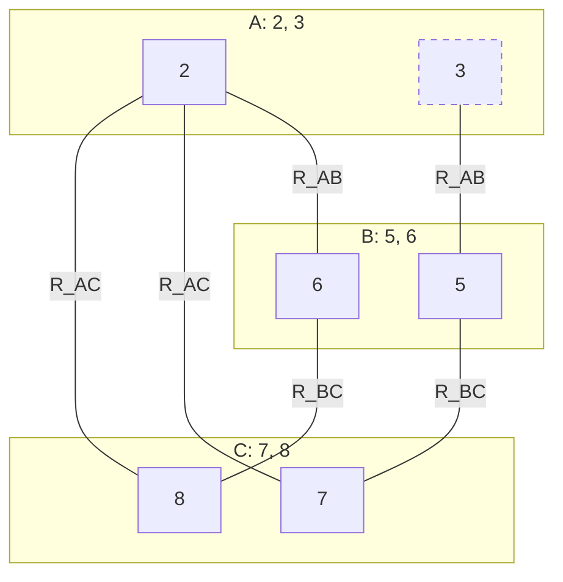

## The Question

CSP over A, B, C (processed in that order), $D_A = D_B = D_C = \{1, \dots, 9\}$:

$$R_{AB} = \{(2,6), (3,5)\} \qquad R_{AC} = \{(2,7), (2,8)\} \qquad R_{BC} = \{(4,7), (5,7), (6,8)\}$$

| # | Question | Official answer |
|---|----------|-----------------|
| 8.1 | Is the CSP arc consistent? | **B** — No |
| 8.2 | After making it arc consistent: path consistent? | **A** — path consistent |
| 8.3 | Solution (A,B,C) | `2,6,8` |

## The Topic in 60 Seconds

- **Arc consistent**: every domain value has a support in each neighbour.
- **Path consistent**: every allowed pair has a middle value compatible with both.
- Making a CSP arc consistent can cascade — one pruning orphans another value.

> Deep-dive: [Arc Consistency](/concepts/week-11-constraint-satisfaction/03-csp-relations-arc-consistency), [Forward Checking](/concepts/week-11-constraint-satisfaction/01-forward-checking).

## The matching diagram

## 8.1 — Arc consistent? → **No**

Check every value on the diagram:

| Value | Supports |
|-------|----------|
| A = 2 | B = 6 ✓, C = 7, 8 ✓ |
| **A = 3** | B = 5 ✓, C = **?** — $(3, c) \notin R_{AC}$ for any c! |
| B = 5 | A = 3 ✓, C = 7 ✓ |
| B = 6 | A = 2 ✓, C = 8 ✓ |
| C = 7 | A = 2 ✓, B = 5 ✓ |
| C = 8 | A = 2 ✓, B = 6 ✓ |

**A = 3 has no support on R_AC** → not arc consistent → **B** ✓

## 8.2 — After arc consistency: path consistent? → **A (path consistent)**

**Revise (AC-3 style):**

1. $A = 3$ pruned (no C support) → $D_A = \{2\}$.
2. Cascade: $B = 5$'s support was $A = 3$ — gone! → $D_B = \{6\}$.
3. $C = 7$'s support via $R_{BC}$ was $B = 5$ — gone! → $D_C = \{8\}$.

Result: $D_A = \{2\}$, $D_B = \{6\}$, $D_C = \{8\}$ — every arc trivially consistent.

**Path consistency:** with singletons everywhere, the only pair is $(2, 8)$ on A–C; the middle $B = 6$ satisfies $(2, 6) \in R_{AB}$ ✓ and $(6, 8) \in R_{BC}$ ✓ → **path consistent** → **A** ✓

## 8.3 — Solution → `2,6,8`

The cascade above leaves exactly one assignment:

$$A = 2,\quad B = 6,\quad C = 8$$

Verify: $(2,6) \in R_{AB}$ ✓, $(2,8) \in R_{AC}$ ✓, $(6,8) \in R_{BC}$ ✓ → `2,6,8` ✓

## Tricks & Tips

<Accordion title="Fast method">
1. Matching diagram first; scan each value for a support on **every** incident relation — A = 3 dies on R_AC.
2. **Cascade** prunings until stable (AC-3): A=3 out ⇒ B=5 out ⇒ C=7 out.
3. Singletons left ⇒ path consistency is automatic and the solution is unique.
4. Compare with the AN paper's near-identical CSP: there every value had support (arc consistent = Yes) but path consistency failed. Same recipe, opposite outcomes.
</Accordion>

<Quiz
  question="Why does B = 5 get pruned during arc consistency?"
  options={[
    { label: "A", text: "5 has no support in R_BC" },
    { label: "B", text: "Its only A-support was A = 3, which was pruned first" },
    { label: "C", text: "5 is not in D_B" },
    { label: "D", text: "R_AB forbids (3,5)" },
  ]}
  correctAnswer="B"
  explanation="AC-3 cascades: pruning A = 3 removes (3,5), leaving B = 5 unsupported — so it goes too."
/>

**Answers:** 8.1 **B (No)** · 8.2 **A (path consistent)** · 8.3 `2,6,8`
