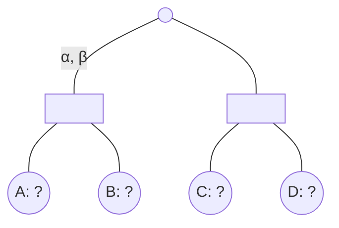

## The Question

Consider a game tree with the root node as MAX, where an arbitrary path from the root reaches the subtree shown in the figure.

Each leaf node A to D takes a UNIQUE EVAL VALUE from the set $\{1, 2, 3, 4\}$.
Alpha-Beta algorithm is entering the subtree with $\alpha=1$ and $\beta=3$;
find an optimal eval assignment (for nodes A to D) that maximizes the number of leaves pruned;
find the minimax value, the type of cuts and the leaves pruned for that assignment.

| # | Question | Official answer |
|---|----------|-----------------|
| 3.1 |  | `3,1,4,2` / `3,2,4,1` / `4,1,3,2` / `4,2,3,1` |
| 3.2 | The minimax value of the subtree for the optimal eval assignment is __________ . | `3` |
| 3.3 |  | `0,2` |
| 3.4 |  | `B,D` / `D,B` |

## The Topic in 60 Seconds

> Deep-dive: browse the [Concepts](/concepts) section for the relevant topic page.

## Solutions

**3.1** — 

**Answer:** `3,1,4,2` / `3,2,4,1` / `4,1,3,2` / `4,2,3,1`

**3.2** — The minimax value of the subtree for the optimal eval assignment is __________ .

**Answer:** `3`

**3.3** — 

**Answer:** `0,2`

**3.4** — 

**Answer:** `B,D` / `D,B`

## Tricks & Tips

<Accordion title="Exam method">
1. Read the question carefully — identify the algorithm or technique.
2. Trace step by step, showing your working.
3. Verify your answer against the question constraints.
</Accordion>
