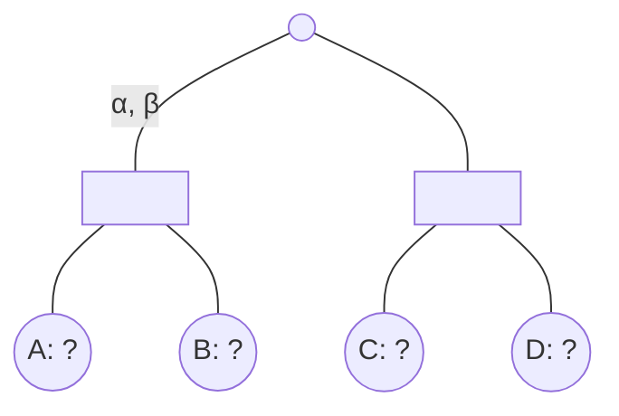

## The Question

Consider a game tree with the root node as MAX, where an arbitrary path from the root reaches the subtree shown in the figure.

Each leaf node A to D takes a UNIQUE EVAL VALUE from the set $\{1, 2, 3, 4\}$.
Alpha-Beta algorithm is entering the subtree with $\alpha=1$ and $\beta=3$;
find an optimal eval assignment (for nodes A to D) that maximizes the number of leaves pruned;
find the minimax value, the type of cuts and the leaves pruned for that assignment.

| # | Question | Official answer |
|---|----------|-----------------|
| 3.1 |  | `3,1,4,2` / `3,2,4,1` / `4,1,3,2` / `4,2,3,1` |
| 3.2 | The minimax value of the subtree for the optimal eval assignment is __________ . | `3` |
| 3.3 |  | `0,2` |
| 3.4 |  | `B,D` / `D,B` |

## The Topic in 60 Seconds

Structure read off the figure: the subtree root is a **MIN** node (it inherits bounds $\alpha=1, \beta=3$ from its MAX ancestors); its two square children are **MAX** nodes over leaf pairs.

- **MAX cutoff**: a MAX child stops once its running value reaches $\beta$ — remaining leaves die.
- After a child returns $v$, the MIN root raises $\alpha \leftarrow \max(\alpha, v)$ before opening the next child; an empty window still evaluates one leaf (to learn the bound) but cuts the rest.

> Deep-dive: browse the [Concepts](/concepts) section for Alpha-Beta.

## Designing the assignment

Goals: prune as many of the four leaves as possible while keeping every value distinct from $\{1,2,3,4\}$.

**Left square:** call it first with window $(\alpha{=}1, \beta{=}3)$. If its FIRST leaf already reads $\ge 3$, the MAX cutoff fires immediately and the sibling is never read:

$$A \in \{3, 4\} \Rightarrow \text{cutoff} \Rightarrow B \text{ pruned}$$

**Right square:** root's $\alpha$ has risen to $\max(1, A) = A \ge 3$, so the window handed down is $(A, 3)$ — empty or razor-thin. The first leaf must still be read (to learn the bound), and it too will sit $\ge 3 = \beta$:

$$C \in \{3, 4\} \Rightarrow D \text{ pruned}$$

Constraints assembled:

$$\{A, C\} = \{3, 4\}, \qquad \{B, D\} = \{1, 2\} \quad (\text{either order inside each pair})$$

That yields exactly $2 \times 2 = 4$ assignments — the four keyed answers:

$$`\,3,1,4,2\,` \quad `3,2,4,1` \quad `4,1,3,2` \quad `4,2,3,1`$$

Any assignment with $A < 3$ reads both left leaves (no cut); any with $C < 3$ reads both right leaves. Two cuts is the maximum — you can never prune the FIRST leaf under a freshly opened child because its parent's value is still unknown.

### 3.2 — Minimax value → `3`

Take the representative assignment $(A,B,C,D) = (3,1,4,2)$:

$$\text{Left} = \max(3,1) = 3 \qquad \text{Right} = \max(4,2) = 4 \qquad \text{Root(MIN)} = \min(3,4) = \mathbf{3}$$

All four keyed assignments give Root $= \min(A, C)$ where $\min(A,C) = 3$ ✓.

### 3.3 — Cut types → `0, 2`

Counting by the bound that did the cutting:

| Cut | Trigger | Type |
|---|---|---|
| B | running value $3 \ge \beta = 3$ at a MAX node | beta-type |
| D | same, in the second square | beta-type |

Zero alpha-type cuts (no MIN-node cutoff ever fires here — the root never lowers below $\beta$), two beta-type cuts → `0, 2`.

### 3.4 — Leaves pruned → `B, D`

As derived: the second leaf under each square dies unread. First leaves are indispensable — they establish their parent's value.

## Interactive trace

<PaperTrace
  height={380}
  nodeWidth={96}
  nodeHeight={48}
  nodeFontSize={12}
  legend={[
    { color: "#b45309", label: "evaluating" },
    { color: "#be123c", label: "pruned" },
    { color: "#15803d", label: "value returned" },
  ]}
  nodes={[
    { id: "R", label: "MIN (a=1,b=3)", x: 300, y: 25 },
    { id: "L", label: "MAX", x: 140, y: 140 },
    { id: "Rt", label: "MAX", x: 470, y: 140 },
    { id: "lA", label: "A 3", x: 80, y: 270 },
    { id: "lB", label: "B 1", x: 190, y: 270 },
    { id: "lC", label: "C 4", x: 420, y: 270 },
    { id: "lD", label: "D 2", x: 530, y: 270 },
  ]}
  edges={[
    { id: "rl", from: "R", to: "L" }, { id: "rr", from: "R", to: "Rt" },
    { id: "la", from: "L", to: "lA" }, { id: "lb", from: "L", to: "lB" },
    { id: "lc", from: "Rt", to: "lC" }, { id: "ld", from: "Rt", to: "lD" },
  ]}
  steps={[
    {
      label: "Enter (1,3)",
      note: "Subtree entered with alpha=1, beta=3.\nAssignment (A,B,C,D)=(3,1,4,2).",
      nodes: { R: "frontier" }, edges: {},
    },
    {
      label: "Cut B",
      note: "Left MAX reads A=3 >= beta=3 -> CUTOFF.\nB never evaluated. Beta-cut #1.\nLeft returns 3.",
      nodes: { R: "frontier", L: "current", lA: "explored", lB: "pruned" }, edges: { la: "active", lb: "pruned" },
    },
    {
      label: "Cut D",
      note: "Root raises alpha=max(1,3)=3.\nRight MAX gets window (3,3): reads C=4 >= beta -> CUTOFF.\nD dies. Beta-cut #2.",
      nodes: { L: "explored", Rt: "current", lC: "explored", lD: "pruned", lB: "pruned" }, edges: { rr: "active", lc: "active", ld: "pruned" },
    },
    {
      label: "Value 3",
      note: "Root(MIN) = min(3, 4) = 3.\nPruned leaves: B, D. Cuts: 0 alpha-type, 2 beta-type.",
      nodes: { R: "path", lA: "path", lC: "path", lB: "pruned", lD: "pruned" }, edges: { rl: "path", rr: "path", la: "path", lc: "path" },
    },
  ]}
/>

## Tricks & Tips

<Accordion title="Exam shortcuts">
1. 'Maximize pruning' questions: put a beta-hitting value FIRST under each MAX child - second leaves are the only ones that can die.
2. First-leaf rule: a newly opened child always spends one evaluation - maximum cuts here = 2 of 4 leaves.
3. Track the window upward: after Left returns v, parent alpha becomes max(alpha, v); hand (alpha, beta) down - empty windows still read one leaf for the bound.
4. Count cut TYPES by which bound fired: value ≥  beta at a MAX node = beta-cut; value ≤  alpha at a MIN node = alpha-cut.
5. Verify uniqueness: the value set must partition across your chosen slots - list the constraint equations before enumerating assignments.
</Accordion>

**Answers:** 3.1 `3,1,4,2` / `3,2,4,1` / `4,1,3,2` / `4,2,3,1` · 3.2 `3` · 3.3 `0,2` · 3.4 `B,D`
