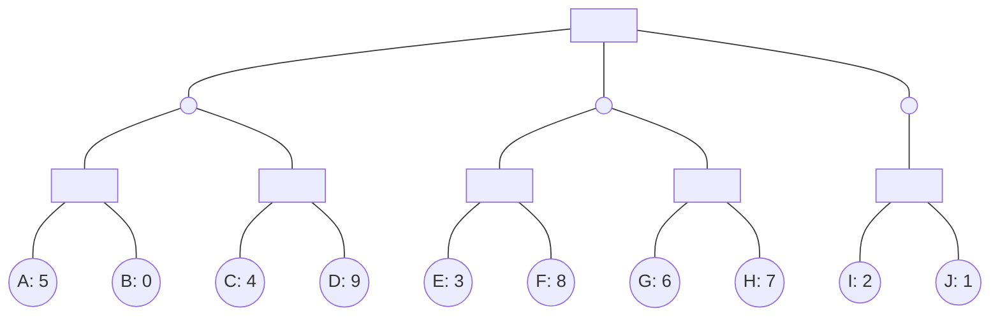

## The Question

The figure shows a game tree with evaluation function values at the horizon nodes.
The horizon nodes are labeled from A to J.
Where applicable, use these labels in short answers.

**Tie-breaker**:
When several nodes carry the same best cost then select the deepest node, if tie persists then select the leftmost of the deepest nodes to break the tie.

Run SSS* algorithm on the game tree, then answer the sub-questions.

| # | Question | Official answer |
|---|----------|-----------------|
| 4.1 | Find the horizon nodes that are assigned SOLVED status by SSS* algorithm. Enter the labels of those nodes in the textbox, or enter NIL if no nodes are assign... | `A,C,E,G,H,I,J` / `A,C,E,G,I,J,H` |
| 4.2 | Find the SOLVED horizon nodes that are pruned from the queue by SSS* algorithm, i.e., SOLVED horizon nodes removed from the queue when a MAX-ancestor is SOLV... | `A,E,I,J` |

## The Topic in 60 Seconds

> Deep-dive: browse the [Concepts](/concepts) section for the relevant topic page.

## Solutions

**4.1** — Find the horizon nodes that are assigned SOLVED status by SSS* algorithm. Enter the labels of those nodes in the textbox, or enter NIL if no nodes are assigned SOLVED status.

**Answer:** `A,C,E,G,H,I,J` / `A,C,E,G,I,J,H`

**4.2** — Find the SOLVED horizon nodes that are pruned from the queue by SSS* algorithm, i.e., SOLVED horizon nodes removed from the queue when a MAX-ancestor is SOLVED. Enter the labels of those nodes in the textbox, or enter NIL if SOLVED nodes were never pruned.

**Answer:** `A,E,I,J`

## Tricks & Tips

<Accordion title="Exam method">
1. Read the question carefully — identify the algorithm or technique.
2. Trace step by step, showing your working.
3. Verify your answer against the question constraints.
</Accordion>
