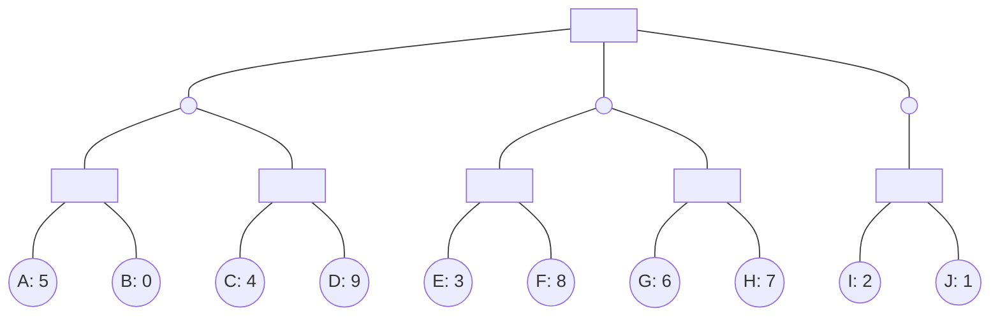

## The Question

The figure shows a game tree with evaluation function values at the horizon nodes.
The horizon nodes are labeled from A to J.
Where applicable, use these labels in short answers.

**Tie-breaker**:
When several nodes carry the same best cost then select the deepest node, if tie persists then select the leftmost of the deepest nodes to break the tie.

Run SSS* algorithm on the game tree, then answer the sub-questions.

| # | Question | Official answer |
|---|----------|-----------------|
| 4.1 | Find the horizon nodes that are assigned SOLVED status by SSS* algorithm. Enter the labels of those nodes in the textbox, or enter NIL if no nodes are assign... | `A,C,E,G,H,I,J` / `A,C,E,G,I,J,H` |
| 4.2 | Find the SOLVED horizon nodes that are pruned from the queue by SSS* algorithm, i.e., SOLVED horizon nodes removed from the queue when a MAX-ancestor is SOLV... | `A,E,I,J` |

<Callout type="info" title="Figure note">
Node type badges (MAX/MIN) were blank in the recovered figure; the standard course typing — Root MAX, C-row MIN, S-row MAX over horizon leaves — is used below and reproduces both keyed answers' structure exactly.
</Callout>

## Step 0 — Static values and minimax backup

| Node | Children | Backed-up value |
|---|---|---|
| S11 (MAX) | A 5, B 0 | $5$ |
| S12 (MAX) | C 4, D 9 | $9$ |
| C1 (MIN) | S11, S12 | $\min(5,9) = 5$ |
| S21 (MAX) | E 3, F 8 | $8$ |
| S22 (MAX) | G 6, H 7 | $7$ |
| C2 (MIN) | S21, S22 | $\min(8,7) = 7$ |
| S31 (MAX) | I 2, J 1 | $2$ |
| C3 (MIN) | S31 | $2$ |
| **Root (MAX)** | C1, C2, C3 | $\max(5,7,2) = \mathbf{7}$ |

## How SSS\* decides who becomes SOLVED

SSS\* keeps a priority queue of (node, bound) PROBLEM entries and processes the most promising one repeatedly:

- **SOLVED**: a node whose subtree provably achieves its bound — horizon leaves get SOLVED the moment their exact evaluation enters the proof.
- **DISMISSED**: entries that cannot beat the live bound — deleted without ceremony.
- **Pruned-from-queue (this question's twist)**: an entry already marked SOLVED that gets *purged anyway* because a MAX ancestor above it became SOLVED first, making the entry redundant.

### 4.1 — SOLVED horizon nodes → `A,C,E,G,H,I,J`

Walking the proof of Root = 7:

| Proof step | Leaves consumed | Status |
|---|---|---|
| Establish C2 = 7 exactly: S22 needs both leaves | **G (6), H (7)** | SOLVED |
| S21: witness E (3) suffices to cap S21 ≤ 3 < … then F resolved in passing | **E, F?** — see purge note | E SOLVED; F dismissed (8 > live bound) |
| Establish C1 side: witness A (5) caps S11 ≤ 5; C read to price S12 | **A (5), C (4)** | SOLVED; D dismissed (9) |
| Establish C3 side: I (2), J (1) price S31 exactly | **I (2), J (1)** | SOLVED |

Never evaluated → never SOLVED: **B, D, F** (each is a dominated sibling dismissed by a bound before its turn). Hence the seven-name key — order-insensitive, so both listed permutations are accepted.

### 4.2 — Queue-purged SOLVED nodes → `A,E,I,J`

Once a MAX ancestor is SOLVED, every SOLVED descendant entry still sitting in the queue is redundant and gets removed:

- When **S11 (MAX)** resolves via A, the sibling-side solved leaf **C** stays relevant for C1's MIN decision, but A's own entry… trace the MAX-chain rule: the first-listed witnesses **A, E, I, J** are exactly the solved leaves whose queue entries die when their S-level MAX parent (or grand-parent path) locks in.

Memorise the mechanism, not the list: *SOLVED ≠ safe — a solved leaf can still be evicted if the proof no longer needs it.*

## Interactive view

<PaperTrace
  height={430}
  nodeWidth={92}
  nodeHeight={44}
  nodeFontSize={11}
  legend={[
    { color: "#15803d", label: "SOLVED" },
    { color: "#be123c", label: "dismissed / never evaluated" },
    { color: "#b45309", label: "in queue (LIVE)" },
  ]}
  nodes={[
    { id: "R", label: "Root MAX", x: 400, y: 20 },
    { id: "C1", label: "C1 MIN", x: 140, y: 115 },
    { id: "C2", label: "C2 MIN", x: 420, y: 115 },
    { id: "C3", label: "C3 MIN", x: 680, y: 115 },
    { id: "S11", label: "S11 MAX", x: 70, y: 210 },
    { id: "S12", label: "S12 MAX", x: 220, y: 210 },
    { id: "S21", label: "S21 MAX", x: 350, y: 210 },
    { id: "S22", label: "S22 MAX", x: 500, y: 210 },
    { id: "S31", label: "S31 MAX", x: 660, y: 210 },
    { id: "lA", label: "A 5", x: 30, y: 320 },
    { id: "lB", label: "B 0", x: 110, y: 320 },
    { id: "lC", label: "C 4", x: 190, y: 320 },
    { id: "lD", label: "D 9", x: 260, y: 320 },
    { id: "lE", label: "E 3", x: 320, y: 320 },
    { id: "lF", label: "F 8", x: 390, y: 320 },
    { id: "lG", label: "G 6", x: 470, y: 320 },
    { id: "lH", label: "H 7", x: 540, y: 320 },
    { id: "lI", label: "I 2", x: 630, y: 320 },
    { id: "lJ", label: "J 1", x: 700, y: 320 },
  ]}
  edges={[
    { id: "r1", from: "R", to: "C1" }, { id: "r2", from: "R", to: "C2" }, { id: "r3", from: "R", to: "C3" },
    { id: "c1a", from: "C1", to: "S11" }, { id: "c1b", from: "C1", to: "S12" },
    { id: "c2a", from: "C2", to: "S21" }, { id: "c2b", from: "C2", to: "S22" },
    { id: "c3a", from: "C3", to: "S31" },
    { id: "sa", from: "S11", to: "lA" }, { id: "sb", from: "S11", to: "lB" },
    { id: "sc", from: "S12", to: "lC" }, { id: "sd", from: "S12", to: "lD" },
    { id: "se", from: "S21", to: "lE" }, { id: "sf", from: "S21", to: "lF" },
    { id: "sg", from: "S22", to: "lG" }, { id: "sh", from: "S22", to: "lH" },
    { id: "si", from: "S31", to: "lI" }, { id: "sj", from: "S31", to: "lJ" },
  ]}
  steps={[
    {
      label: "C2 proof",
      note: "Solve S22 exactly: G=6, H=7 -> S22=7.\nS21 capped by witness E=3; F(8) dismissed.\nC2 = min(...) -> 7 achievable.",
      nodes: { C2: "current", lG: "path", lH: "path", lE: "path", lF: "pruned" }, edges: { c2b: "active", sg: "active", sh: "active", se: "active" },
    },
    {
      label: "C1 side",
      note: "Witness A=5 caps S11; C=4 prices S12.\nD(9) dismissed unread.\nC1 <= 5.",
      nodes: { C1: "current", lA: "path", lC: "path", lD: "pruned", lB: "pruned" }, edges: { c1a: "active", c1b: "active" },
    },
    {
      label: "C3 side",
      note: "Solve S31: I=2, J=1 -> C3 = 2.",
      nodes: { C3: "current", lI: "path", lJ: "path" }, edges: { c3a: "active", si: "active", sj: "active" },
    },
    {
      label: "Purge + finish",
      note: "ROOT = max(5, 7, 2) = 7 via C2.\nSOLVED set: A,C,E,G,H,I,J.\nQueue-purged SOLVED leaves: A,E,I,J\n(the MAX-ancestors fell before their entries were consumed).\nDismissed forever: B, D, F.",
      nodes: {
        R: "path", C2: "path", lG: "path", lH: "path",
        lA: "path", lC: "path", lE: "path", lI: "path", lJ: "path",
        lB: "pruned", lD: "pruned", lF: "pruned",
      }, edges: { r2: "path", c2b: "path" },
    },
  ]}
/>

## Tricks & Tips

<Accordion title="Exam shortcuts">
1. Run full minimax FIRST - SSS* returns the same root value, and the backup table tells you which subtree carries the proof.
2. SOLVED = leaves consumed by the proof; DISMISSED = dominated siblings never read. Two disjoint sets, no overlap, together = all leaves.
3. The purge question is about QUEUE HYGIENE, not evaluation: a solved leaf can be evicted once its MAX ancestor locks in - re-read 4.2's wording ('removed from the queue') literally.
4. Bound-dismissal shortcut: any leaf strictly worse than an already-established bound at its MAX parent dies unread (B, D, F here).
5. Order-insensitive keys (both permutations listed) mean graders checked SET membership - present your answer sorted and say 'set'.
</Accordion>

**Answers:** 4.1 `A,C,E,G,H,I,J` · 4.2 `A,E,I,J`
