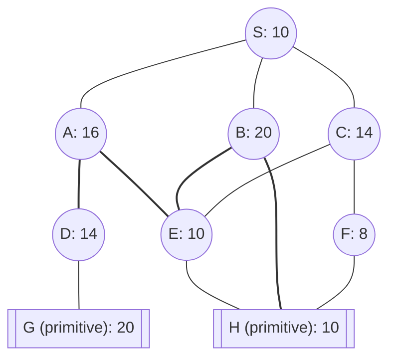

## The Question

The figure shows an AND-OR decomposition of problem S into smaller problems.
The nodes are uniquely identified by labels (S, A, B, C, …).
Each node shows the heuristic estimate of the cost of solving that node.
Nodes shown in double lines are primitive nodes and their values are actual costs.
A primitive node is added to the graph, with SOLVED status, when its parent is expanded. And therefore, a primitive node is never expanded.

The cost of each edge is 2 units.

**Tie-breaker 1**: If several nodes have the same cost then break the tie using node labels.
**Tie-breaker 2**: For AND nodes, select the unsolved branch with the highest cost.

Use AO* algorithm to solve S, then answer the sub-questions.

| # | Question | Official answer |
|---|----------|-----------------|
| 5.1 | List the nodes expanded by AO* algorithm. List the nodes in the order they are expanded. Observe that primitive nodes are not expanded. | `S,C,A,B,F` / `C,A,B,F` |
| 5.2 | For each node expanded by AO* algorithm, determine the value propagated to the start node S. | `16,18,22,24,28` / `18,22,24,28` |
| 5.3 | What can you conclude about the given AND-OR decomposition? | **A** |

## The Topic in 60 Seconds

> Deep-dive: browse the [Concepts](/concepts) section for the relevant topic page.

## Solutions

**5.1** — List the nodes expanded by AO* algorithm. List the nodes in the order they are expanded. Observe that primitive nodes are not expanded.

**Answer:** `S,C,A,B,F` / `C,A,B,F`

**5.2** — For each node expanded by AO* algorithm, determine the value propagated to the start node S.

**Answer:** `16,18,22,24,28` / `18,22,24,28`

**5.3** — What can you conclude about the given AND-OR decomposition?

Options:

| Option | |
|---|---|
| **A** | The heuristic is admissible. |
| **B** | The heuristic is inadmissible. |
| **C** | The heuristic is sometimes admissible and sometimes inadmissible. |

**Answer:** **A**

## Tricks & Tips

<Accordion title="Exam method">
1. Read the question carefully — identify the algorithm or technique.
2. Trace step by step, showing your working.
3. Verify your answer against the question constraints.
</Accordion>
