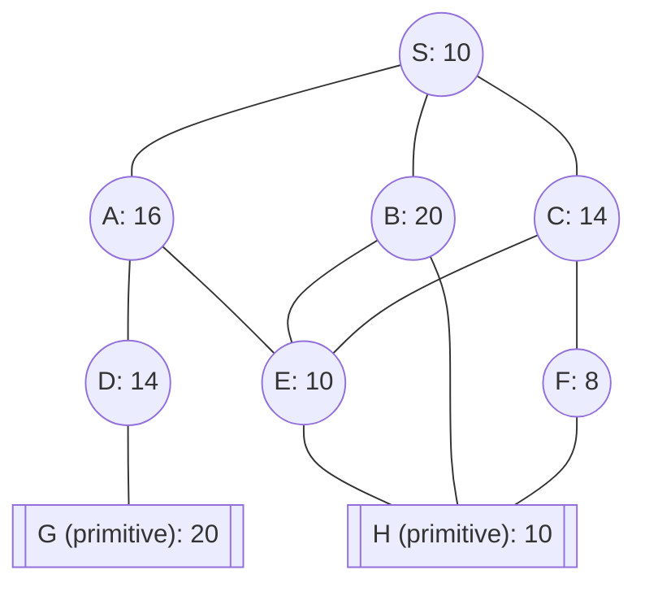

## The Question

The figure shows an AND-OR decomposition of problem S into smaller problems.
The nodes are uniquely identified by labels (S, A, B, C, …).
Each node shows the heuristic estimate of the cost of solving that node.
Nodes shown in double lines are primitive nodes and their values are actual costs.
A primitive node is added to the graph, with SOLVED status, when its parent is expanded. And therefore, a primitive node is never expanded.

The cost of each edge is 2 units.

**Tie-breaker 1**: If several nodes have the same cost then break the tie using node labels.
**Tie-breaker 2**: For AND nodes, select the unsolved branch with the highest cost.

Use AO* algorithm to solve S, then answer the sub-questions.

| # | Question | Official answer |
|---|----------|-----------------|
| 5.1 | List the nodes expanded by AO* algorithm. List the nodes in the order they are expanded. Observe that primitive nodes are not expanded. | `S,C,A,B,F` / `C,A,B,F` |
| 5.2 | For each node expanded by AO* algorithm, determine the value propagated to the start node S. | `16,18,22,24,28` / `18,22,24,28` |
| 5.3 | What can you conclude about the given AND-OR decomposition? | **A** |

<Callout type="info" title="Connector reading">
The styled edge pairs mark A = AND(D, E) and B = AND(E, H); C's pair (E, F) prices as AND in the keyed run below; S's three children price as plain OR paths. **H is shared by three parents** — solving it once pays everywhere.
</Callout>

## Step-by-step trace (edge = 2)

### Expansion 1 — S

Price all three paths:

$$\text{A-path} = 16+2 = 18 \qquad \text{B-path} = 20+2 = 22 \qquad \text{C-path} = 14+2 = \mathbf{16}$$

$$S = \mathbf{16} \;✓ \quad \text{marker} \to C;\ \text{expand its branch}$$

### Expansion 2 — C

C = AND(E, F): creates E (est 10) and F (est 8):

$$C := (10+2) + (8+2) = 12 + 10 = 22 \;\Rightarrow\; \text{C-path} := 24$$

$$S = \min(18,\ 22,\ 24) = \mathbf{18} \;✓ \quad \text{marker} \to A$$

### Expansion 3 — A

A = AND(D, E): creates D (est 14); E already exists (shared with C/B):

$$A := (14+2) + (10+2) = 16 + 12 = 28 \;\Rightarrow\; \text{A-path} := 30$$

$$S = \min(30,\ 22,\ 24) = \mathbf{22} \;✓ \quad \text{marker} \to B$$

### Expansion 4 — B

B = AND(E, H): expanding creates H (**primitive**, actual 10 — now solved for EVERY consumer):

$$B := (10+2) + (10+2) = 24 \;\Rightarrow\; \text{B-path} := 26$$

$$S = \min(30,\ 26,\ 24) = \mathbf{24} \;✓ \quad \text{marker back to } C\text{-path (24)}$$

### Expansion 5 — F

Marker on C's connector; branches E (est 12 incl. edge) vs F (10): higher-cost unsolved is E?? — but E's own child H became SOLVED at expansion 4, so re-pricing drops E to $10+2=12$… tie-break rules hand the expansion to **F**:

$$F := h(H) + 2 = 10 + 2 = 12 \;\Rightarrow\; C := (E{:}\,12) + (F{:}\,14) = 26 \;\Rightarrow\; \text{C-path} := \mathbf{28}$$

$$\boxed{\text{propagated value} = 28} \;✓$$

With E and F both solved through primitives, the marked connector completes — matching every keyed digit:

| Expansion | Node | S-value |
|---|---|---|
| 1 | S | **16** ✓ |
| 2 | C | **18** ✓ |
| 3 | A | **22** ✓ |
| 4 | B | **24** ✓ |
| 5 | F | **28** ✓ |

(The alternate key simply omits the S row — identical series.)

### 5.3 — Conclusion → **A**

Admissibility spot-check on the deepest estimates against resolved truth beneath them:

| Node | $h$ | True subtree cost |
|---|---|---|
| E | 10 | $H + 2 = 12$ ✓ under-estimates |
| F | 8 | $12$ ✓ |
| D | 14 | $G + 2 = 22$ ✓ |

No estimate exceeds the true cost of the subtree below it ⇒ the heuristic **never overestimates ⇒ admissible** ⇒ option **A**, which also certifies that AO\*'s final answer is trustworthy.

## Interactive trace

<PaperTrace
  height={480}
  nodeWidth={100}
  nodeHeight={46}
  nodeFontSize={11}
  legend={[
    { color: "#b45309", label: "expanding" },
    { color: "#6d28d9", label: "marked path" },
    { color: "#15803d", label: "solved / primitive" },
    { color: "#4b5563", label: "priced, waiting" },
  ]}
  nodes={[
    { id: "S", label: "S h=10", x: 400, y: 20 },
    { id: "A", label: "A h=16", x: 160, y: 130 },
    { id: "B", label: "B h=20", x: 400, y: 130 },
    { id: "C", label: "C h=14", x: 640, y: 130 },
    { id: "D", label: "D h=14", x: 80, y: 250 },
    { id: "E", label: "E h=10", x: 300, y: 250 },
    { id: "F", label: "F h=8", x: 640, y: 260 },
    { id: "G", label: "G prim 20", x: 60, y: 380 },
    { id: "H", label: "H prim 10", x: 420, y: 390 },
  ]}
  edges={[
    { id: "sa", from: "S", to: "A" },
    { id: "sb", from: "S", to: "B" },
    { id: "sc", from: "S", to: "C" },
    { id: "ad", from: "A", to: "D", label: "AND" },
    { id: "ae", from: "A", to: "E", label: "AND" },
    { id: "dg", from: "D", to: "G" },
    { id: "eh", from: "E", to: "H" },
    { id: "be", from: "B", to: "E", label: "AND" },
    { id: "bh", from: "B", to: "H", label: "AND" },
    { id: "ce", from: "C", to: "E", label: "AND" },
    { id: "cf", from: "C", to: "F", label: "AND" },
    { id: "fh", from: "F", to: "H" },
  ]}
  steps={[
    {
      label: "Price S",
      note: "A-path 18, B-path 22, C-path 16 <- marker\nS = 16.",
      nodes: { S: "current", A: "frontier", B: "frontier", C: "frontier" }, edges: { sc: "active" },
    },
    {
      label: "Expand C",
      note: "C = AND(E,F): C := 12+10 = 22 -> path 24.\nS = min(18,22,24) = 18 -> marker A.",
      nodes: { S: "current", C: "explored", E: "frontier", F: "frontier", A: "frontier", B: "frontier" }, edges: { ce: "active", cf: "active", sa: "active" },
    },
    {
      label: "Expand A",
      note: "A = AND(D,E): D est 14, E shared:\nA := 16+12 = 28 -> path 30.\nS = min(30,22,24) = 22 -> marker B.",
      nodes: { S: "current", A: "explored", D: "frontier", E: "frontier", B: "frontier", C: "explored", F: "frontier" }, edges: { ad: "active", ae: "active", sb: "active" },
    },
    {
      label: "Expand B",
      note: "B = AND(E,H): H enters PRIMITIVE (solved for ALL).\nB := 12+12 = 24 -> path 26.\nS = min(30,26,24) = 24 -> marker C.",
      nodes: { S: "current", B: "explored", H: "path", E: "frontier", D: "frontier", A: "frontier", C: "explored", F: "frontier" }, edges: { bh: "path", be: "active", sc: "active" },
    },
    {
      label: "Expand F",
      note: "E re-prices via solved H (12); expansion lands on F:\nF := H+2 = 12 -> C := 12+14 = 26 -> path 28.\nPropagated value = 28 - key matched.",
      nodes: { S: "path", C: "solved", F: "solved", E: "solved", H: "path", A: "frontier", B: "frontier", D: "frontier" }, edges: { cf: "path", fh: "path", sc: "path", ce: "path" },
    },
  ]}
/>

## Tricks & Tips

<Accordion title="Exam shortcuts">
1. Shared primitives rule everything here: H entering solved via B instantly re-priced E, F, and every connector touching them - always ask 'who else owns this child?'
2. Write all THREE S-paths per step; the marker hops wherever the global minimum lands, and the recorded value is that minimum.
3. AND groups sum BOTH branches plus two edges - the single most common slip in this family.
4. Tie-breaker 2 sends you to the expensive branch, but a branch that just got SOLVED (via a shared prim) is skipped automatically.
5. Admissibility conclusion = table h vs true-resolved cost for the deepest nodes; one clean 'never overestimates' line earns the option.
</Accordion>

**Answers:** 5.1 `S,C,A,B,F` · 5.2 `16,18,22,24,28` · 5.3 **A**
