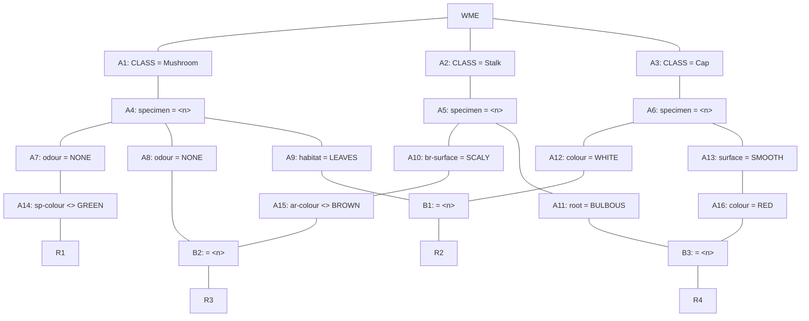

## The Question

A part of the Rete Net that classifies mushrooms (as edible or poisonous) is shown in the figure.
The labels A1, A2, ..., A10, A16, ..., B1, B2, B3, R1, …, R4 uniquely identify the nodes in the network.
When required, use the above label ordering to break ties and to enter short answers.

Note: `attribute <> x` is true when that attribute exists and its value is not equal to x.



Run the Rete algorithm for the Working Memory shown below, the WMEs are in timestamp order.
Assume that WMEs reside at appropriate Alpha nodes, and the Beta nodes point to WMEs residing in Alpha nodes.

```text
101. (Cap ^specimen C36 ^colour RED ^surface SMOOTH)
102. (Cap ^specimen A25 ^colour WHITE ^surface SMOOTH)
103. (Mushroom ^specimen X16 ^odour NONE ^habitat LEAVES)
104. (Mushroom ^specimen A25 ^odour NONE ^habitat LEAVES)
105. (Stalk ^specimen C36 ^root BULBOUS ^ar-colour WHITE)
106. (Stalk ^specimen X16 ^br-surface SCALY ^ar-colour WHITE)
107. (Mushroom ^specimen C36 ^odour NONE ^sp-colour WHITE)
108. (Mushroom ^specimen B49 ^odour ALMOND ^sp-colour BROWN)
109. (Stalk ^specimen B49 ^br-surface SMOOTH)
```

For each WME identify its location (node label) in the Rete Net, and prepare the conflict set for the first cycle, then answer the sub-questions.


| # | Question | Official answer |
|---|----------|-----------------|
| 6.1 | Which of the following rule-data tuples are in the conflict-set? | **A**, **B**, **C**, **D** |
| 6.2 | If the Inference Engine uses Specificity as the conflict resolution strategy then which of the following rule-data tuples will qualify? | **C**, **D** |
| 6.3 | If the Inference Engine uses Recency as the conflict resolution strategy then which of the following rule-data tuples will qualify? | **A** |

## The Topic in 60 Seconds

> Deep-dive: browse the [Concepts](/concepts) section for the relevant topic page.

## Solutions

**6.1** — Which of the following rule-data tuples are in the conflict-set?

Options:

| Option | |
|---|---|
| **A** | R1,107 |
| **B** | R2,102,104 |
| **C** | R3,103,106 |
| **D** | R4,101,105 |
| **E** | R2,102,103 |
| **F** | R3,104,106 |

**Answer:** **A**, **B**, **C**, **D**

**6.2** — If the Inference Engine uses Specificity as the conflict resolution strategy then which of the following rule-data tuples will qualify?

Options:

| Option | |
|---|---|
| **A** | R1,107 |
| **B** | R2,102,104 |
| **C** | R3,103,106 |
| **D** | R4,101,105 |
| **E** | R2,102,103 |
| **F** | R3,104,106 |

**Answer:** **C**, **D**

**6.3** — If the Inference Engine uses Recency as the conflict resolution strategy then which of the following rule-data tuples will qualify?

Options:

| Option | |
|---|---|
| **A** | R1,107 |
| **B** | R2,102,104 |
| **C** | R3,103,106 |
| **D** | R4,101,105 |
| **E** | R2,102,103 |
| **F** | R3,104,106 |

**Answer:** **A**

## Tricks & Tips

<Accordion title="Exam method">
1. Read the question carefully — identify the algorithm or technique.
2. Trace step by step, showing your working.
3. Verify your answer against the question constraints.
</Accordion>
