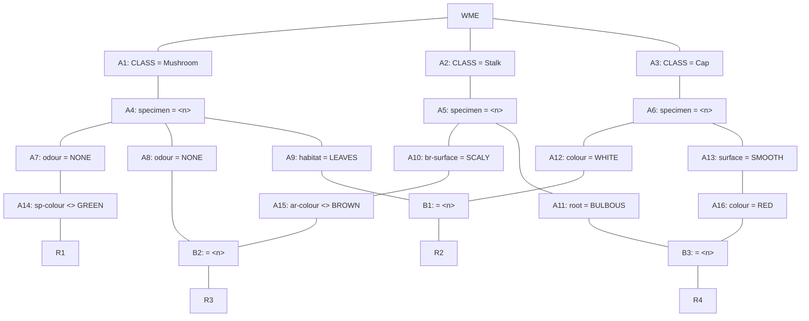

## The Question

A part of the Rete Net that classifies mushrooms (as edible or poisonous) is shown in the figure.
The labels A1, A2, ..., A10, A16, ..., B1, B2, B3, R1, …, R4 uniquely identify the nodes in the network.
When required, use the above label ordering to break ties and to enter short answers.

Note: `attribute <> x` is true when that attribute exists and its value is not equal to x.



Run the Rete algorithm for the Working Memory shown below, the WMEs are in timestamp order:

```text
101. (Cap ^specimen C36 ^colour RED ^surface SMOOTH)
102. (Cap ^specimen A25 ^colour WHITE ^surface SMOOTH)
103. (Mushroom ^specimen X16 ^odour NONE ^habitat LEAVES)
104. (Mushroom ^specimen A25 ^odour NONE ^habitat LEAVES)
105. (Stalk ^specimen C36 ^root BULBOUS ^ar-colour WHITE)
106. (Stalk ^specimen X16 ^br-surface SCALY ^ar-colour WHITE)
107. (Mushroom ^specimen C36 ^odour NONE ^sp-colour WHITE)
108. (Mushroom ^specimen B49 ^odour ALMOND ^sp-colour BROWN)
109. (Stalk ^specimen B49 ^br-surface SMOOTH)
```

| # | Question | Official answer |
|---|----------|-----------------|
| 6.1 | Which of the following rule-data tuples are in the conflict-set? | **A**, **B**, **C**, **D** |
| 6.2 | If the Inference Engine uses Specificity as the conflict resolution strategy then which of the following rule-data tuples will qualify? | **C**, **D** |
| 6.3 | If the Inference Engine uses Recency as the conflict resolution strategy then which of the following rule-data tuples will qualify? | **A** |

## Step 0 — File every WME into its alpha node

| Alpha store | Tokens ($n$ = specimen) |
|---|---|
| Mushroom / bind | 103 (X16), 104 (A25), 107 (C36), 108 (B49) |
| odour NONE (×2 stores) | 103, 104, 107 — 108 dies (ALMOND) |
| habitat LEAVES | 103 (X16), 104 (A25) |
| sp-colour ≠ GREEN | **107 only** — 103/104 lack the field, and absent ≠ pass |
| Cap / bind | 101 (C36), 102 (A25) |
| colour WHITE | **102** (101 is RED) |
| surface SMOOTH | 101, 102 |
| colour RED (under smooth-cap) | **101** |
| Stalk / bind | 105 (C36), 106 (X16), 109 (B49) |
| br-surface SCALY | **106** |
| root BULBOUS | **105** |
| ar-colour ≠ BROWN (under scaly) | **106** (WHITE ≠ GREEN-style test passes) |

Missing-attribute rule bites twice: 108's ALMOND kills it early, and 103/104 never reach A14 because they carry no ^sp-colour at all.

## Step 1 — Joins on shared specimen $n$

| Beta | Join | Result |
|---|---|---|
| **B1** | A9 $\{X16, A25\}$ ⋈ A12 $\{A25\}$ | match $n$=A25 → (**R2**, 104, 102) |
| **B2** | A8 $\{X16, A25, C36\}$ ⋈ A15 $\{X16\}$ | match $n$=X16 → (**R3**, 103, 106) |
| **B3** | A11 $\{C36\}$ ⋈ A16 $\{C36\}$ | match $n$=C36 → (**R4**, 105, 101) |
| — | A14 alone → R1 | (**R1**, 107) |

### 6.1 — Conflict set → **A, B, C, D**

$$\{(R1,107),\ (R2,104,102),\ (R3,103,106),\ (R4,105,101)\}$$

Exactly four tuples — matching the four keyed options. Everything pairing across specimens (e.g., white cap A25 with leaves-mushroom X16) fails the same-$n$ join.

### 6.2 — Specificity → **C, D**

Count constant tests per rule:

| Tuple | Tests counted | Count |
|---|---|---|
| R3 | Mushroom + NONE + Stalk + SCALY + ar≠BROWN | **5** |
| R4 | Stalk + BULBOUS + Cap + SMOOTH + RED | **5** |
| R2 | Mushroom + LEAVES + Cap + WHITE | 4 |
| R1 | Mushroom + NONE + sp≠GREEN | 3 |

The two 5-test join-backed tuples top the ranking → keyed winners **C, D**.

### 6.3 — Recency → **A**

Sorted-descending timestamp lists:

| Tuple | List |
|---|---|
| **R1** | **[107]** ← newest element overall |
| R3 | [106, 103] |
| R2 | [104, 102] |
| R4 | [105, 101] |

Newest-first comparison crowns `[107]` → the R1 tuple fires → keyed **A**.

## Interactive trace

<PaperTrace
  height={500}
  nodeWidth={110}
  nodeHeight={42}
  nodeFontSize={10}
  legend={[
    { color: "#0369a1", label: "holding tokens" },
    { color: "#15803d", label: "rule in conflict set" },
    { color: "#be123c", label: "starved branch" },
  ]}
  nodes={[
    { id: "A14", label: "A14 spc!=GREEN", x: 60, y: 60 },
    { id: "A9", label: "A9 LEAVES", x: 60, y: 180 },
    { id: "A12", label: "A12 WHITE", x: 60, y: 300 },
    { id: "A8", label: "A8 NONE", x: 60, y: 420 },
    { id: "A15", label: "A15 arc!=BROWN", x: 60, y: 520 },
    { id: "A11", label: "A11 BULBOUS", x: 60, y: 620 },
    { id: "A16", label: "A16 RED", x: 60, y: 720 },
    { id: "B1", label: "B1 n=n", x: 320, y: 230 },
    { id: "B2", label: "B2 n=n", x: 320, y: 460 },
    { id: "B3", label: "B3 n=n", x: 320, y: 670 },
    { id: "R1n", label: "R1", x: 540, y: 60 },
    { id: "R2n", label: "R2", x: 540, y: 230 },
    { id: "R3n", label: "R3", x: 540, y: 460 },
    { id: "R4n", label: "R4", x: 540, y: 670 },
  ]}
  edges={[
    { id: "r1e", from: "A14", to: "R1n" },
    { id: "b1a", from: "A9", to: "B1" }, { id: "b1b", from: "A12", to: "B1" }, { id: "r2e", from: "B1", to: "R2n" },
    { id: "b2a", from: "A8", to: "B2" }, { id: "b2b", from: "A15", to: "B2" }, { id: "r3e", from: "B2", to: "R3n" },
    { id: "b3a", from: "A11", to: "B3" }, { id: "b3b", from: "A16", to: "B3" }, { id: "r4e", from: "B3", to: "R4n" },
  ]}
  steps={[
    {
      label: "Alpha stores",
      note: "A9={X16,A25} A12={A25} A8={X16,A25,C36}\nA15={X16} A11={C36} A16={C36} A14={107}",
      nodes: {}, edges: {},
    },
    {
      label: "Join B1",
      note: "A9 vs A12 on n: {X16,A25} n {A25} = {A25}.\nTuple (R2, 104, 102).",
      nodes: { B1: "current", R2n: "path", A9: "frontier", A12: "frontier" }, edges: { b1a: "active", b1b: "active", r2e: "path" },
    },
    {
      label: "Join B2",
      note: "A8 vs A15: {X16,A25,C36} n {X16} = {X16}.\nTuple (R3, 103, 106).",
      nodes: { B2: "current", R3n: "path", R2n: "path", A8: "frontier", A15: "frontier" }, edges: { b2a: "active", b2b: "active", r3e: "path" },
    },
    {
      label: "Conflict set",
      note: "B3: {C36} n {C36} -> (R4,105,101).\nA14 alone -> (R1,107).\nCONFLICT SET = 4 tuples (options A-D).\nSpecificity: R3/R4 (5 tests). Recency: [107] -> R1.",
      nodes: { B3: "current", R4n: "path", R1n: "path", R2n: "path", R3n: "path" }, edges: { b3a: "active", b3b: "active", r4e: "path", r1e: "path" },
    },
  ]}
/>

## Tricks & Tips

<Accordion title="Exam shortcuts">
1. Alpha table first, n-bindings attached - all four joins become set intersections you can eyeball.
2. Absent attribute = failed comparison (the question states it!) - 103/104 never reach A14 despite passing odour-NONE.
3. One dead WME (108's ALMOND) quietly starves nothing here, but always check which alpha stores LOSE tokens before joining.
4. Specificity counts TESTS (5 > 4 > 3); recency compares timestamp lists newest-first - precompute both columns once.
5. Same-n discipline: cross-specimen pairings die silently; verify each tuple's two WMEs carry identical specimen numbers before ticking.
</Accordion>

**Answers:** 6.1 **A, B, C, D** · 6.2 **C, D** · 6.3 **A**
